> 论文 [Deformable Convolutional Networks](https://arxiv.org/abs/1703.06211)
> 代码 https://github.com/msracver/Deformable-ConvNets

这篇文章是微软亚研院的作品，跟STN的思路基本上是一样的，但是做法还是有很大不同。

# 1 简介

上一篇讲STN（Spatial Transformer Networks）的时候，提到 CNN中池化层的存在带来了空间不变性（旋转不变性，平移不变性等），而 Spatial Transformer Networks 也是为了增加空间不变性。但是二者增加空间不变性的出发点是不同的：

**CNN是尽力让网络适应物体的形变，而STN是直接通过  Spatial Transformer 将形变的物体给变回到正常的姿态（比如把字摆正）。** 

也就是说，从模型的几何变换能力（空间变换能力）来说，CNN是比较弱的，因为它主要是通过合适的降采样来减弱目标形变对预测的影响。CNN的几何变换能力不好，是因为它是一个固定的几何结构（固定的卷积核，池化核），所以CNN对几何形变的建模能力是有限的。而STN就是一个比较好的具备对几何形变建模能力的模型。

通常来说为了适应物体的几何形变一般有以下几种做法：

- 数据扩展 data augmention ：这个在深度学习中很经常使用，比如 multi-view 的方式，选取5个patch等
- 使用具备平移不变性的特征或算法 transformation-invariant  features and algorithms ：特征，比如 SIFT 特征，一般在传统的方法中使用；算法，比如卷积神经网络，目标检测模型中的sliding window，现代计算视觉中使用。
- CNN模型中还可以使用池化的方法

缺点：

- 几何变换能力是固定的，已知的：比如CNN固定的卷积核，固定的池化核，固定的ROI；数据扩展是先验知识的一种利用。对于新的视觉任务（比如换个数据集），之前构建的固定的几何变换模型可能就不能用了，这也是为什么在ImageNet上训练好的分类模型用到检测或分割上时要 fine-tuning。
- 对于手工设计的 特征比如SIFT，在一些复杂的视觉任务中，表现很差，甚至是不可行的。

CNN在分类，检测，分割领域取得了很大进展，这些模型增强几何变换能力的方法也基本是上面提到的三种方法,但是上面提到的缺点仍然存在。

CNN固定的卷积核，固定的池化核，固定的ROI，导致高层神经元的感受野（receptive field  ）是固定的，没有办法有效的编码语义或者位置信息。

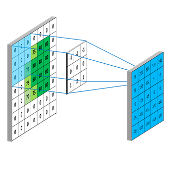

如果感受野能够自适应的动态调节，那对精细化的定位问题是很有利的。

这篇文章在STN的基础之上，针对分类和检测提出了两种新的模块 deformable convolution （可变性卷积）和deformable RoI pooling （可变性 ROI池化），来达到动态调节感受野的作用，取得了不错的效果。

# 2 Deformable Convolutional Networks

为方便表示，以下所有都是在2D卷积的基础上示例，对于3D卷积 来说每个通道的变换是一样的。

## 2.1 Deformable Convolution

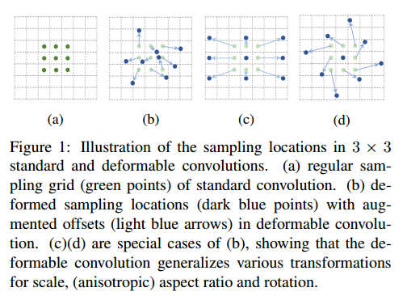

先看下可变性卷积的效果，如上图：

- (a)：标准卷积采样点
- (b), (c), (d)：浅绿色是标准卷积采样点，深蓝色是可变形卷积采样点，浅蓝色箭头是偏移（offset）
- (c), (d)是(b)的特例，其中(c)是 带孔卷积(Atrous convolution )或者叫膨胀卷积(dilated convolution)，这说明可变形卷积是比较具有一般性的卷积形式。

可变形卷积与标准卷积相比，采样点不再是固定的了，而是有个偏移量offset，这个偏移量是2维的，通过网络学习得到，它使得采样点的形状可以根据目标发生变化。

**2D卷积：**

用 $R$ 表示卷积核中的格点，比如以下是一个 3×3 的卷积核的表示

标准2D卷积的过程：

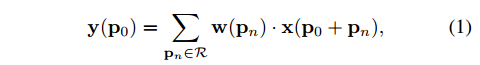

- $x$ ：输入 feature map
- $y$ ： 输出 feature map
- $p_0$ ：输出feature map $y$ 上的坐标
- $p_n$ ： $R$ 中的坐标
- 采样点坐标： $p_0+p_n$ ，整数
- $w$ ：采样参数，CNN中就是权值
- $w(p_n)$ ：代表卷积核中的权值
- $x(p_0+p_n)$ : 采样点处的像素值

**可变形卷积：**

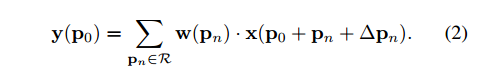

- 要给 $R$ 加上偏移 offset： $\{\Delta p_n | n=1,...,N\},N=|R|$ 
- 现在的采样坐标点变成了  $p_0+p_n+\Delta p_n$ ，$\Delta p_n$ 是小数，所以采样坐标也变成了小数坐标
- $x(p_0+p_n+\Delta p_n)$ ：对应到feature map上没有像素值，因此又需要插值了

插值函数：

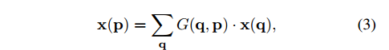

- $p=p_0+p_n+\Delta p_n$ : 输入feature map $x$ 上的小数坐标
- $q$ : 输入feature map $x$ 上的所有整数坐标
- $G(q,p)$ ：插值核函数，可以代表更一般性的插值核函数，比如线性插值，最近邻插值等，不过这里用的是双线性插值

因此插值核函数：

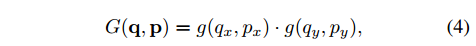

- $g(a, b) = max(0, 1 - |a - b|)$  

大概说一下线性插值核函数，如下：
$$
W_{bil}(x,y)
=w_{lin}(x) \cdot w_{lin}(y)
=\begin{cases}1-x-y-x\cdot y  & for \, \, \,0 \le |x|,|y| <1\\[2ex]
0 & otherwise\end{cases}
$$
详细的参考：[双线性插值](https://zh.wikipedia.org/wiki/%E5%8F%8C%E7%BA%BF%E6%80%A7%E6%8F%92%E5%80%BC) ， [图像处理之插值运算](http://blog.csdn.net/lz0499/article/details/69791572) .

虽然插值需要对输入feature map $x$ 上的所有整数坐标进行遍历和计算，但是由于 $G(q,p)$  实际上在很多位置都是0，所以插值计算是很快的。

**可变形卷积的结构示意图**

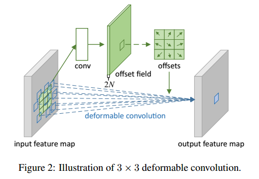

这个模块有两条 流动路线，

- 下面一路是一个标准的 3×3 卷积，
- 上面也是一个 3×3 卷积，步长一样，输出 offset field 与 input feature map 大小一样
- 通道为 2N 个，代表N个2维的偏移场，一个通道是一维（x 或 y）
- 剪裁（crop）出于卷积核相对的那一块区域，得到offsets
- 与下面一路标准卷积核进行相加，然后线性插值，确定采样点坐标
- 最后进行卷积操作即可

后向传播：

对输入feature map的后向传播与标准卷积一样

对 offset $\Delta p_n$ 的导数如下：

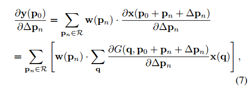

- 其中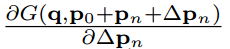可以通过公式4求出。
- $\partial \Delta p_n$ 代表 $\partial \Delta p_n^x$ 或 $\partial \Delta p_n^y$ 

## 2.2 Deformable RoI Pooling

**首先是 ROI Pooling：**

回顾一下 ROI 池化：

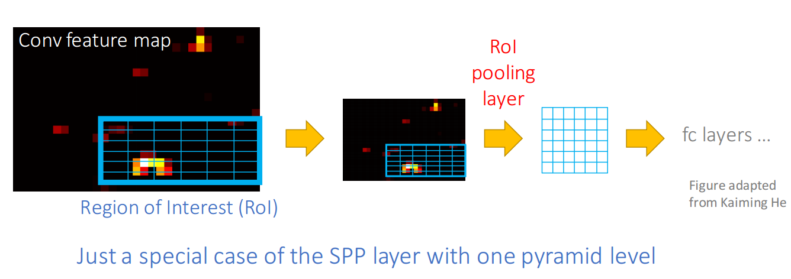

- 输入feature map ：$x$ 
- RoI 的大小 ：$w×h$ 
- 左上角点坐标： $p_0$
- RoI pooling 将 RoI 分成 $k × k$  ($k$ 是自由参数，可以人为设定) 个网格(bins )，每个网格中像素有多个，大小： $\dfrac{w}{k} × \dfrac{h}{k}$ 
- 输出 $k × k$ 大小的 feature map： y

坐标 $(i, j)$ 处的网格 $(0 ≤ i, j < k)$ 的输出：

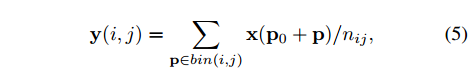

- $p\in bin(i,j)$ 
- 坐标 $(i, j)$ 处的网格的像素跨度：$\lfloor i {w \over k}\rfloor \le x \le \lceil (i+1){w \over k}\rceil$    和   $\lfloor j {h \over k}\rfloor \le y \le \lceil (j+1){h \over k}\rceil$ ，$\lfloor \cdot \rfloor$ 和 $\lceil  \cdot \rceil $ 分别代表下界和上界
- $n_{ij}$ : 坐标 $(i, j)$ 处的网格中的像素总数，这是个平均值池化
- $p_0+p$  $(i, j)$ ：处的网格中的坐标，即采样点坐标

同样的要给 ROI  加上偏移 offset： $\{\Delta p_{ij} | (0 ≤ i, j < k) \}$  ，如下：

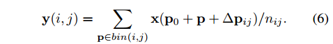

同样的 $\Delta p_{ij} $ 一般都是小数，同样的还是用双线性插值来完成坐标映射，公式3和公式4.

可变形 ROI 池化 结构图

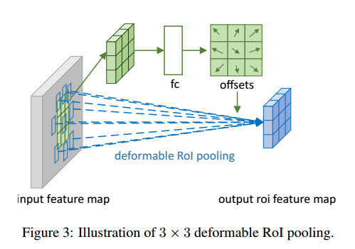

- 首先从ROI中生成 池化后的 feature map

- 其后全连接层生成 归一化的（normalized） offsets： $\Delta \hat p_{ij}$ ，这个归一化的向量是必须的，因为ROI的尺寸不一，必须要统一标准，比如归一化到 [-1,1]

- 归一化的向量 $\Delta \hat p_{ij}$ 再生成 offsets  $\Delta p_{ij}$  , 直接与ROI做 点积：

  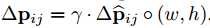

  $\gamma$ 是一个预定义的系数，用于衡量 偏差offset 的 重要程度，按经验选取，文章使用的 $\gamma =0.1$ .

后向传播：

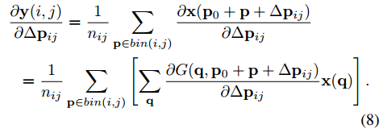

$\dfrac{\partial y(i,g)}{\partial \Delta \hat p_{ij}}$ 可以很轻松的通过  求出。

------

**再来看看Position-Sensitive (PS) RoI Pooling**  

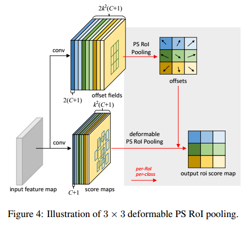

- 基本与ROI Pooling相同，因为池化后的feature map 中的每一个像素都来自不同组的score map 的对应位置（颜色对应），所以公式5和6 中的 输入feature map 由 $x$  改为 $x_{ij}$ 

- 不同的是 offset的生成方式， offset 的生成方式与 分类问题中的 PS Pooling是一样的

  从输入feature map另起一路，先生成 $2k^2(C+1)$ 通道的 score map（C个类别，偏移量是2维的），然后PS Pooling

- 同样也是先生成 归一化的 偏移量，然后再转换成 与ROI 尺寸相关的 offset 与 池化坐标相加，得到采样点坐标。

- 上面图中的加了偏移量的网格（bins）已经与原来的网格产生了偏移

# 3 试验

## 3.1 试验准备

现有的CNN模型一般都包含两部分，一部分特征提取，一部分分类或检测或分割等。

**Deformable Convolution for Feature Extraction**  

- ResNet-101 
- Aligned-Inception-ResNet ，这是 Inception-ResNet  的一个改进版本，因为对于密集预测任务（比如检测和分割） Inception-ResNet 的特征和原图上的目标不能对齐。
- 这两种网络的降采样比例由原来的32 调整为 16，并使用了 带孔卷积（Atrous convolution ） 或者叫做 膨胀卷积（dilated convolution ）
- 经过试验验证 deformable convolution 放置于网络最后3层。

**Segmentation and Detection Networks** 

- DeepLab ：用于分割
- Category-Aware RPN ：检测，RPN的分类由二分类换成多分类
- Faster R-CNN 使用 FPN（Feature pyramid networks for object detection. ）的配置，ROI Poling 换为 deformable RoI pooling. 
- R-FCN ：PS Pooling 换为 deformable position-sensitive RoI pooling. 

## 3.2 Understanding Deformable ConvNets

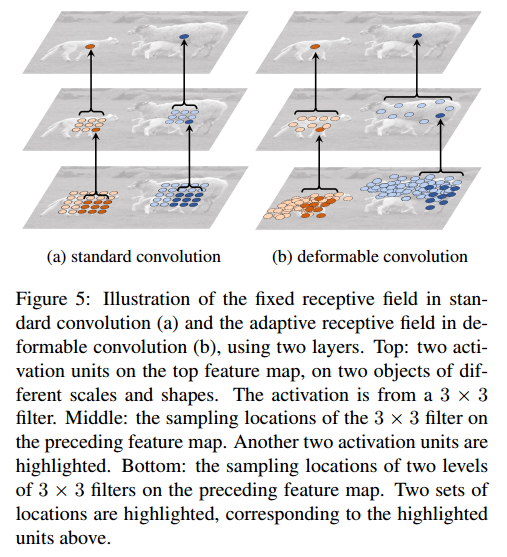

- (a)：标准卷积中固定的感受野和卷积核采样点
- (b)：可变形卷积中自适应的感受野和卷积核采样点，
- 意味着可变形卷积中高层神经元看到原图的区域更接近目标，所以更容易分类

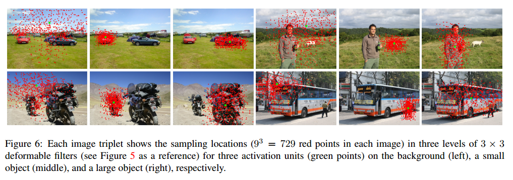

- 这图表示的是高层的神经元在原图上的感受野和采样点
- 每个图像三元组显示了三层3x3可变形卷积核的采样点位置（共729个点），对应于三个不同的图像区域（从左至右，背景，小物体，大物体）
- 绿色点对应高层的一个像素点，红色点对应高层神经元在底层的感受野内的采样点，与figure 5对应

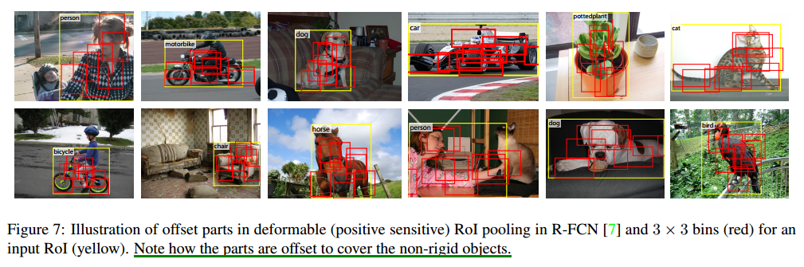

- R-FCN模型中 PS Pooling换成可变形池化后，ROI中的网格分布
- 比较整齐的黄色框是 PS ROI Pooling
- 红色框是deformable PS ROI Pooling
- 很明显红色框更接近目标的形状

## 3.3 Ablation Study

**Deformable Convolution 对检测或分割的效果** 

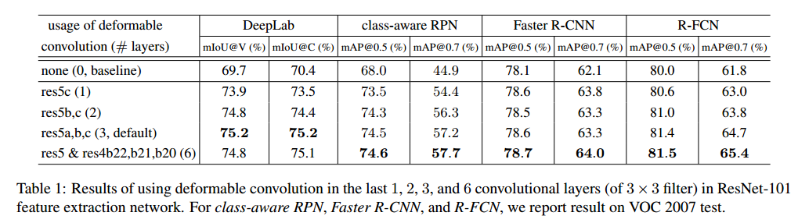

- 控制变量：deformable convolution 的数量 和 不同的网络模型
- 整体上来说 deformable convolution 越多，效果越好；但是从3-6的增益不大，所以文章其他部分都是用的3个deformable convolution

为了说明模型中高层神经元的感受野是动态自适应的，文章做了一个粗略的测量：

对可变形卷积核，加了offset 前后的采样点对，计算他们之间的平均距离，称为 有效膨胀：effective dilation 。这可以粗略的衡量感受野的大小，effective dilation越大，感受野越大

看看效果：

使用包含3个 deformable layers 的R-FCN 在 PASCLA VOC2007数据集上检测，目标按照COCO 的标准分为大，中，小。这三个可变形卷积层的有效膨胀 统计如下：

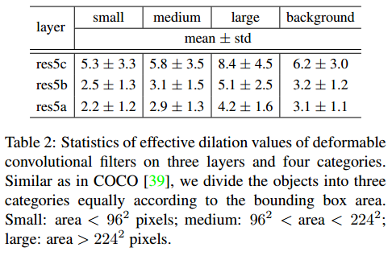

- 越大的目标有效膨胀越大，感受野也越大，确实在感受野的区域面积上实现了动态自适应调整

- 背景的感受野介于 中等目标和大目标之间

- 当然这个只是对感受野的区域大小作评估，而感受野的区域是如何跟随目标的形状动态变化的，就只能从figure5，figure6，figure7中观察了

  ​

疑问：这怎么跟figure 6上的可视化效果不太一样？figure 6上可是背景的感受野最大, 感觉有效膨胀确实不太准确, 个人认为有效膨胀衡量的是膨胀前后两个相对应的坐标对之间的距离，跟坐标点分布的大小区域的关系不太大，不过文章也说了是粗略测量。

**atrous convolution**  

下图（b）是带孔卷积，可以跳着选，隔一个加一个，即 dilation=1，隔两个的话就是  dilation=2

再来看看带孔卷积的效果，膨胀卷积实际上是本文提出的可变形卷积的特例：

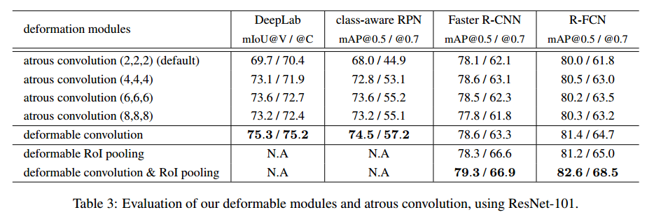

- dilation 从 2到4，到6，到8，整体上来看，效果在增加，说明默认 default network 的感受野比较小
- 最优的 dilation value 对于不同的任务和模型也是不同的，6 for DeepLab but 4 for Faster R-CNN 
- deformable convolution 有最好的效果，说明自适应的学习可变形的卷积核或池化核是有效的
- 对比 Faster RCNN 和 R-FCN，当 deformable convolution 和 deformable  RoI Pooling 同时使用时, 能够得到显著的效果提升，

**模型复杂度对比：**

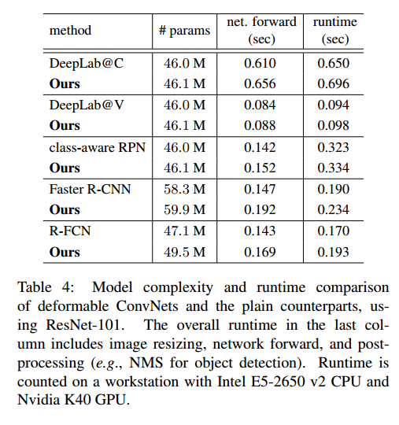

- 参数会增加，但是增加的很少，对时间影响不大
- 说明可变形卷积网络获得的收益不是由于参数增加而获得的

**COCO上的效果对比：** 

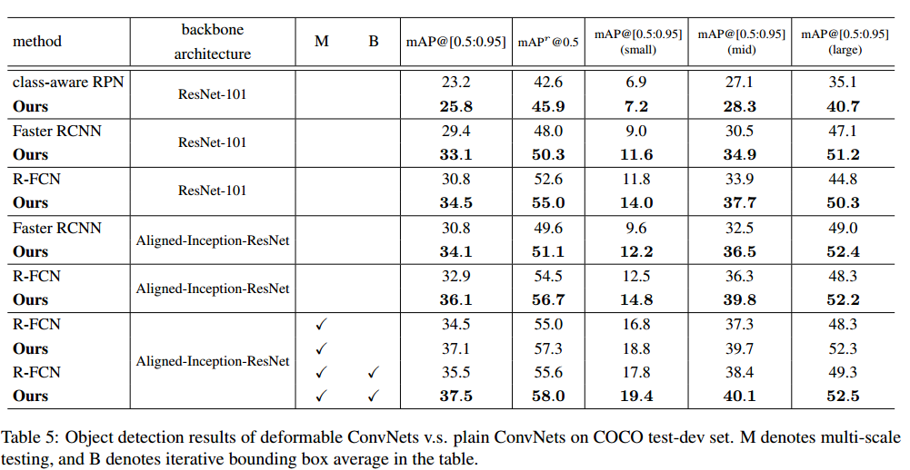

- 无疑 可变形卷积神经网络取得了不错的成绩
- 将ResNet101换为Aligned-Inception-ResNet  ，即便不使用可变形卷积也会提高精度，说明 Aligned-Inception-ResNet 效果比 ResNet101好，Aligned-Inception-ResNet到底是个啥，等会说。

# 4 与STN的比较

整个结构跟STN(Spatial Transformer Networks )还是比较像的。

- deformable convolution 中学习到的偏移量 offset 可以认为是一种 轻量化的 spatial transformer 。

- spatial transformer 是一种全局几何变换，一次把 目标所在区域全部给变换过去；

  而deformable convolution 则是以局部、密集采样的方式完成几何变换的，本质上还是属于卷积操作。

- spatial transformer crop出的区域是一个平行四边形，相对来说还是比较规整的；

  deformable convolution 中的感受野是可以根据目标形状随意形变的。

- STN比deformable convolution的参数要多，而且学习变换矩阵比学习偏移量更难。

- STN虽然在小的数据集上取得了比较好的效果，不过在大的数据集上的效果好像不怎么好，这篇论文好像有探讨：Inverse compositional spatial transformer networks.  

# 5 Aligned-Inception-ResNet

Aligned-Inception-ResNet是Inception-ResNet的改进版本，由于 Inception-ResNet网络太深，使用了很多卷积层和池化层，深层神经元（靠近输入层）在原图上的映射，与感受野的中心是不能对齐的，比如下图这样的一层卷积，后一层的每个像素都与感受野的中心是对齐的，但是这样的层堆起来之后，然后再加一些池化层的话，就很有可能对不齐了。

实际上这种情况在深层卷积神经网络中是比较普遍的，一般都是通过控制池化层数量（比如ResNet，GoogLeNet模型中就没有池化层）和总降采样比例来减缓的，而且有些视觉任务是在能够对齐的假设下构建的，比如FCN，最后的feature map中的一个 cell 的预测对应了原图的一个位置。

为了弥补这个缺陷，何凯明还有微软亚研院一干人等 提出了 Aligned-Inception-ResNet ，这是一篇没出版的论文，arxiv网站上也没找到，这里是在 deformable convolutional networks 这篇论文的 附录部分看到的。

看下面这篇论文中的引用：unpublished work

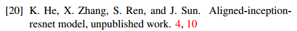

论文中也声明了：

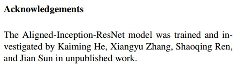

不过网络结构倒是挺清晰的，个别细节不太清楚。

网络结构看table6 和 figure 8：

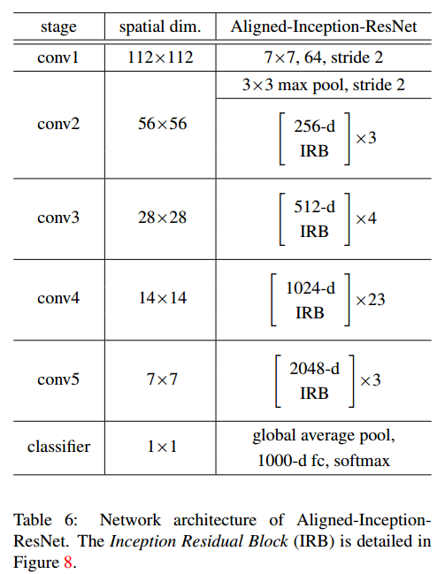

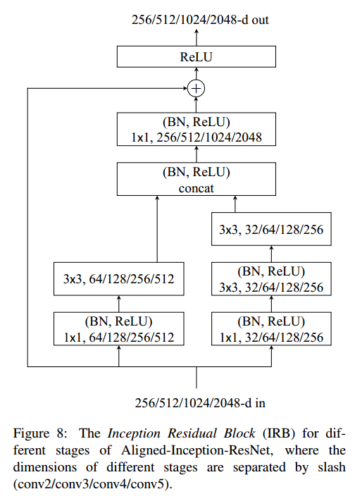

- 与原始的Inception-ResNet，相比， Aligned-Inception-ResNet 使用了很多重复的结构，称为 IRB ，如figure 8，整个网络结构比 Inception-ResNet简单了好多；
- 关于对齐的方式，附录只是说在卷积层和池化层使用了合适的 padding（proper padding in convolutional and pooling layers. ）。具体是怎么做的也没说清楚.

ImageNet上的效果如下：

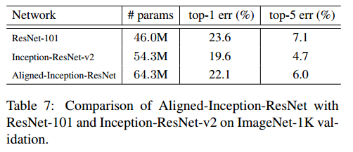

- 可见效果并没有超越其他的结构，号称是Inception-ResNet的改良，竟然还不如 Inception-ResNet，而且参数也多，IRB那个结构感觉也是将Inception-ResNet 中的模块调整了一下，没有啥太大本质的变化。
- 唯一有效的恐怕就是在分割或者目标检测中用作基础网络时效果会好点吧，见table5.

这个结构目前只在两篇文章中见到过：一篇 是上面讲的 deformable convolutional networks ，还有一篇是：Flow-Guided Feature Aggregation for Video Object Detection ，都是微软亚研院的工作。

# 参考资料

1. [双线性差值](https://zh.wikipedia.org/wiki/%E5%8F%8C%E7%BA%BF%E6%80%A7%E6%8F%92%E5%80%BC) 
2. [图像处理之插值运算](http://blog.csdn.net/lz0499/article/details/69791572)
3. https://mlnotebook.github.io/post/CNN1/

