论文：[Spatial Transformer Networks](https://arxiv.org/abs/1506.02025)，是Google旗下 DeepMind 公司的研究成果。

这篇论文的试验做的特别好。

# 1 简介

## 1.2 问题提出

CNN在图像分类中取得了显著的成效，主要是得益于 CNN 的深层结构具有 空间不变性（spatially invariance）（平移不变性，旋转不变性），所以图像上的目标物体就算是做了平移或者旋转，CNN仍然能够准确的识别出来，这对于CNN的泛化能力是有益的。

- 空间不变性主要是由于 Pooling 层 和 步长不为1的卷积层 的存在带来的。实际上主要是池化层的作用，因为大部分的卷积层的步长都是大于1而又小于卷积核大小的，也就是滑动时是有重叠的，而池化层一般不是重叠的。也就是说这些层越多，越深，池化核或卷积核越大，空间不变性也越强；但是随之而来的问题是局部信息丢失，所以这些层越多准确率肯定是下降的，所以主流的CNN分类网络一般都很深，但是池化核都比较小，比如2×2。
- 比如ResNet，GoogLeNet，VGG，FCN，这些网络的总降采样比例一般是 16或32，基本没有见过 64倍，128倍或者更高倍数的降采样（会损失局部信息降低准确率），也很少见到 2倍或者4倍的降采样比例（空间不变性太弱，泛化能力不好）。不过这个是跟数据集中的图像大小有关的，上述主流图像分类网络基本都是针对于 ImageNet数据集做分类的，ImageNet中的图片都比较大，一般在 256×256 左右。如果数据集中的图像本来就很小，那么降采样比例就也会小，比如 MNIST数据集，图像只有28×28，所以LeNet中的降采样比例是4。总之，降采样比例要根据数据集调整，找到合适的降采样比例，才能保证准确率的情况下，有较强的空间不变性。

那么如何在保证准确率的情况下，即不损失局部信息的前提下，增强网络的空间不变性呢？这篇文章就是为了解决这个问题。

## 1.2 解决方法

对于CNN 来说，即便通过选择合适的降采样比例来保证准确率和空间不变性，但是 池化层 带来的空间不变性是不够的，它受限于预先选定的固定尺寸的池化核（感受野是固定的，局部的）。因为物体的变形包括旋转，平移，扭曲，缩放，混淆噪声等，所以后面feature map中像素点的感受野不一定刚好包含物体或者反映物体的形变。

文章提出了一种 Spatial Transformer Networks，简称 STN，引进了一种可学习的采样模块 Spatial Transformer ，姑且称为空间变换器，Spatial Transformer的学习不需要引入额外的数据标签，它可以在网络中对数据（feature map）进行空间变换操作。这个模块是可微的（后向传播必须），并且可以插入到现有的CNN模型中，使得 feature map具有空间变换能力，也就是说 感受野是动态变化的，feature map的空间变换方向 与 原图片上的目标的空间变换方向（一般认为是数据噪声）是相反的，所以使得整个网络的空间不变性增强。试验结果展示这种方法确实增强了空间不变性，在一些标志性的数据集（benchmark）上取得了先进的水平。

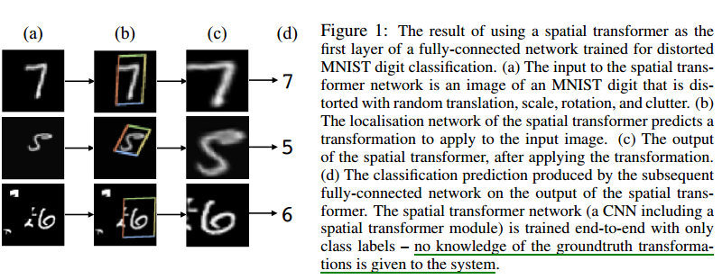

**图1 在输入层使用 Spatial Transformer** 

空说无凭，先看一个简单效果，如图1：

- (a) ：输入图片
- (b) ：框起来的是用于后面网络进行进一步识别分类的部分，这一部分是就是Spatial Transformer的结果
- (c) ：输出层的可视化
- (d) ：预测结果

整体上来看是一种视觉 attention 机制，也更像一种弱的目标检测机制，就是把图片中物体所在区域送到网络后面的层中，使得后面的分类任务更简单。

**CNN是尽力让网络适应物体的形变，而STN是直接通过  Spatial Transformer 将形变的物体给变回到正常的姿态（比如把字摆正），然后再给网络识别。**

文章给的 Spatial Transformer 的使用场景：

- image classification ：如果数据集中的图像上的目标形变很大，噪声很大，位于图片中心较远，那么  Spatial Transformer 可以将物体部分 “剪裁” 出来，并做一定的旋转，缩放变换，使之成为大小统一的图片，便于后续网络识别，并且获得比CNN更好的结果。
- co-localisation ：给定输入图片，不确定是否有物体，如果有，可以使用Spatial Transformer做出定位。
- spatial attention ：对于使用attention机制的视觉任务，可以很轻松的使用 Spatial Transformer 完成。

看完这篇论文之后，个人觉得目标检测（object detection）也是可以用的，果不其然，真有人将类似的方法用在了 目标检测上，这篇论文就是 Deformable Convolutional Networks ，后面再讲。

# 2 Spatial Transformer结构

文章最重要的一个结构就是 Spatial Transformers ，这个结构的示意图如下：

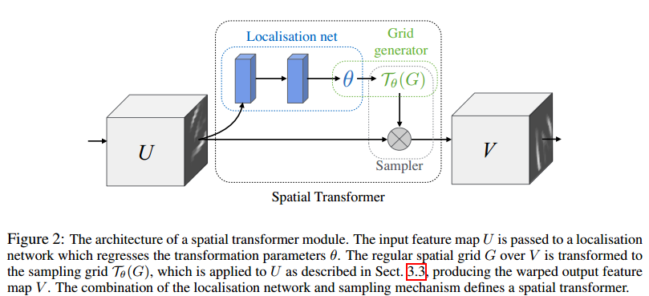

 **图2 Spatial Transformers 结构图**

这样一个结构相当于 CNN中的一个 卷积层或者池化层：

这个结构又被分为三部分：localisation network ，grid generator和sampler

一些符号意义：

- $U \in R^{H \times W \times C}$ 为输入 feature map
- $V \in R^{H' \times W' \times C'}$ 为输出 feature map
- $\theta=f_{loc}(U)$  是一个回归子网络
- $T_{\theta}$ 表示以参数 $\theta$ 为变换矩阵的某种变换，可以是2维仿射变换(2D affine transformation )，平面投影变换(plane projective transformation )，薄板样条变换(thin plate spline )
- $ G_i = (x^t_i, y_i^t)$  代表V中的像素点   $G = \{G_i\} $ 是V中像素点的整体。
- $T_{\theta}(G)$ 代表下面图3中，输入U上的绿色区域的坐标。

这个图与图1做个对应，U 相当于 图1 中的 (a) , V相当于 图1 中的(c)，中间那一部分相当于图1 中的(b), 作用就是为了找到那个物体所在的框，或者叫做弱目标检测。

## 2.1 Localisation network

这一部分很简单，可以使用全连接层或者全卷积层，只要保证最后一层是一个回归层即可，最后输出的一个向量是 $\theta$ 。 $\theta$ 的维度下面再说。

## 2.2 Grid generator

前面提到中间那一部分是为了**找到那个物体所在的框，并把它给 变换回 "直立的状态"**。很自然就能想到使用仿射变换就可以完成，如下图：

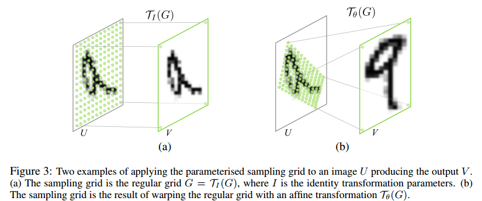

 **图3 (a)恒等变换与采样； (b)仿射变换与采样**

**我们期望的是输出 V 是 将U中某一部分（比如绿色点覆盖的部分）做了旋转，放缩，平移之后的feature map。**

看一下Grid generator是如何进行仿射变换的。

------

先简单的看一下仿射变换：

仿射变换用于表示旋转，缩放和平移，表示的是两副图之间的关系，

以下 A 为旋转矩阵，B 为平移矩阵，M称为仿射变换矩阵。

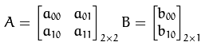

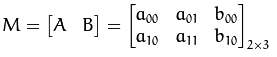

假设要对二维向量  进行仿射变换，仿射变换可以写成如下两式，两种写法等价：

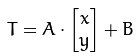

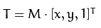

输出的结果是：

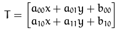

对于仿射变换来说，一般的用法有两种：

- 已知 M 和 X，求T; 这个很简单，直接矩阵相乘。
- 已知 X 和 T , 求M; 可以选取三对点，带入上面的式子中，列方程，6个方程6个未知数；

------

这里使用的是第一种用法。其中 图3 (b)  U 中的被绿点覆盖的那一部分相当于这里的 T，V相当于这里的 X，那不是应该 M也是已知的吗？M哪去了？还记得上面提到的 $\theta$ ？ $\theta$ 就相当于这里的M。因为 M的大小是 2×3 ，所以 $\theta$ 的维度为6。如果使用了别的变换方法，那就根据变换矩阵的大小相应调整。也就是说这里的变换矩阵是学习出来的。

对应于图3的变换公式如下：

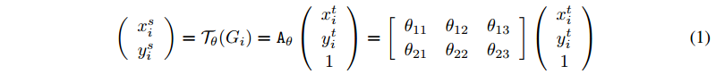

- $(x^t_i, y_i^t)$  are the **target coordinates** of the  regular grid in the output feature map ，代表的是图3输出V中的像素点，即目标像素坐标；
- $(x^s_i, y_i^s)$ are the **source coordinates** in the input feature map that define the sample points ,代表的是图3输入U中被绿色点覆盖的像素点，即源像素坐标；
- $A_{\theta}$ is the affine transformation matrix ，代表的是仿射变换矩阵。其中的成员 $\theta_{ij}$ 由 localisation network 回归生成。图3或图2中的 $T_{\theta}$ 这时指的仿射变换 $A_{\theta}$。

注意他这个仿射变换是  **从后向前变换的**，就是说这个模块的输出是仿射变换的输入，这个模块的输入的其中一部分（图3(b) 绿点覆盖部分）是仿射变换的输出。

按照一般的做法，应该是从前往后变换，即从 source coordinates 得到 target coordinates 。但是这样做的问题是，如何确定变换的输入？如果是从前往后做变换，U 中绿色部分相当于 X，那怎么确定这一部分是多大，什么形状，位置在哪？

实际上从后往前变换也就是为了解决这个问题，就是要根据输出V的坐标得到输入U中目标所在的区域的坐标（绿色的区域）。

仿射变换变换的是坐标，既是坐标，那么变换的输入和输出的坐标的参考系应该是一样的，就是说 V 中像素的坐标 和 U 中像素的坐标应该是同一个参考系。这里使用的是针对 宽和高 进行的归一化坐标(height and width normalised coordinates)，把在U和V中的像素坐标归一化到 [-1,1] 之间。U的 尺寸是上一层决定的，V的尺寸是人为固定的，输出 $H',W'$  可以分别比 输入$H,W$ 大或者小，或者相等。

可以给仿射变换的变换矩阵添加更多的约束：

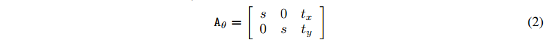

这时候，绿色区域已经确定了，相当于V中对应坐标$(x^t_i, y_i^t)$  的像素都将从U中这块绿色区域中获取。 $H',W'$ 与$H,W$   不一定相等；即便是相等，由于变换后的源坐标  $(x^s_i, y_i^s)$ 很有可能不是整数 ，对应U中不是整数像素点，所以没有像素值，没办法直接拷贝。所以V中  $(x^t_i, y_i^t)$ 坐标的像素值如何确定就成了问题。这时就涉及到采样和插值。

## 2.3 Sampler

实际上 CNN中的卷积核 或者 池化核起到的就是采样的作用。

$(x^s_i, y_i^s)$ 是U中绿色区域的坐标，来看看更加具有一般性的采样问题如何描述：

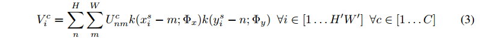

- $U_{nm}^c$ 是输入feature map上第 $c$ 个通道上坐标为 $(n, m)$ 的像素值；
- $V_i^c$ 是输出 feature map上第 $c$ 个通道上坐标为 $(x^t_i, y_i^t)$ 的像素值；
- $k()$ 表示插值核函数；
- $Φx , Φy$  代表 x 和 y 方向的插值核函数的参数；
- $H,W$ 输入U的尺寸;
- $H',W'$ 输出 V 的尺寸;

注意上式只是针对一个通道的像素进行采样，实际上每个通道的采样都是一样的，这样可以保留 空间一致性。

卷积的操作也是符合上式的，比如一维卷积：

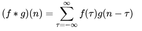

- $f(\tau)$ 相当于 $U_{nm}^c$ ；
- $g(n-\tau)$ 相当于 $k(x_i^s-m; \Phi_x)$ 或 $(y_i^s-m; \Phi_y)$   因为这里的卷积是 一维的。

理论来说 任意 对 $x^s_i, y_i^s$ 可导或局部可导的采样核函数都是可以使用的.

比如最近邻插值核函数:

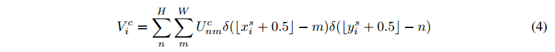

- 其中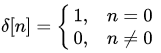
- $\lfloor x + 0.5\rfloor$ 向下取整

这个插值核函数做的就是把U中 离 当前源坐标 $(x^s_i, y_i^s)$ （小数坐标） 最近的 整数坐标 $(n,m)$ 处的像素值拷贝到V中的  $(x^t_i, y_i^t)$ 坐标处；

不过这篇文章使用的是双线性插值，双线性插值 参考 [维基百科](https://zh.wikipedia.org/wiki/%E5%8F%8C%E7%BA%BF%E6%80%A7%E6%8F%92%E5%80%BC) 和 [图像处理之插值运算](http://blog.csdn.net/lz0499/article/details/69791572)，这里放一张示意图吧：

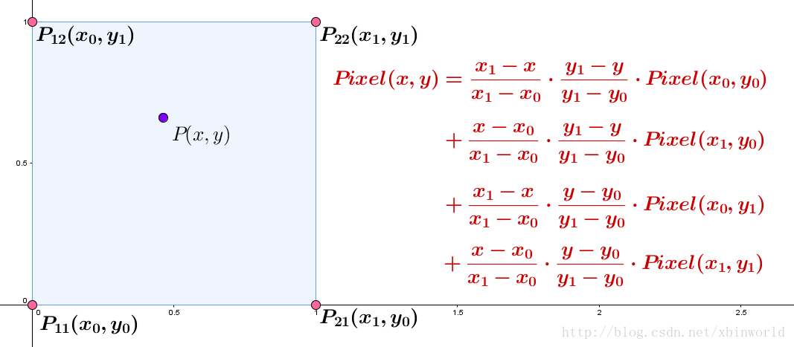

 **图4 双线性插值（来源于[参考资料 6]）**

这里的公式如下：

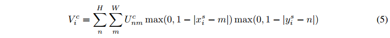

这个插值核函数做的是利用 U中 离 当前源坐标 $(x^s_i, y_i^s)$ （小数坐标）  最近的 4个整数坐标 $(n,m)$ 处的像素值做双线性插值然后拷贝到V中的  $(x^t_i, y_i^t)$ 坐标处；

我在想他那个通过仿射变换确定绿色区域之后，绿色区域相当于ROI，那采样能不能使用ROI 池化的方式?

## 2.4 前向传播

结合前面的分析，总结一下前向传播的过程，如下图：

- 实际上首先进行的是 localisation network 的回归，产生 变换矩阵的参数 $\theta$ ，进而resize为 变换矩阵 $T_{\theta}$ ;
- 根据 V中的 目标坐标 $(x^t_i, y_i^t)$ 做逆向仿射变换变换到源坐标  $(x^s_i, y_i^s)$ ： $Source= T_{\theta} \cdot Target$ ， 源坐标 $(x^s_i, y_i^s)$ 位于U上；对应图中 1,2步；
- 在U中找到 源坐标 $(x^s_i, y_i^s)$ （小数坐标）附近的四个整数坐标，做双线性插值，插值后的值作为 目标坐标  $(x^t_i, y_i^t)$ 处的像素值；对应图中 3,4步；

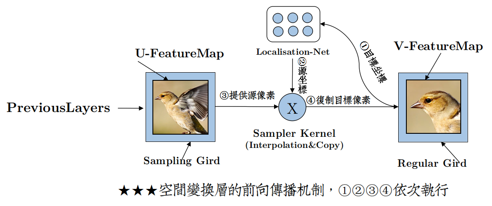

 **图5 前向传播流程**（来源于**[参考资料 6]**）

## 2.5 梯度流动与反向传播

这个函数虽不是 完全可导 但也是局部可导的，求导如下，对  $y_i^s$ 的导数也是类似的：

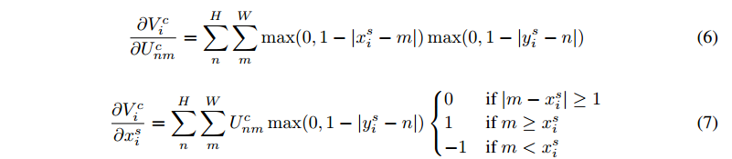

根据公式(1)很容易求得： $\dfrac{\partial x_i^s}{\partial \theta}    $   和 $\dfrac{\partial  y_i^s}{\partial \theta} $ 。

所以反向传播过程，误差可以传播到输入 feature map（公式6），可以传播到 采样格点坐标(sampling grid coordinates )（公式7），还可以传播到变换参数 $\theta$ .

下图是梯度流动的示意图：

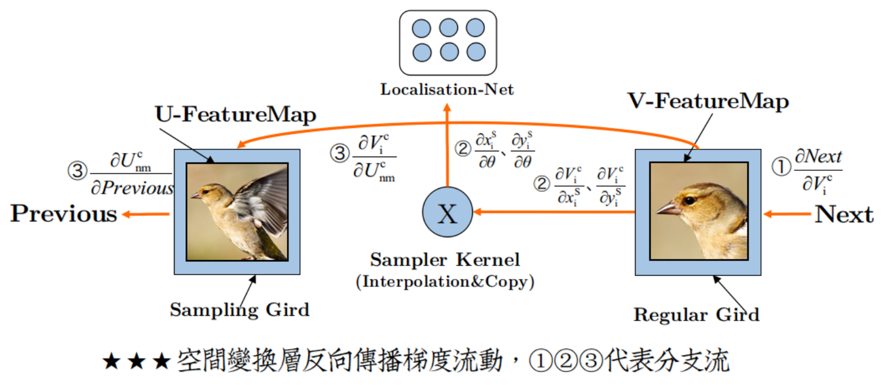

 **图6 反向传播流程**（来源于**[参考资料 6]**）

其中localisation network中的 $\dfrac{\partial x_i^s}{\partial \theta}    $   和 $\dfrac{\partial  y_i^s}{\partial \theta} $ 也就是这一股误差流 $\left\{\begin{matrix}\frac{\partial V_{i}^{c}}{\partial x_{i}^{S}}\rightarrow \frac{\partial x_{i}^{S}}{\partial \theta}\\ \frac{\partial V_{i}^{c}}{\partial y_{i}^{S}}\rightarrow \frac{\partial y_{i}^{S}}{\partial \theta}\end{matrix}\right.$  ，在定位网络处就断了。

定位网络是一个回归模型，相当于一个子网络，一旦更新完参数，流就断了，独立于主网络。

# 3 试验

## 3.1 Distorted MNIST

这个试验的数据集 是 MNIST，不过与原版的MNIST 不同，这个数据集对图片上的数字做了各种形变操作，比如平移，扭曲，放缩，旋转等。

如下，不同形变操作的简写表示：

- 旋转：rotation (R), 
- 旋转+缩放+平移：rotation, scale and translation (RTS), 
- 投影变换：projective transformation (P), 
- 弹性变形：elastic warping (E) – note that elastic warping is destructive and can not be inverted in some cases.  

文章将 Spatial Transformer 模块嵌入到 两种主流的分类网络，FCN和CNN中（ST-FCN 和 ST-CNN ）。Spatial Transformer 模块嵌入位置在图片输入层与后续分类层之间。

试验也测试了不同的变换函数对结果的影响：

- 仿射变换：affine transformation (Aff), 
- 投影变换：projective transformation (Proj),
- 薄板样条变换：16-point thin plate spline transformation (TPS) 

其中CNN的模型与 LeNet是一样的，包含两个池化层。为了公平，所有的网络变种都只包含 3 个可学习参数的层，总体网络参数基本一致，训练策略也相同。

试验结果

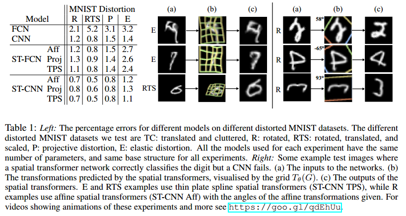

- 左侧：不同的形变策略以及不同的 Spatial Transformer网络变种与 baseline的对比；
- 右侧：一些CNN分错，但是ST-CNN分对的样本
  - (a)：输入
  - (b)：Spatial Transformer层 的 源坐标（$T_{\theta}(G)$ ）可视化结果 
  - (c)：Spatial Transformer层输出
- 很明显：ST-CNN优于CNN, ST-FCN优于FCN，说明Spatial Transformer确实增加了 空间不变性
- FCN中由于没有 池化层，所以FCN的空间不变性不如CNN，所以FCN效果不如CNN
- ST-FCN效果可以达到CNN程度，说明Spatial Transformer确实增加了 空间不变性
- ST-CNN效果优于ST-FCN，说明 池化层 确实对 增加 空间不变性很重要
- 在 Spatial Transformer 中使用 plate spline transformation (TPS)  变换效果是最好的
- Spatial Transformer 可以将歪的数字扭正
- Spatial Transformer 在输入图片上确定的attention区域很明显利于后续分类层分类，可以更加有效地减少分类损失

作者也做了噪声环境下的试验：将数字 放置在 60×60的图片上，并添加斑点噪声（图1第三行）错误率分别为：

 FCN ，13.2% error； CNN ， 3.5% error；  ST-FCN ，2.0% error；  ST-CNN ，1.7% error. 

## 3.2 Street View House Numbers

Street View House Numbers是一个真实的 街景门牌号 数据集，共200k张图片，每张图片包含1-5个数字 ，数字都有形变。

- baseline character sequence CNN model ：11层，5个softmax层输出对应位置的预测序列
- STCNN Single ：在输入层添加一个Spatial Transformer 
- ST-CNN Multi ：前四层，每一层都添加一个Spatial Transformer 见下面 tabel 2 右侧
- localisation networks 子网络：两层32维的全连接层
- 使用仿射变换和双线性插值

结果：

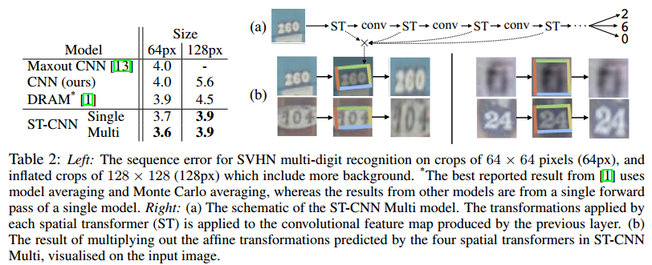

## 3.3 Fine-Grained Classification

数据集：CUB-200-2011 birds dataset，  6k training images and 5.8k test images, covering 200 species of birds. 

- baseline CNN model ： an Inception architecture with batch normalisation pre-trained on ImageNet and fine-tuned on CUB – which by itself achieves the state-of-the-art accuracy of 82.3% (previous best result is 81.0% [30]).  
- ST-CNN, which contains 2 or 4 parallel spatial transformers, parameterised for attention and acting on the input image. 

这里使用了并行的Spatial Transformer ， 效果是可以将图片的不同 部分（part）输入到不同的 Spatial Transformer 层，会产生不同的 part representations 然后经过 inception ，最后再合并起来，经过一个单独的softmax层做分类。

结果：

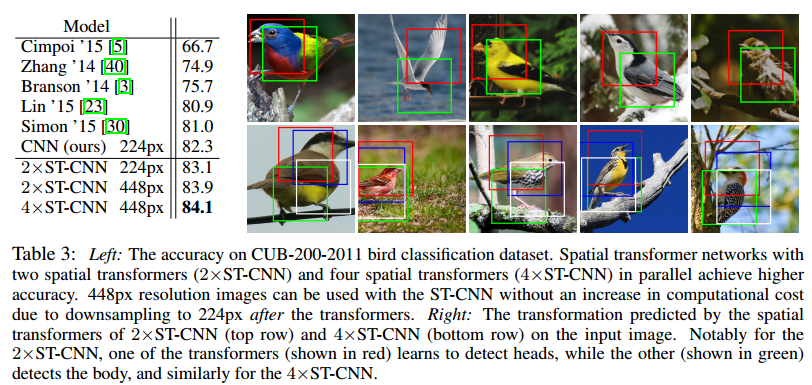

- ST-CNN效果最好
- 右侧上边使用了 2 路 Spatial Transformer并行，可以看到其中一个 spatial transformer(红色) 检测的是鸟的头部, 而另外一个 (绿色) 检测的鸟的身体.  
- 右侧下边使用了 4 路 Spatial Transformer并行，有相似的效果.
- 此处的Spatial Transformer有点像目标检测的味道

## 3.4 MNIST Addition

这个试验是将任意两张MNIST中的数字独立的进行一系列变形，然后叠加到一块，给网络识别，标签是二者之和。

同样的测试 FCN, CNN, ST-CNN,2×ST-CNN。

2×ST-CNN在输入层使用了两个并行的Spatial Transformer，结构见下面table 4右侧。

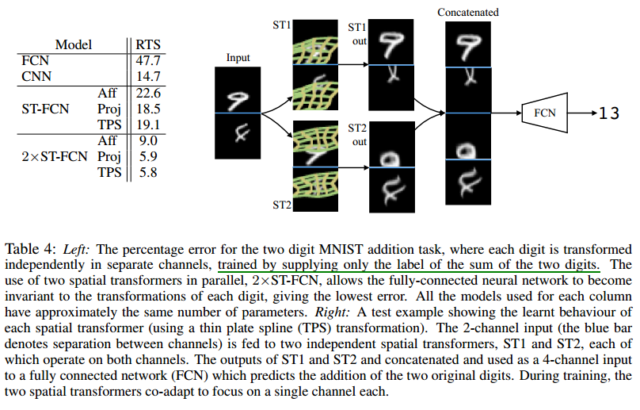

- 由于数据比较复杂，FCN的效果很差，添加了 Spatial Transformer之后，错误率显著下降
- CNN有池化层存在所以效果比FCN好
- 2×ST-CNN效果最好
- 从右边可视化的图中可以看到虽然每个输入channel都输入到了两个Spatial Transformer中，但是每个Spatial Transformer都是对其中一个channel作用强，而且这两个Spatial Transformer是互补的，所以最后连接起来之后 4个通道的feature map中有两个是完整的数字，所以识别较为有效。

## 3.5 Co-localisation

这个试验将 Spatial Transformer用在了半监督的任务Co-localisation 。

Co-localisation ：给一些图片，假设这些图片包含一些目标（也可能不包含），在不使用目标类别标签和目标位置标签的情况下，定位出常见的目标。

数据集还是 MNIST ，将 28×28大小的 数字图像 随机的放在 84×84 大小的含有噪声的背景上，对每个数字产生100个不同的变形。数据有定位标签，但是在训练时不用，测试时用。

模型还是使用 LeNet CNN模型，在输入层嵌入Spatial Transformer。

文章使用了半监督的方式，监督的学习过程是这样的：

对于一个 包含 N 张图片的 数据集 $I = \{I_n\}$  ，比如table 5 右侧的图。

- 最下面一行代表在同类别的样本中挑选一张 $I_n$ 做一个随机裁剪，裁剪出的这一块 $I_n^{rand}$ ,认为是目标位置
- 中间这一行代表将同样的样本 $I_n$输入 Spatial Transformer，输出 $I_n^{T}$ 
- 上面这行代表另选一个样本  $I_m$ 输入Spatial Transformer，输出  $I_m^{T}$ 
- 以上三个输出分别经过一个映射函数 $e()$ ，这个函数由 LeNet CNN模型提供，以便于将上述三个feature map映射成向量，映射成向量后可以计算两两之间的距离
- 计算 $L1=||e(I_m^T)-e(I_n^T)|_2$  , $L2=||e(I_n^T)-e(I_n^{rand})||_2$ , 训练过程中就是要保证 L1 < L2，L2是一个随机裁剪与经过Spatial Transformer的输出之间的距离，理应大于L1.

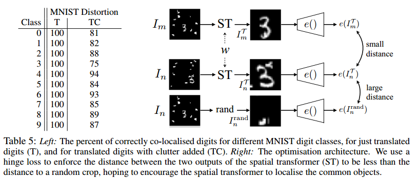

经过上面的分析，可以提出如下损失函数: hinge loss (triplet loss)

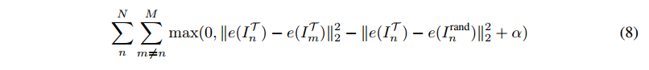

$α$ is a margin ,可以称为 裕度，相当于净赚多少。

半监督是因为这里的标签相当于 L2，而L2是人为构造出来的距离指标。

测试时认为检测出的box与ground truth bounding box的IOU 大于0.5为正确，table5 左侧为测试结果。

在没有噪声时，可以达到100%的准确率，有噪声时在75-93%之间。

下图是优化过程的动态可视化结果，可见随着迭代次数越来越多，模型对目标的定位越来越准确

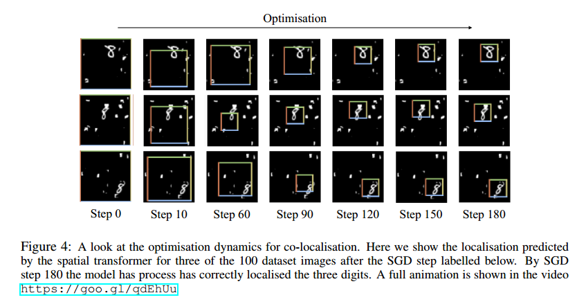

这个试验使用了一种简单的损失函数，在不使用数据定位标签的情况下，构建了一种距离标签，实现了对目标的检测。这个可以推广到目标检测或追踪问题中去。

作者把前面一些检测的动态效果做成了视频，看起来很清晰明了，看这里：https://goo.gl/qdEhUu 

# 4 总结

这篇文章提出的 Spatial Transformer 结构能够很方便的嵌入到现有的CNN模型中去，并且实现端到端（end-to-end）的训练，通过对数据进行反向空间变换来消除图片上目标的变形，从而使得分类网络的识别更加简单高效。现在的CNN的已经非常强大了，但是 Spatial Transformer 仍然能过通过增强空间不变性来提高性能表现。Spatial Transformer实际上是一种attention机制，可以用于目标检测，目标追踪等问题，还可以构建半监督模。

下一篇介绍 Deformable Convolutional Networks ，跟本篇的TSN思路很像，但是又比这个模型简单。

# 参考资料

1. [opencv中文教程——仿射变换](http://www.opencv.org.cn/opencvdoc/2.3.2/html/doc/tutorials/imgproc/imgtrans/warp_affine/warp_affine.html)
2. [仿射变换与齐次坐标](https://guangchun.wordpress.com/2011/10/12/affineandhomogeneous/)
3. [知乎——如何通俗易懂的理解高维仿射变换与线性变换](https://www.zhihu.com/question/20666664)
4. [维基百科——双线性插值](https://zh.wikipedia.org/wiki/%E5%8F%8C%E7%BA%BF%E6%80%A7%E6%8F%92%E5%80%BC)
5. [图像处理之插值运算](http://blog.csdn.net/lz0499/article/details/69791572)
6. [讲STN的一篇博客，不过关于仿射变换那一块写的是错的，但是其中的图还是挺不错的，借用几张图](http://www.cnblogs.com/neopenx/p/4851806.html)