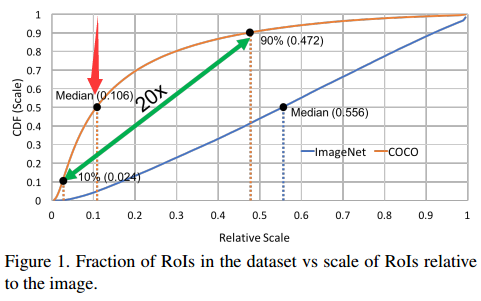
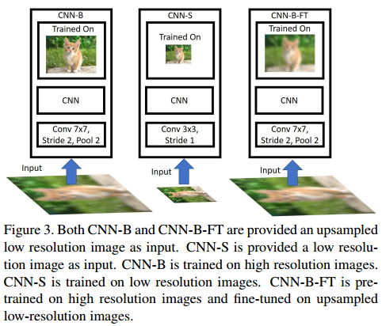
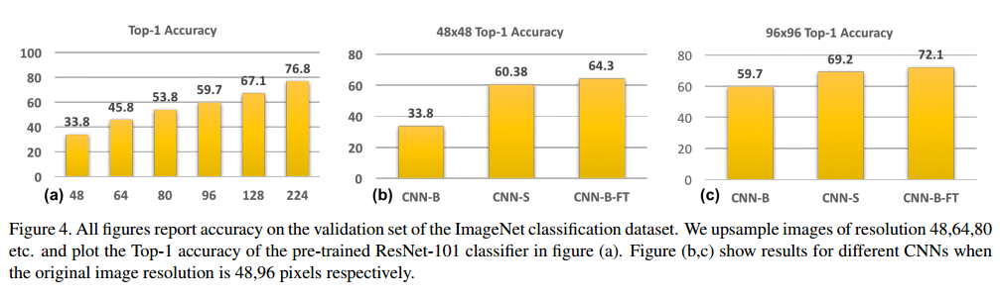
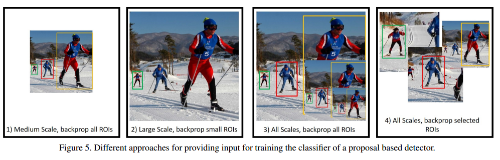
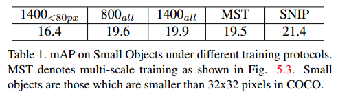
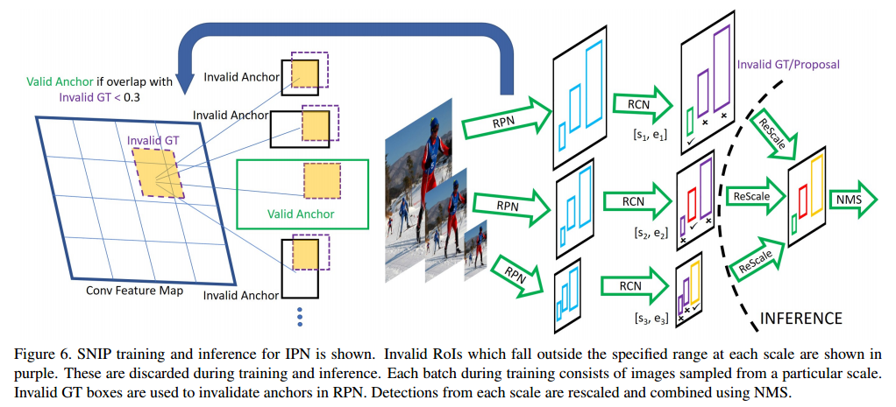
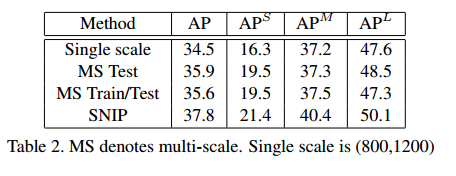
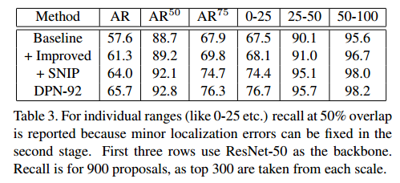
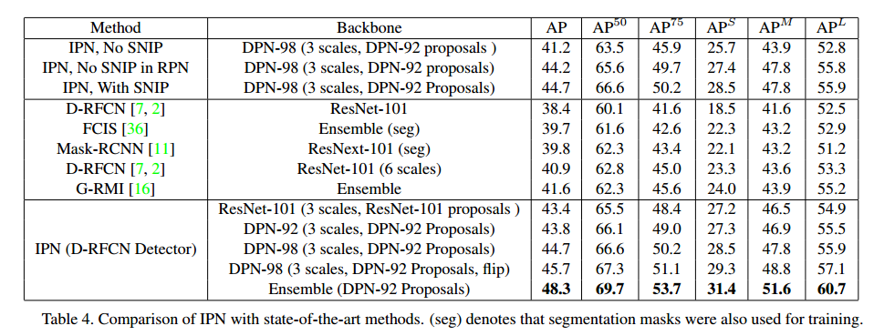

> CVPR2018   the Best Student Entry in the COCO 2017 challenge
> 论文：[An Analysis of Scale Invariance in Object Detection-SNIP](https://arxiv.org/abs/1711.08189) 
> 代码：https://github.com/bharatsingh430/snip

这篇论文看了几遍才看明白什么意思，哎，功力火候不够啊。。。不过感觉越看越有意思，文章思想还是很巧妙的。

这里还有个王乃岩大神写的 https://zhuanlan.zhihu.com/p/36431183 SNIP的剖析，写的很深入，要是看明白了这个，就不用看这篇文章了。

# 1 问题提出

计算机视觉问题中，分类（classification）任务是最简单的，而且最近几年随着各种新的模型提出，ImageNet分类准确率逐步提高，现在已经能够超过人类的识别率，top-5准确率已经提高到98%左右（SENET）。但是对于检测（detection）来说，按照检测任务的评估方法（mAP/AP，关于mAP/AP的介绍可以参考这里），如果不考虑使用额外的数据，那么[PASCAL VOC 排行榜](http://host.robots.ox.ac.uk:8080/leaderboard/displaylb.php?cls=mean&challengeid=11&compid=3&submid=17462)最高为77.5（mAP），[MS COCO排行榜](http://cocodataset.org/#detection-leaderboard)最高为 73.0 （AP@0.5）。虽然分类与检测使用的评估标准不一样，分别是准确率（accuracy）和精度（precision），但是从发展的速度来看，明显检测任务的发展是比较缓慢的，这也说明了检测任务的复杂性和难度。检测任务为什么比分类难，一个宏观上的原因是由于 检测是一种密集型的分类任务（当然有些模型会用回归的方式来检测），除此之外还有很多其他原因，这里不详细分析。当然这里肯定要提出一个比较重要的原因，这篇论文也是针对这个原因提出的优化训练方法。

检测任务由于目标的大小，形状不一，因此在检测时需要处理的一个重要的点，是scale。首先小目标的scale太小了，其次大目标和小目标的scale跨度太大。这两个scale上的问题是检测任务难度大、制约检测精度的难点**之一**。关于scale的含义，可以简单的理解为 目标面积开平方，比如我们经常说某个图片是 224×224大小的，或者某个目标是 30×30 大小的，这个224和30就是scale。

接下来看一下ImageNet和COCO数据集中的图片在scale上的分布（现在的新的检测模型往往更关注COCO上的结果，VOC用的不多了）:

这个图乍看起来有点懵，横轴竖轴都是scale。横轴的scale是目标大小相对于图片大小的相对scale，竖轴是当前scale下的目标数量占数据集中所有目标数量的百分比。这应该是一个累加的统计，比如箭头所指的点代表的意思是：COCO数据集中，相对scale小于0.106的目标占所有目标数量的50%。

可知以下几点：

- ImageNet中目标scale分布比较均匀：有一半的目标其relative scale是 $\le 0.556$（media scale）的，大小目标数量基本平衡。
- COCO中明显小目标占比更多：因为有一半的目标其relative  scale是  $\le 0.106$（small scale）的（面积相当于小于原图面积的1%，注意平方关系），而且有90%的目标其relative  scale是 $\le 0.472$ （media scale）的，只有剩下差不多10%才是 large scale的。
- COCO中目标scale跨度大：media scale（0.472） 和 smallest scale（0.024）相差20倍。

上面的现象造成的后果是：

- 对于检测器来说要处理这么大跨度的scale是很困难的， scale invariance将会受到极大影响。
- ImageNet与COCO数据集在scale上的分布差异，在迁移学习时将会造成domain-shift。

为了解决小目标检测困难，scale 变化跨度大等问题，有很多学者提出了很多方法：

- 结合深层feature map和浅层feature map预测小目标
- 使用dilated/deformable convolution（膨胀卷积）来增加感受野，这可以使检测器对scale跨度大的问题适应性更强（因为使用高分辨率图像或者上采样来增加小目标时，会使大目标变得更大，也不利于检测）。
- 在不同分辨率的图像上独立的预测不同scale的目标。
- 增加context信息
- multi-scale training
- multi-scale inference on an image pyramid combined NMS

以上几种方法的代表性论文基本都是检测领域中比较重要的论文，具体看原文吧，这里不提了。

以上方法都解决了一些问题，作者提出了两个问题：

- 对获得更好的精度来说，图片的上采样是有必要的吗？检测用数据集中额图片一般大小都在 480×640左右，但是为了提升对小目标检测效果，现在的很多检测模型在训练时都会图片放大到 800×1000 左右的大小。能不能在ImsgeNet上训练一个总步长较小的模型，然后再将它迁移到检测数据集上检测小目标？
- 在迁移学习时，是否应该将目标的大小都固定在一个范围比如从 64×64 到 256×256，是否应该将resize过的目标全部用于训练？

# 2  Multi-scale Classification

现在的很多检测模型为了提升对小目标的检测精度，一般都会在 800×1200的分辨率上训练图片，为了进一步提升对小目标的监测精度，在inference时会进一步放大图片，比如在1400×2000的分辨率上检测。

也就是说 train和test(inference)之间是存在domain shift 的。

当然从直观来说，放大图片确实会增加检测效果，但是作者做了很严谨的实验来证明这个现象。

如上图，是作者提出的三个用于做对照实验的模型。

- CNN-B：是在高分辨率图像的数据集上训练的（ImageNet 224），然后测试时，先将ImageNet的图像下采样至 48x48, 64x64, 80x80, 96x96 and 128x128 大小，然后再上采样至224，将这个ImageNet称为 ImageNet  up-sampled low resolution images to 224。
- CNN-S：是在低分辨率图像的数据集上训练的（ImageNet 48x48, 64x64, 80x80, 96x96 and 128x128, 通过降采样完成），测试也是在相应分辨率上测试的。
- CNN-B-FT：是在高分辨率图像的数据集上训练（ImageNet 224），而后又在上采样到224的低分辨率的数据集上fine tuning的（ImageNet  up-sampled low resolution images to 224数据），测试也是在ImageNet  up-sampled low resolution images to 224上。

上图是结果分析：

- （a）：CNN-B 在不同分辨率图像上的测试精度，注意CNN-B是在高分辨率图像上训练的，然后在 由不同低分辨率图像 上采样构成的 ImageNet 上测试的。很明显，测试图像与训练图像的分辨率差别越大，效果越差。使用网络没有训练过的图像进行测试，结果只能是次优的，至少对于分类问题来说是这样。

- （b），（c）：三种训练好的模型在 48×48 (96×96)大小的低分辨率图像上的测试精度，CNN-B的效果最差，CNN-S次之，CNN-B-FT最好。

  - 直接用低分辨率图像训练（CNN-S，减小步长），然后低分辨率测试，效果是比较好的。

    这给我们的直接启发是如果检测时想要提升对小目标的检测效果，应该专门在低分辨率的ImageNet上训练一个对低分辨率图像最优的分类模型（通过减小步长），然后再迁移到检测任务上，用于检测小目标。

  - 先从高分辨率图像训练然后再在上采样后的低分辨率图像上fine tuning 效果最好，说明分类模型在高分辨率图像中学习到了其他更有用的信息，上采样是有用的。

    这给我们的直接启发是在高分辨率图像上先预训练，然后再在低分辨率图像上fine tuning，对于分类小目标是有利的，应该比前一条提到的方法更有效。

进一步：

- 在高分辨率图像上先预训练，然后再在低分辨率图像上fine tuning，对于分类小目标时有利的。
- 如果检测时的proposals与ImageNet预训练模型的分辨率相近，那么可以减少domain shift。
- 上采样确实是有用的

现有的检测模型也确实都是这么做的，先将图片上采样（800×1200），然后使用在高分辨率图像（ImageNet）上预训练的模型fine tuning。

# 3 Multi-scale Detection

前面提到train和test时分辨率不同将会存在domain shift，但是由于GPU现存的限制，这个差异一般都会存在。事实检测模型经常会在800×1000的分辨率上训练，然后再1400×2000的分辨率上测试。

下面是作者做的几个实验，作者固定了测试时的分辨率为 1400×2000 ，然后通过调整不同的输入来对比COCO数据集上小目标（小于32×32的目标）的检测精度。作者主要使用了800×1000和1400×2000这两种输入分辨率，然后再梯度反向传播时，把所有scale的ROI的梯度回传。因此下表 800all,1400all，就是代表这个意思。

- 首先是800all和1400all的对比：按照前面第2节的分析，关于分类问题高分辨率图片是可以提升分类效果的，所以理论上使用大分辨率的图像检测，应该也会提升小目标的检测效果的，而且1400all是不存在train和test的domain shift的，因为train和test的分辨率是一样的。但是实验发现，这里 1400all的结果竟然低于800all，作者的分析是有大分辨率图像中medium和large 的目标也会变得更大，这也是不利于检测的，所以说，虽然大分辨率有利于小目标检测，但是损害了中等和大目标的检测效果。
- 1400(<80px)和1400all的对比：为了验证上面的解释，作者又做了一个实验，输入还是1400all，但是将目标大于80px的目标全部都忽略掉，只保留小目标，按说排除了大目标的影响，小目标的检测效果应该有所提升，但是很不幸，还是很差，比800all都差。作者的分析是，移除大目标会损失目标的多样性。这个损失掩盖了移除大目标地优势。
- MST：最终作者还用 multi-scale training，做了实验（figure5.3），结果还是差不多，作者分析的原因是，**小scale 图像中的小目标更小了，大scale 图像中的目标更大了，这种极端尺寸的目标会损害性能。**
- SNIP：性能最牛，下面再分析。

# 4 SNIP

Scale Normalization for Image Pyramids (SNIP).

前面说了那么多，这一部分才是文章的核心。

通过上面的分析，SNIP的思想是比较明显的。SNIP训练的方法是一种改进的multi scale training，而且他保证了目标实例的大小在224×224大小左右，这个与ImageNet与训练的分类网络的尺度是统一的，减少了domain shift。

SNIP在训练时只考虑了那些在合适scale范围内的ROI，那些极端尺寸的ROI都直接被忽略。结果在table 1中也展示了，效果是最好的。

作者使用了R-FCN的基础模型。

因为是multi-scale training，在某个分辨率 i 上，如果一个ROI的大小落在了一个有效范围内，比如 $[s_i^c,e_i^c]$ ，那么这个ROI回被标记为有效；其余标记为无效，无效的ROI在反向传播时不予考虑。这样就可以将极端尺寸的ROI过滤掉。

实际在操作中，ground truth box在不同分辨率的图片上会随之放大或缩小，因此过大或过小的 gt box就被标记为无效。在RPN层生成anchor或者 proposals时，anchor如果与无效gt box的IOU大于0.3，那么这些anchor就会在反向传播时被忽略。在测试或者inference时，每张分辨率不同的图片都运行这样一个检测器，对于检测出来的bounding box如果范围落在有效范围 $[s_i^c,e_i^c]$ 之外，就会被忽略。最终使用NMS。这样就保证了每个分辨率图片上的目标scale是一样的。

在 ROI pooling 时保证pooling之后的 ROI 在224×224大小（这地方应该有个resize操作或者resale操作），这样就减少了与ImageNet预训练的分类网络的domain shift。

# 5 训练

训练使用的图片分辨率比较高（1400x2000），为了减少GPU显存，作者在原图上进行crop，裁剪出1000×1000大小的chip。裁剪过程是：先随机生成50个1000×1000大小的chip，然后选取包含包含最多目标的chip保留。如果图像分辨率是 800x1200 or 480x640 就不用这么随机裁剪了。

文章使用了三个scale的image pyramid来做multi scale training，分别是(480, 800), (800, 1200) and(1400,2000),

训练策略：

- 7 epochs for the classifier while RPN is trained for 6 epochs
-  warmup learning rate of 0.00005 for 1000 iterations after which it is increased to 0.0005.
- Step down is performed at 4.33 epochs for RPN and 5.33 epochs otherwise.
- OHEM online hard examplemining 
- implementation is in MxNet and training is performed on 8 Nvidia P6000 GPUs. Batch size is 1 per GPU and we use synchronous SGD.
-  For efficient utilization of multiple GPUs in parallel, images of only one resolution are included in a mini-batch. 

三个scale的image使用的object 的scale分别是：

- images of resolution (1400,2000), the valid range in the original image (without up/down sampling) is [0, 80],
- at a resolution of (800,1200) it is [40, 160] 
- and at a resolution of (480,800) it is [120, 1]. 

随后这些object 回被re-scale到224×224大小。

# 6 实验结果

实验部分详细的描述不提了。

# 7 总结

- 这篇文章通过对比实验验证了上采样对提升分类性能有很大帮助，基于此分析作者提出了一种 Image Pyramid Network（IPN）用于目标检测，在训练和测试时都使用与ImageNet分类网络同样的image scale。
- 由于过小和过大的目标分别在 小的scale上和大的scale上较难识别，因此作者提出了一种SNIP的训练方法，在反向传播时将极端尺寸的目标忽略。

# 参考资料

1. 王乃岩大神写的 https://zhuanlan.zhihu.com/p/36431183，写的很深入本质