> 论文：[Cascade R-CNN: Delving into High Quality Object Detection](https://arxiv.org/abs/1712.00726)
> 代码：https://github.com/zhaoweicai/cascade-rcnn

这是一篇针对R-CNN系列的两步检测模型 提出的改进方法。主要是针对匹配策略提出了 multi-level 的方式。

# 1 问题提出

检测=分类+定位，对于分类来说，标签就是标签，直接计算损失。但是对于定位问题来说，它的标签处理稍微麻烦一点。现在的目标检测模型对于定位问题的解决方法主要是回归。我们来看一下在Faster R-CNN中是如何进行回归的：

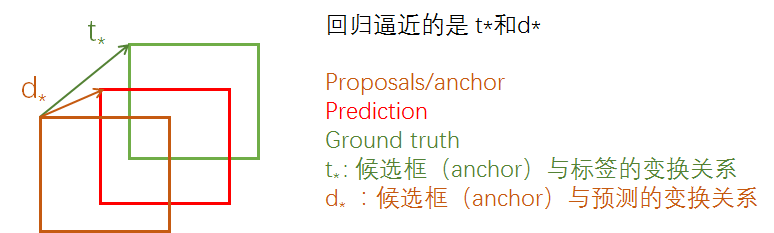

现在的问题是生成的 anchor box是有很多的，那么势必会导致只有少部分是包含目标或者是与目标重叠关系比较大的，那当然只有这以少部分才是我们的重点观察对象，我们才能把他用到上述提到的回归过程中去。因为越靠近标签的default box回归的时候越容易，如果二者一个在最上边，一个在最下边，那么回归的时候难度会相当大，而且也会更耗时间。

确定这少部分重点观察对象的过程就是匹配策略。换句话说其实就是为了确定一部分对象作为正样本。

所以对于回归问题来说，需要把ground truth box转换一下，也就是这里的正样本。

确定正样本的过程普遍的做法是：计算anchor box与ground truth 之间的IOU，大于某一个阈值就认为这是一个正样本，这个阈值一般是0.5。

但是实际上严格来说使用0.5的阈值偏低，造成的结果就如 Figure 1(a)那样会有很多，“close” false positives ，通俗的说就是有很多重复的没用的框，可以称为噪声，而我们期望的是输出像  Figure 1(b)那样。

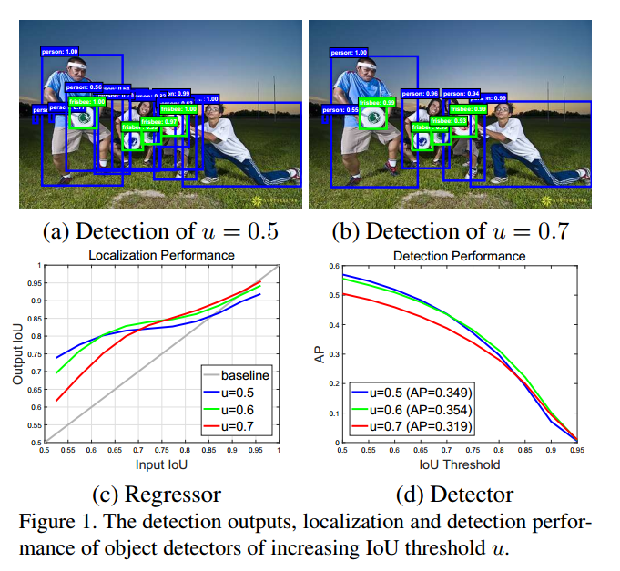

但是提高IOU阈值是会出问题的，因为提高 IOU阈值会使效果变差，主要有两个原因：

- 提高IOU会导致正样本数量过少，然而模型比较大，会导致过拟合。
- detector肯定是在某一个IOU阈值上训练的，但是inference时，生成anchor box之后，这些anchor box跟ground truth box会有各种各样的IOU，对于这些IOU来说detector是次优化的。

文章解决的也是这个问题。

# 2 Cascade 结构的提出

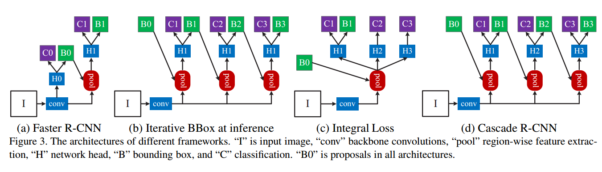

首先看一下目标检测中广泛使用的定位损失：

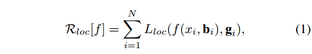

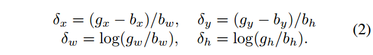

分类损失

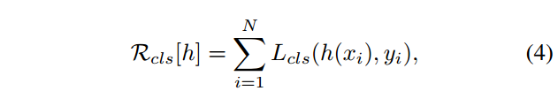

## 2.1 两种可能的解决方法

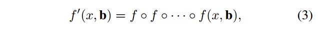

**iterative bounding box regression, denoted as iterative BBox.**   

如 Figure 3(b).

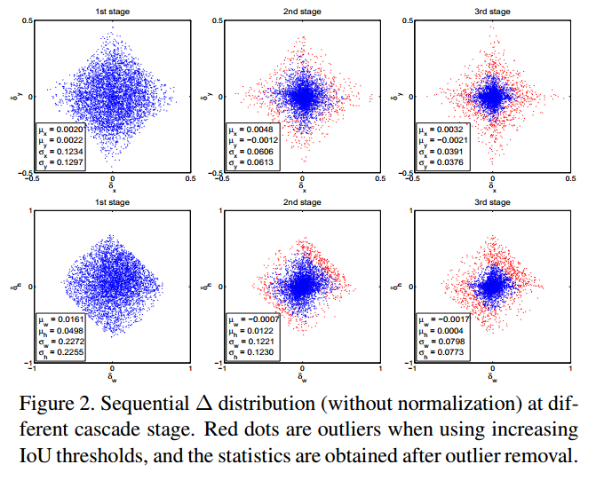

存在的问题：

- 三个head部分是一样的，也就是说都是针对某一个IOU阈值，比如0.5，是最优化的，但是当inference时，真正的IOU大于0.5以后他是次优化suboptimal 的。
- 很明显级联之后，每个输出的box的分布是会变化的如上图 Figure (2)，所以相同的head对于后面的结构来说是次优化的suboptimal 。

**第二种方法：**

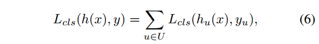

也就是Figure 3(c).

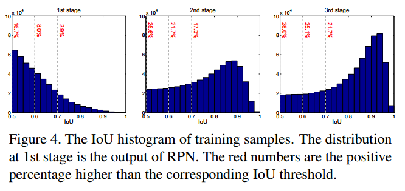

存在的问题：不同IOU阈值的分布是不均衡的，如上图左。所以上面的损失是不均衡的。

## 2.2 Cascade R-CNN

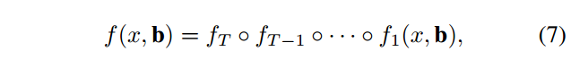

如图 Figure 3(d):

损失函数：

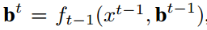

# 3 试验结果

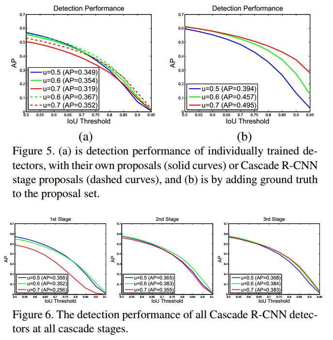

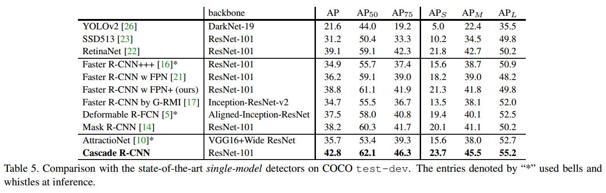

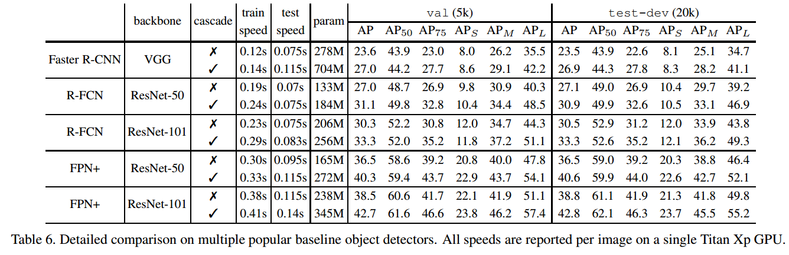