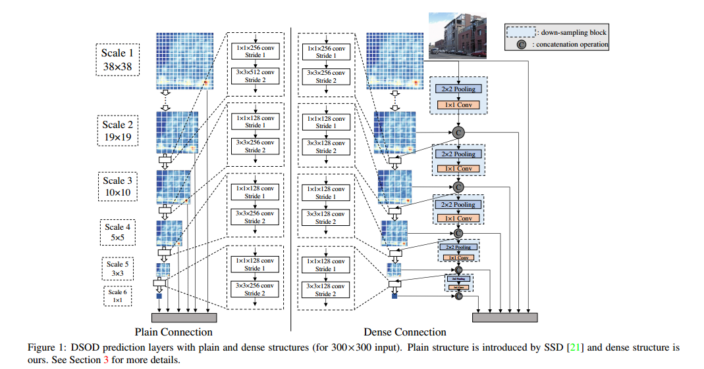
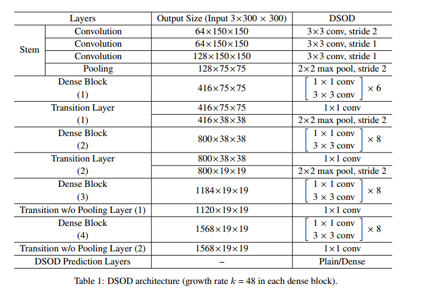
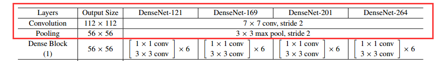
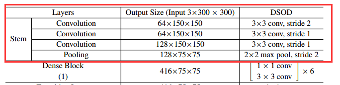
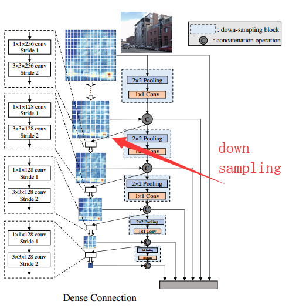
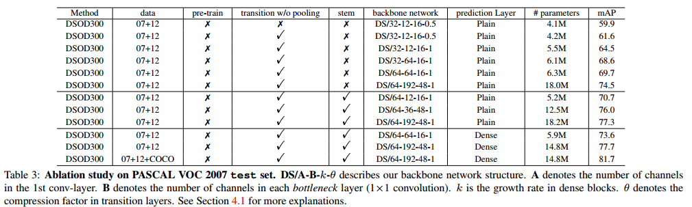
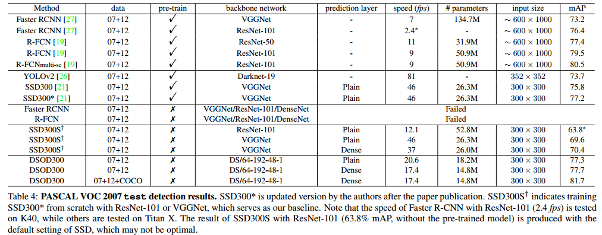
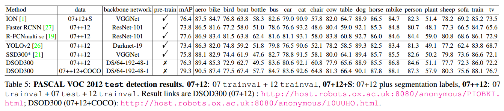
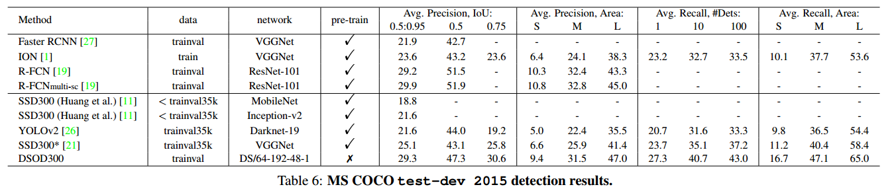

> 论文：[DSOD: Learning Deeply Supervised Object Detectors from Scratch](https://arxiv.org/abs/1708.01241) 
> 代码：https://github.com/szq0214/DSOD

# 0 简介

这篇文章提出了一种不需要预训练的目标检测模型。

现在的目标检测模型为了获得较高的精度，普遍采用的做法是：拿在ImageNet上预训练过的分类网络 fine-tuning。fine-tuning 也可以称为是迁移学习，它的好处有两个：（1）有很多针对于ImageNet公开的深度网络模型，可以很方便将这些公开的网络用到目标检测问题上；（2）fine-tuning 训练要比完全从头训练（train from scratch）更省时间，而且fine-tuning对数据量的要求不像分类问题那么严格，可以使用较少的标注数据训练得到比较好的结果。

但是使用预训练的网络存在以下三个问题：

1. Limited structure design space：网络设计空间受限。预训练的网络往往都是计算量，参数量很大的网络，应用到目标检测上之后，虽然针对 head 部分的设计可以随心所欲，但毕竟前面的backbone是固定的，因此计算量和参数量基本固定，网络调整的灵活性不大。
2. Learning bias：学习的偏置问题。分类问题和检测问题的loss函数以及类别分布是不同的，作者认为迁移学习时可能会引入 bias ，二者的优化空间是不同的，有可能使检测问题陷入局部最小值。即便fine-tuning可以在一定程度上消除这个bias问题，但是能够消除多少是不确定的，作者认为这并不能从根本上解决问题。
3. Domain mismatch：应用领域的不匹配。当ImageNet与你要应用的领域有较大的不同时，比如深度图，医疗影像等数据集，由于数据集本身的 huge mismatch 也会对迁移学习后的结果又一定影响。

基于以上问题，作者认为根本的解决方法是构建一个网络，并且 train from scratch 。作者也构建了这么一个网络成为 DSOD 。DSOD的结果确实要好一点。

作者关于迁移学习存在的问题只是理论与经验上的推断，确实有一定道理，但是也仅仅是推断而已，作者并没有用大量的试验来验证。关于迁移学习的问题，刚发现了一篇论文 [Do Better ImageNet Models Transfer Better?](https://arxiv.org/abs/1805.08974) 使用了大量的试验来验证 关于迁移学习的问题，这个后面会仔细阅读一下。

这篇文章的主要贡献：

- 全球首例可以 train from scratch 的目标检测网络模型。
- 在设计过程中提出了应该遵守的原则。
- 在 PASCAL VOC 2007, 2012 and MS COCO datasets    三个数据集上获得了state-of-the-art 的精度、处理速度和模型紧凑性。

# 1 DSOD

DSOD 的设计思想可以从下图中看出。

DSOD是在SSD的基础上发展而来的，DSOD的不同在于，不管是在backbong还是head部分，DSOD都借鉴了DenseNet的设计思想。关于DenseNet的详解，可以看这里。

DSOD的详细网络结构见下表：

点击 [这里](http://ethereon.github.io/netscope/#/gist/b17d01f3131e2a60f9057b5d3eb9e04d) 查看这个网络结构的可视化。

网络的一些设计原则：

**Principle 1: Proposal-free.** 

目前已有的目标检测模型主要有两大类：

- R-CNN，Fast R-CNN, Faster R-CNN and R-FCN 等 region proposal based 的两步检测模型
- YOLO, SSD等 proposal-free的一步检测模型

作者的实验表明 region base的两步检测模型如果train from scratch将不会收敛，作者认为是ROI池化的存在使梯度不能平稳地从region-level 传递到 feature map（RoI pooling generates features for each region proposals, which hinders the gradients being smoothly back-propagated from region-level to convolutional feature maps.），然而对预训练模型 fine-tuning 可以收到比较好的结果是因为 ROI池化之前的层拥有一个比较好的初值，而不需要随机赋初值，这个在train from scratch时是不存在的。

作者使用proposal-free的SSD模型，得到了stateof-the-art 的精度和速度。

**Principle 2: Deep Supervision.**  

这个原则实际上就是如何选择深层神经网络。原文是这么说的

> The central idea is to provide integrated objective function as direct supervision to the earlier hidden layers, rather than only at the output layer. 

根本思想是提供一个集成的objective function，也就是损失函数不仅要给输出层提供监督信号，还要对网络中前面的非输出层提供监督信号。看到这里我们很显然的想到了 ResNet 和 DenseNet 都是符合这个要求的，二者都存在skip-connection。作者也提到了这两个网络，不过作者最后使用的是DensNet，毕竟DenseNet在ImageNet上的效果略胜一筹。

此外还使用了 Transition without Pooling Layer 来增加dense block数量。

**Principle 3: Stem Block.**  

stem block是 inception v3和v4中的结构，就是除了那些卷积block之后，主干网络中与传统 CNN 一样的部分，就是卷积+池化的堆叠结构，不存在skip-connection等特殊结构。

DenseNet的前面几层，也就是Dense block之前的stem部分是下面这样的，

DSOD中被修改成了这样的：

**Principle 4: Dense Prediction Structure.** 

Dense Prediction Structure.中有个特殊的处理，看下图：

每一个scale中的feature map（channel）中只有一半是通过前面层学习得到的，还有一半是直接通过降采样得到的。上面图中的红色箭头所指的黑色箭头就是代表这个意思。

在这个图中用于预测的层也采用了 dense block的结构（head指scale2-scale5预测层，scale1是在backbone中的），但实际上这一部分也可以使用与SSD一样的普通的卷积层（plain），这一点作者也做了相关实验来对比二者之间的差别。

# 2 训练策略

框架：caffe

硬件：NVidia TitanX GPU

训练策略上大部分都沿用了SSD的相关策略，有略微差异，这一部分不再叙述。

# 3 实验结果

## 3.1 对照实验

**DSOD本身关于densenet 网络配置参数的对照实验** 

- 这里只提一点：当backbone与prediction Layer都采用 densenet的结构时，效果最好。
- 其他关于压缩系数 growth rate 以及 各种channel数量的影响不再赘述

**DSOD提出的设计原则之间的对照实验**

- 注意一点：当Faster R-CNN train from scratch 时，是不收敛的
- SSD train from scratch 时 是可以收敛的，但是精度会降低，当结合densenet构成DSOD时，精度一下又上去了。
- 参数量减少很多，这一部分得益于densenet。

有趣的是，作者提出的DSOD本来是使用train from scratch的方法训练的，但是作者也尝试过使用DSOD先在ImagNet上预训练，然后在VOC上fine-tuning的方式：

作者使用 backbone network DS/64-12-16-1 （这个架构比DenseNet论文中使用的效果好于ResNet的结构在配置上差很多）在 ImageNet上预训练, 获得了 66.8% 的top-1 精度和87.8%的 top-5 精度，其结果稍差于VGG。将其用于在 “07+12” trainval set上预训练, 获得了 70.3% 的mAP（ VOC 2007 test-set）。

同样结构的DSOD直接 train from scratch，获得的mAP是70.7%，可以看到两种策略训练出来的结果很接近，train from scratch还略微好一点，这也说明了 densenet 的结构是比较适用于 train from scratch 的。

还有一个有趣的现象，从table 4中可以看到原版的SSD也就是使用VGG的SSD 从fine tuning 到 train from scratch 其精度是降低的。所以对于VGG结构的网络来说 train from scratch 并没有太大的好处。

参数量与速度方面：

DSOD的参数量：1/2 parameters to SSD300 with VGGNet, 1/4 to SSD300 with ResNet-101, 1/4 to R-FCN with ResNet-101 and 1/10 to Faster R-CNN with VGGNet.  

具体的速度看table4. 另外还有一个轻量级的版本，表中没列出：

A lite-version of DSOD (10.4M parameters, w/o any speed optimization) can run 25.8 fps with only 1% mAP drops    

## 3.2 PASCAL VOC 和 MSCOCO

PASCAL VOC 和 MSCOCO 的试验结果不详细赘述。

# 4 总结

这两年来深度网络特别是以 ResNet 为代表的深层神经网络发展很迅速，其促进了计算机视觉领域（还有其他领域比如NLP）的快速发展，很多视觉问题取得了高速的发展，基于这个趋势，人们会认为更深的网络，更多的数据集应该可以取得更好的结果，比如现在谷歌有个 Open Images Dataset ，包含大约900万张图片，这基本上是 ImageNet的 7.5倍大。当然这么多的数据集也许是好的，但是如果能通过合设计网络结构使网络在较小的数据集上能取得相当的结果，那么何乐而不为呢？

DSOD的结果就是很好的例子：train from scratch 仅仅使用了 16551 张图片就可以得到相当或者更好的精度，而fine tuning使用了 1.2 million + 16551 张图片。

DSOD的这个思想我个人觉得是很有意义的，因为尽管对于学术研究来说，随着硬件（GPU，TPU等）的发展和大公司公开新的更大的数据集，研究更深的网络以求获得更好的精度是可行的，但是对于深度学习的产品落地来说，大的网络结构是不现实的，毕竟你无法将100多层的以ResNet为基础的网络或者其他更深的网络跑在一个终端设备或者移动设备上，然而从产品落地的层面来说，终端设备或者移动设备的占比要更大，而大型的网络则只能做成云端或者服务器端的产品。