> 论文：[FSSD: Feature Fusion Single Shot Multibox Detector](https://arxiv.org/abs/1712.00960)
> 代码：https://github.com/lzx1413/CAFFE_SSD/tree/fssd

这篇文章在FPN的基础上进行了一定的思考，提出了一种新的特征融合方式，并将这种特征融合方式与SSD相结合，在损失一定速度的情况下，提高了检测精度。

这篇文章立足于特征融合。

# 1 简要介绍

首先是模型的拓扑结构：

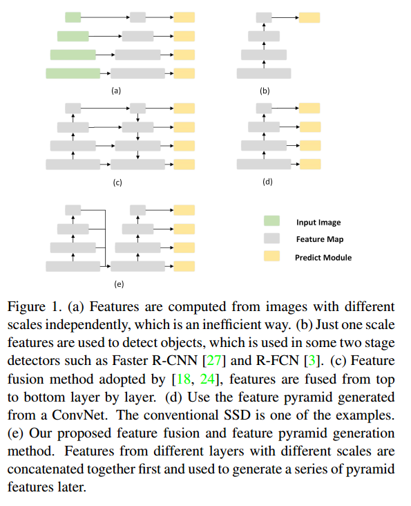

- (a)：featurized image pyramids ，使用 image pyramid 构建 feature pyramid，金字塔形状的feature是从不同scale的图片上计算出的。典型的使用这种结构的模型：OverFeat，R-CNN。
- (b)：对图片来说只有一个scale，但是为了达到 预测不同scale 的bounding box的目的，Faster R-CNN 提出了 anchor 的机制，解决了这一问题。典型的模型有：Faster R-CNN，R-FCN等。
- (d)：先说下d吧，这是SSD中提出的结构，充分利用了CNN自身的 feature pyramid 结构。结合了不同的层，分别预测，预测的时候是独立的，最后生成结果时才通过NMS融合。严格来说不能算是特征融合，只能说是multi-scale 预测。
- (c)：这是FPN和DSSD提出的结构，这个才是真正的特征融合，在预测之前先通过一系列上采样额外再生成一系列feature pyramid，并通过lateral/skip connections 与CNN主结构上的feature pyramid 特征进行融合，之后再去预测。
- (e)：这是本文的拓扑结构。与FPN结构相似，但实际上跟FPN 有很大的不同。FPN是先上采样，再多个层融合；FSSD是先融合多个层的feature map，后面再跟一个CNN模块，这个CNN模块跟SSD是一样的，采用multi-scale预测。

实际上除了上面的一些拓扑结构之外，还有一种拓扑结构，就是下图的 (b)。

- (a)：与前面那个图的(a)是一样的，image pyramid。
- (b)：这种结构是前面没有提到的，multi-scale filter ，这个跟SSD比较像，SSD是multi-scale prediction，每一个prediction 都对应一种size的filter。
- (c)：Faster R-CNN的anchor机制，从(b)中发展出来的，把multi-scale filter 换成了 multi-scale anchor。

# 2 模型设计

## 2.1 Feature Fusion Module

作者认为 FPN的融合是在多个feature map进行的，这种侧向连接和  element-wise add 是很费时间的：

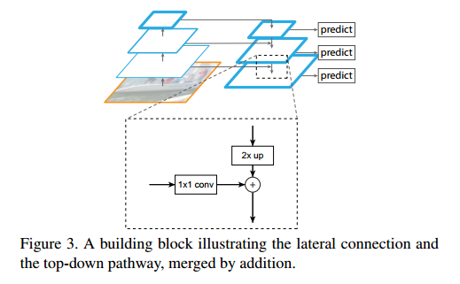

所以作者提出了一种 lightweight and efficient feature fusion module 

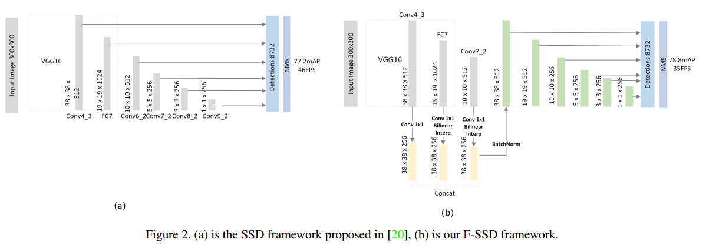

- 特征融合只在一个位置发生
- 后续的结构跟SSD是一样的

作者提出一种数学模型来表示这种结构：

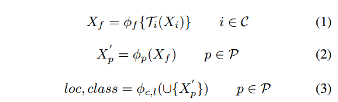

- $X_i, i ∈ C$   ：用于融合的 source feature map，SSD中选择的是：conv4 3, fc 7 of the VGG16 and new added layer conv6_2, conv7_2, conv8_2, conv9_2   。这篇文章选用的是conv3 3, conv4 3, fc 7 and conv7_2  
- $T_i$  ：在融合之前 每一个 source feature map的变换函数，类似于激活函数。在FPN中使用的是 1×1 的卷积来降低输入通道。这篇文章使用的 1×1 卷积 + 线性插值的， 1×1 卷积 同样是为了降低输入通道，线性插值是因为这里的融合是不同level的层或者前后层之间的融合，他们的feature map大小是不一样的，因此需要线性插值将所有的source feature map 转换成统一的大小。FPN中是侧向连接，是同一level的层之间的融合，因此不存在这个问题。
- $\phi_f$  ：特征融合函数，FPN中使用的 element-wise summation ，而这个操作不仅要求feature map的大小一样，还要求 feature map的通道数也要统一，这个在FPN中在使用 1×1 卷积时就保证了融合时的通道统一。由于操作麻烦，在FSSD中，1×1 卷积只负责降低通道，而不保证所有feature map的通道统一，融合时选用了concatenation 的操作，简单有效，不需要feature map的通道统一。
- $\phi_p$  ：生成 后续 pyramid features的函数，与SSD一样，只不过这个后续结构，作者在这个部分尝试了多种结构的堆叠，见下图。最终通过实验选择了一种简单的方式，这与SSD中的结构是一样的。
- $\phi_{c,l}$  ：用于检测和分类的函数，与SSD一样。

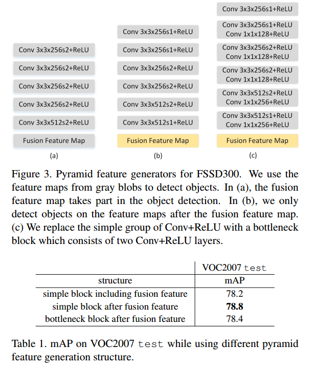

## 2.2 Training

两种训练策略：

- 第一种：由于这是在SSD的基础上改进的，所以可以使用预训练的SSD，然后fintuning
- 第二种：使用预训练的VGG，然后fintuning

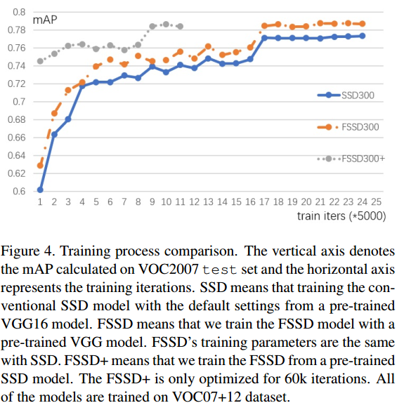

- SSD300：SSD的训练曲线（VGG+fintuning）
- FSSD300：前面提到的第二种，VGG+fintuning
- FSSD300+：前面提到的第三种，SSD+fintuning

两种训练方法训练出的模型的精度相差无几，但是第一种训练方法明显收敛更快。

# 3 实验

一些对照试验，决定了前面提到的很多参数的选取，比如用于融合的source feature map，融合的方法，训练方法，batch normalization等。

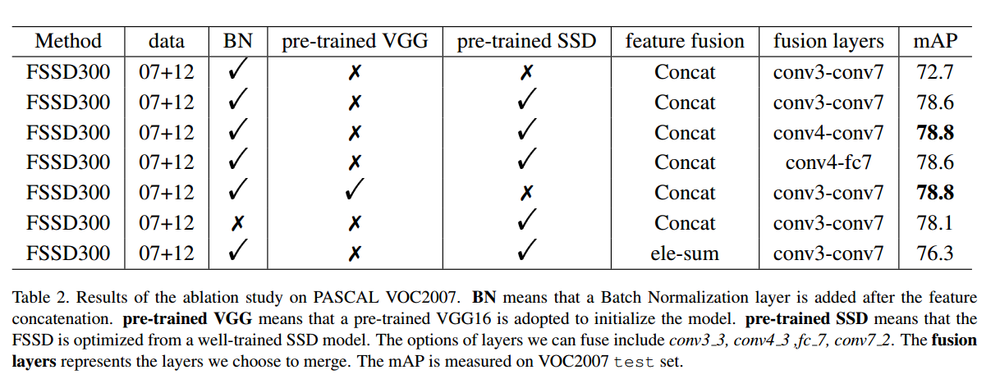

**PASCAL VOC**

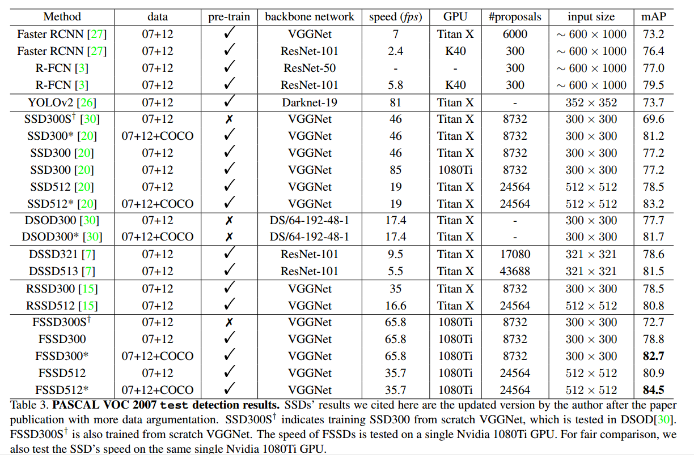

- 注意 在对比速度时，测试的GPU是不一样的，1080ti的性能比TITAN X要好很多。
- 网络的 backbone network也是不一样的。

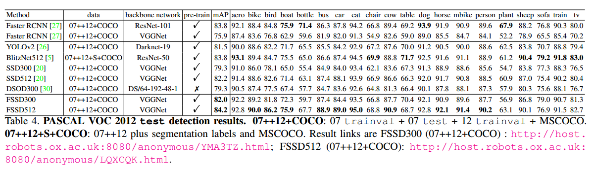

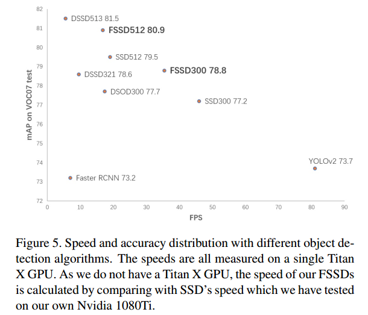

- 同样 注意 在对比速度时，测试的GPU是不一样的
- 这张图对比 FSSD，与SSD的速度是有意义的，因为其他模型都是在TITAN X上测试的。

**COCO**

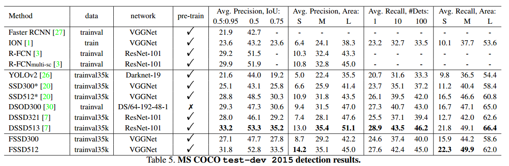