> 论文：[Focal Loss for Dense Object Detection](https://arxiv.org/abs/1708.02002)  ICCV2017 Best Student Paper Award 
> 代码：https://github.com/facebookresearch/Detectron

# 1 问题提出

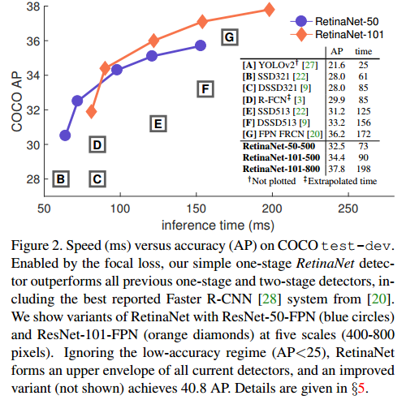

- two-stage detector ：精度高，速度慢

  - the first stage ： 生成一个 **稀疏的候选框的集合** （**a sparse set** of candidate proposals ），过滤掉大部分负样本（ filtering out the majority of negative locations）

    这第一阶段可以采用：selective search，edgebox，RPN等算法完成，是一个弱检测器。

    **可以极大的降低候选框的数量(e.g., 1-2k)**  

  - the second stage：对候选框进行 前景目标 或 背景 的分类 （classifies the proposals into foreground classes / background）

  ​

  对类别不平衡问题的解决 ：

  - sampling heuristics：such as a fixed foreground-to-background ratio (1:3), 通过RMS将前景目标和背景（或者负样本和正样本）的比例保持在 1:3 .
  - online hard example mining (OHEM) : 一种训练方法

- one-stage detector ：精度低，速度快

  生成一个 **稠密的候选框的集合** (a dense set of candidate proposals)，直接进行回归。

  这个密集的候选框的集合 数量在 100k 左右。然而正样本只有一少部分，大部分都是背景，这个类别不平衡问题比两步检测的方式要严重的多。

  解决方法：可以使用上面提到的两种方法，但是由于 易分类样本数量太多 损失函数会被这些样本产生的损失湮没。

  这个问题可以使用 bootstrapping 的方法来解决。不过这篇文章提出了一种更有效的方式。

  ​

**类别不平衡是导致 one-stage 检测方法精度不如 two-stage 的主要原因。**  

这是比较容易理解的：比如假设一张图片只包含一个目标，一开始有 100k 个可能包含目标的区域，可以先使用一个弱检测器挑选出 1k 个候选区域，然后再用一个强分类器对这 1k 个候选区域进行筛选，挑出最接近ground truth 的区域。这比直接从100k个初始候选区域中直接挑选1个要更精确。而且类别不平衡问题也没有 one-stage 方法的严重。

但是 two-stage 的代价就是：因为是两次分类所以速度上肯定会慢很多。

这篇文章主要是针对类别不平衡问题，解决 one-stage 检测方法精度不高的现象。

# 2 解决方法 Focal Loss

避免损失函数被 **易分类的负样本** 产生的损失湮没，注意 是 **易分类的负样本**

可以从以下两个方面解决

- 修改 **正样本 和 负样本** 对损失函数的贡献量，使二者平等
- 修改 **难分类样本 和 易分类样本** 对损失函数的贡献量，使二者平等

以下是 Focal Loss  的设计过程

## 2.1 交叉熵损失 Cross Entropy (CE)

先看下经典的 交叉熵损失（cross entropy  ）：

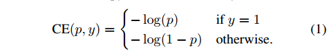

- $y\in\{±1\}$ ，代表正负样本
- $p\in[0,1]$ ，是分类的概率，代表正样本的概率（y=1），那么  $1-p$  代表负样本的概率（y=-1）

用下式改写

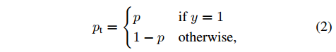

交叉熵损失改写为：

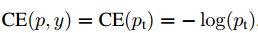

## 2.2 正负类别平衡的交叉熵损失 Balanced Cross Entropy

**修改 正样本 和 负样本 对损失函数的贡献量**  

- 给正样本的损失 乘上 一个权重 $\alpha \in [0,1]$ , 
- 给负样本的损失乘上 $1-\alpha$ 。

这样可以使二者对损失函数的贡献平等。使用同样的方法用  $\alpha _t$ 代表 $\alpha$ .

将交叉熵损失改写为：

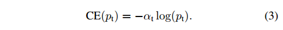

## 2.3 难易类别平衡的损失 Focal Loss

**修改 难分类样本 和 易分类样本 对损失函数的贡献量**

引进一个 调节因子 $(1-p_t)^{\gamma}, \ \ \gamma \ge 0$ , 

改写损失函数：

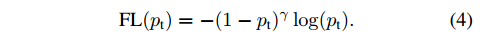

- 当 样本错分类（难分类样本），并且 $p_t$ 很小时，调节因子 趋向于1，而 $FL(p_t)$ 与 $CE(p_t)$ 接近；
- 如果是 易分类样本， $p_t$ 很大，调节因子趋向于0，损失也为0。

看下图:

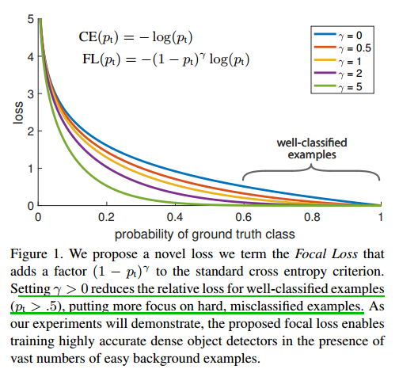

最终文章使用的损失函数是这样的：

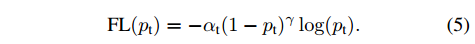

# 3 RetinaNet Detector

文章构建的一个 one-stage 检测模型，使用了上述提出的损失函数

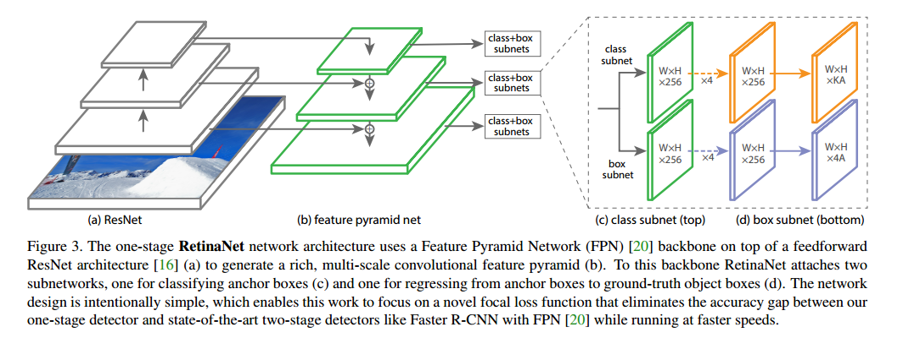

## 3.1 实验结果

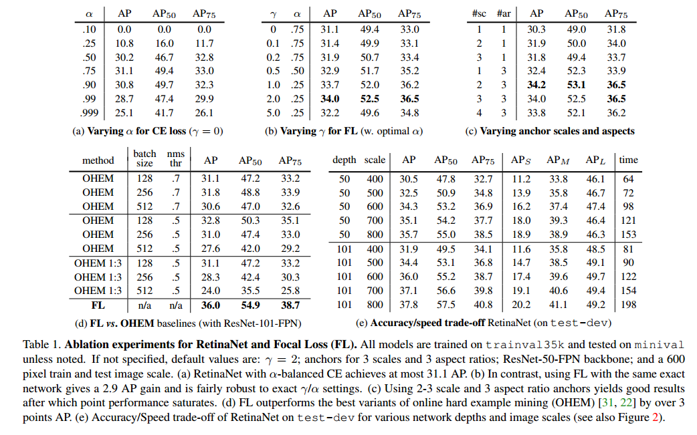

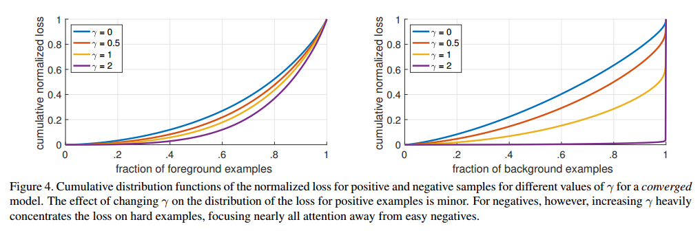

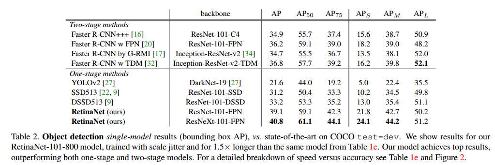

# 参考资料

[Huber Loss function](http://blog.csdn.net/lanchunhui/article/details/50427055) 

[Focal Loss function](https://ggbm.at/bDR5r4Ej) 