> 论文： [HyperNet: Towards Accurate Region Proposal Generation and Joint Object Detection](https://arxiv.org/abs/1604.00600)

# 1 简介

这篇文章主要解决了两个问题：

- 解决 R-CNN 系列 目标检测模型，需要生成几百上千的候选框（Faster R-CNN 300；Fast R-CNN 2000）的问题。HperNet 只需生成 100~200个候选框。而精度比 Faster R-CNN 还要好一点。
- 将deep ConvNet的高低层特征进行融合，进而利用融合后的特征进行region proposal提取和进一步目标检测。提升了对小目标的检测效果。

主要的贡献：

- object proposal task 上：使用50个proposals 可以获得95%的recall；使用100个proposals可以获得97%的recall。

  **注意：这个recall只是用于region proposals的，并不是针对 PASCAL 或 COCO 数据集的最终检测效果的recall。**就是说事先生成的 几百个region 与 ground truth 的区域IOU在某一阈值之上的region 占总 的ground truth的比例，这个比例自然是比最终detection的recall要高很多的。因为这个阶段相当于一个弱检测器，约束条件也不高，生成的框里面自然会包含很多 ground truth 的区域。

- detection challenges 上：在PASCAL VOC 2007 和 2012 数据集上取得的 平均检测精度（mAP），分别为76.3%和71.4%。比Fast R-CNN分别高了6个和3个百分点。

- HperNet 的快速版，可以达到 5FPS的速度。

宏观架构：

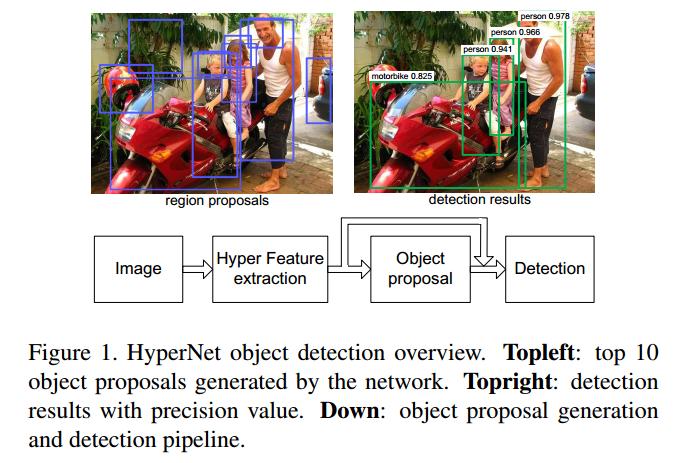

整个网络结构也属于两步检测，即先生成 region proposals ，再进行检测。

# 2 HyperNet 网络结构

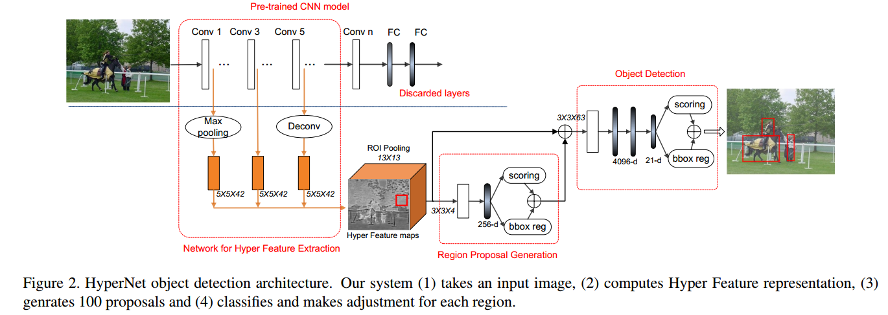

图中标注的 写法 比如 5×5×42 指的是，这是一个5×5的卷积核，卷积核的个数为42个，其他的 3×3×4，3×3×63也是一样的写法，写的都是卷积核的参数。

整个网络结构跟 Faster R-CNN 还是比较像的。

主要分为三部分：

- 第一部分：卷积层提取特征，然后进行特征融合；
- 第二部分：弱检测器，生成候选区域，卷积层+全连接层, Conv+FC；
- 第三部分：强检测器，生成最终的检测结构，卷积层 + 全连接层，Conv+FC。

下面分别介绍：

## 2.1 Hyper Feature Production

特征融合，如下图：

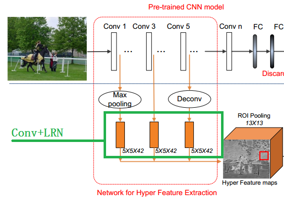

- 将图片resize，使得最短边 为600（比如：resize后的大小为 1000×600）；
- 首先使用基础卷积神经网络（Alexnet，VGG）提取特征；
  - 在最底层卷积层（conv1）后面加上 max pooling 层，实现降采样；
  - 在最高层卷积层（conv5）后面加上 反卷积 deconv 层，实现上采样；
  - 中间层（conv3）不做处理；
- 在上一步操作之后每一个 level 后面都再加 一系列卷积层（绿框中的黄色矩形）： 进一步提取语义特征、将不同分辨率的feature map 压缩到相同的分辨率。
- 卷积后每个 feature map 加局部响应归一化 LRN，之后输出 Hyper Feture maps。这里的Hyper Feture maps的大小不是13×13×126的，图上写的那个 13×13 是经过ROI 的大小（红色框框）。这点作者没说清楚，代码也没有，搞不明白Hyper Feture maps到底是多大。

假设使用VGG做特征提取，输入图片为1000×600。那么Conv1、Conv2、Conv3、Conv4、Conv5层的feature map 输出（不含池化层）分别为 1000×600，500×300，250×150，125×75，62.5×37.5。

最后的feature map会是62×37, 这样会造成信息损失。

- 因此把最后的Conv5层的feature map通过反卷积上采样到250×150，然后再经过一系列卷积；
- 把第一层Conv1的feature map做一个max pooling 降采样，然后再经过一系列卷积；
- 中间层，不做变化，直接经过一系列卷积；
- 然后把1，3，5层的feature map 进行 LRN之后连在一起。LRN是必要的，因为不同层的feature resolution 不同，如果不做正则，norm大的feature会压制住norm小的feature。

## 2.2 Region Proposal Generation

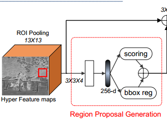

如上图，对于Hyper Feture maps 使用 ROI pooling 。ROI pooling 的大小是 13×13的，因此最后输出的特征是 ROI feature 是 13×13×126的。中间那个红色的框框是ROI，但是怎么来的，作者没说清楚。

ROI pooling之后使用了 3×3的4个卷积核。输出的是 13×13×4 的feature map，图上那个空白的矩形就是。之后再经过一个256维的 全连接层；再之后并行经过两个 两个全连接层，分别是分类和回归（用于定位）。

这个阶段每张图片生成 30k 个不同尺寸的 候选框。然后通过NMS，减少到1k 个，然后再取 top-100或top-200个。

不过有个疑问的地方：这里的ROI是怎么来的作者没说清楚。

这也是与Faster R-CNN的不同之处，Faster R-CNN的 ROI Pooling 是在RPN生成 region proposals 之后作用在生成的region上的。如下图Faster R-CNN的结构，对比一下二者在整体结构上的差别。

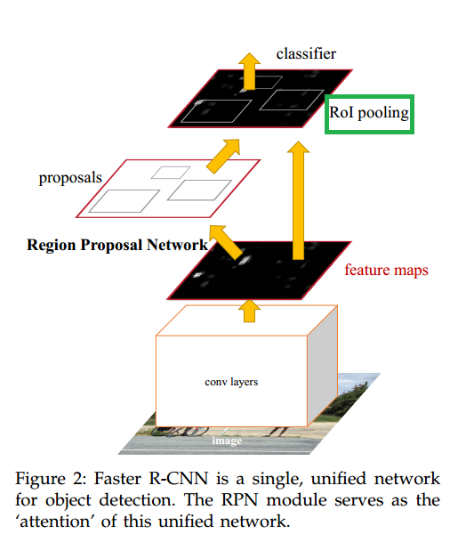

而在HyperNet中在生成region proposals时就使用了 ROI Pooling ，如下。

**Faster R-CNN中的ROI是 RPN生成的 region proposals。**

**HyperNet中的ROI是怎么来的是个疑问。而且HyperNet中的ROI相当于 Faster R-CNN中的anchor box。**

一直不知道HyperNet中的ROI是怎么来的，直到我在知乎上找到了 这个帖子：   [对话CVPR2016：目标检测新进展](https://zhuanlan.zhihu.com/p/21533724) 

这个帖子的作者（孔涛,清华大学）好像就是这篇文章的作者 （Tao Kong，Tsinghua University）

里面有一段话：

> HyperNet：文章的出发点为一个很重要的观察：神经网络的高层信息体现了更强的语义信息，对于识别问题较为有效；而低层的特征由于分辨率较高，对于目标定位有天然的优势，而检测问题恰恰是识别+定位，因此作者的贡献点在于如何将deep ConvNet的高低层特征进行融合，进而利用融合后的特征进行region proposal提取和进一步目标检测。**不同于Faster R-CNN，文章的潜在Anchor是用类似于BING[4]的方法通过扫描窗口的方式生成的，但利用的是CNN的特征，因此取得了更好的性能。** 
>
> 通过以上的改进策略，HyperNet可以在产生大约100个region proposal的时候保证较高的recall，同时目标检测的mAP相对于Fast R-CNN也提高了大约6个百分点。

里面有一句：

> **不同于Faster R-CNN，文章的潜在Anchor是用类似于BING[4]的方法通过扫描窗口的方式生成的，但利用的是CNN的特征，因此取得了更好的性能。** 

也就是说 HyperNet中的ROI 是使用类似于BING的方法提取的 ，上面提到的 BING[4] 文献是：

[4] Cheng M M, Zhang Z, Lin W Y, et al. BING: Binarized normed gradients for objectness estimation at 300fps. In CVPR 2014

这篇文章的项目主页是：http://mmcheng.net/bing/

大概看了一下论文，是一种利用手工设计的特征进行 object 估计的。这个特征叫做 binarized normed gradients features （BING）. 具体是怎么弄的，没仔细看。

看一下结果好了，图中的SEL是我们熟知的 Selective Search算法。DR是指object detection rate ，不清楚怎么算的。

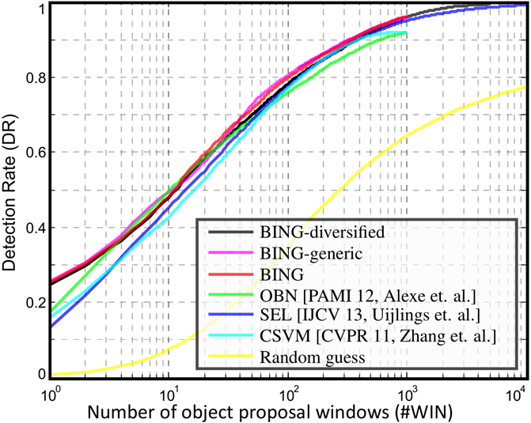

运行速度如下：

测试条件：Intel i7-3940XM CPU

| Method         | [1]  | OBN [2] | CSVM [3] | SEL [4] | Our BING |
| -------------- | ---- | ------- | -------- | ------- | -------- |
| Time (seconds) | 89.2 | 3.14    | 1.32     | 11.2    | 0.003    |

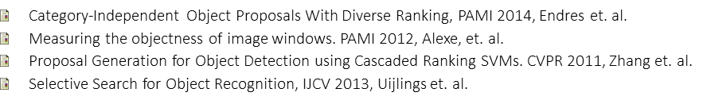

可见BING是比 Selective Search效果更好的算法，速度也比 Selective Search 快很多，可达300FPS。

也就是说HyperNet使用了额外的 region 估计算法，使得后面的 region proposals 提取的region更加精确，然后之后再进行object detection。

作者说的是使用的是类似于 BING的方法，具体怎么用的，没有代码，不知道是怎么用的。

## 2.3 Object Detection

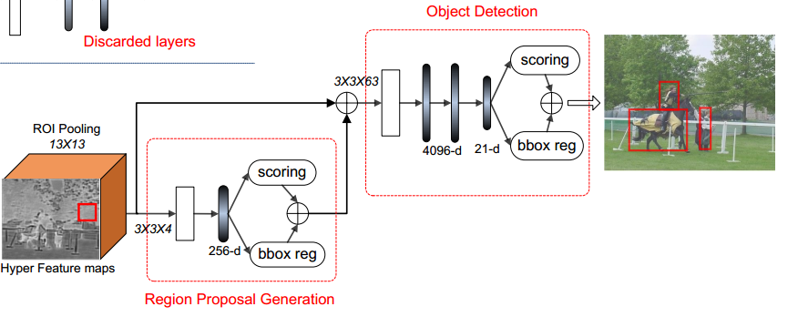

与Faster R-CNN不同之处在于 在两个全连接层之前使用了一个 3×3 卷积层，降低了输入通道（从126到63）。后面是三个全连接层。

还有一个不同是，全连接层之间的 dropout 层的概率使用的是0.25，不是0.5。

## 2.4 训练策略

损失函数：

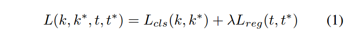

没啥大变化

训练步骤：

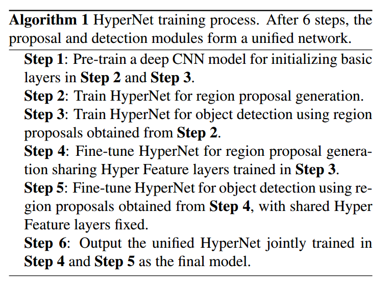

与Faster R-CNN训练步骤一样，都是先训练 region proposals 网络，然后保持卷积层部分权值不动，再训练object detection 网络。然后再保持卷积层特征提取部分权值不动，再训练region proposals 网络。

只不过这里多训练了两次。

## 2.5 加速

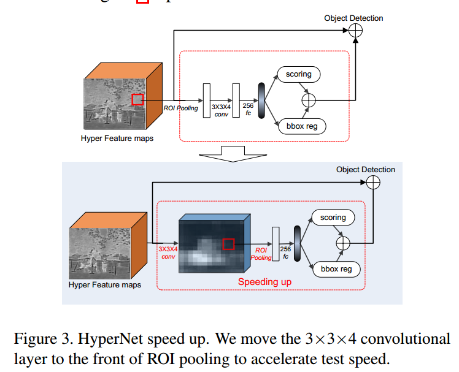

如上图，上边的图中两个空白矩形框，第一个是 ROI Pooling的输出，第二个是 3×3卷积的输出。

下边 的图中，3×3卷积的输出用了一个立方体，后面那个白色矩形框是ROI Pooling的输出。

在生成region proposals 时，将卷积层放在 ROI Pooling层之后，可以实现加速。

- 先卷积降低了通道数量（由126降到4）；
- 大量 proposal 的conv操作移至前方，实现计算共享；
- ROI Pooling 后面分类器的结构变成了全连接层，简化结构，之前是 卷积层＋全连接层。（个人觉得这个作用不大）

使用这个策略获得了 40倍的加速。

# 3 试验结果分析

## 3.1 region proposals

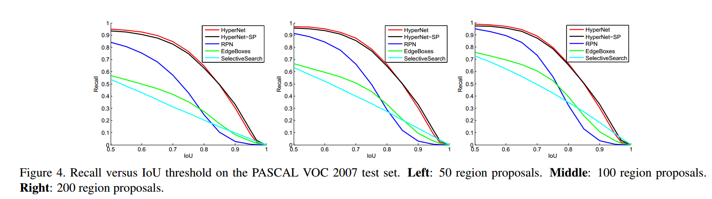

上图衡量的是 不同的IOU 阈值 对 recall的影响。**再说明一下，这个recall不是最终的detection recall。而是region proposals recall。** IOU 阈值越大，条件越严苛，recall势必会下降。对比几条不同方法的结果，HyperNet下降的最慢，比其他方法recall也高。

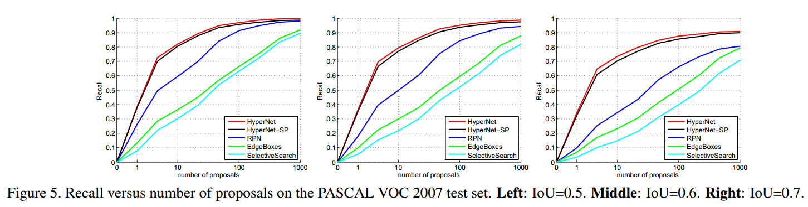

上图衡量的是 不同的proposals 数量 对 recall的影响。**再说明一下，这个recall不是最终的detection recall。而是region proposals recall。** proposals数量越少,条件越严苛,recall势必会下降。对比几条曲线，HyperNet下降的最慢，比其他方法recall也高。

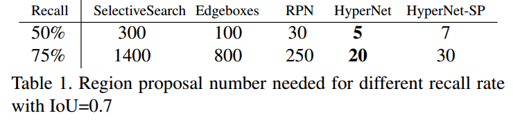

上面这个表，衡量的是IOU=0.7的情况下，region proposals recall达到50%和75%时，需要proposals的数量。很明显 HyperNet需要的最少。

Conv1、Conv2、Conv3、Conv4、Conv5 5个卷积层，为什么选择1,3,5呢？答案在下图中。

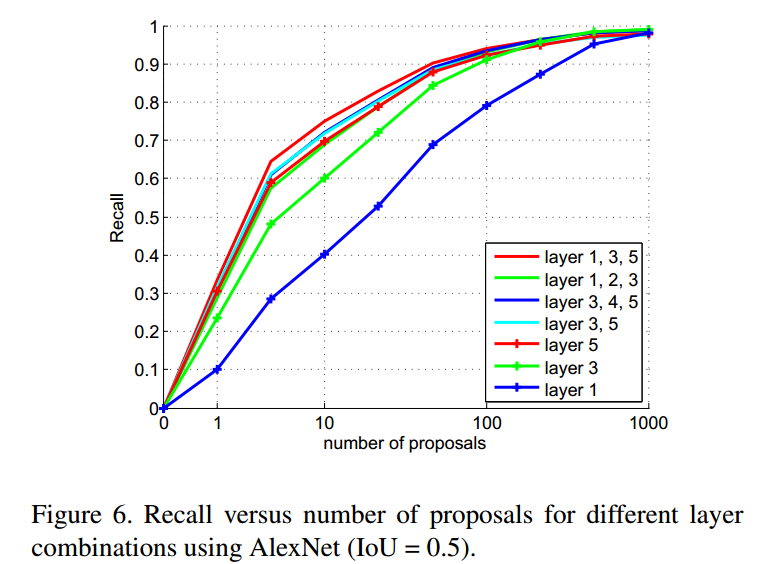

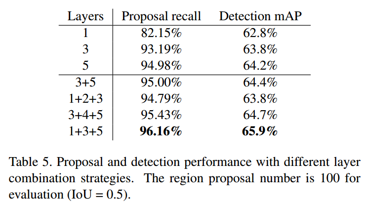

## 3.2 Object Detection

结果：

VOC 2007

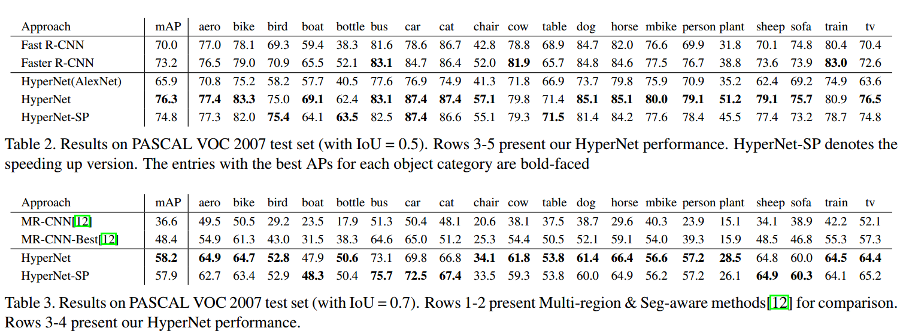

VOC 2012

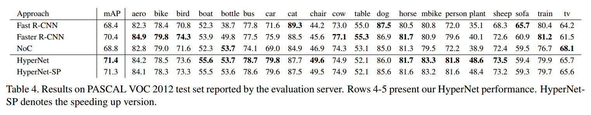

关于小目标的检测，没有明确标准，只是使用的PASCAL VOC中相对较小的目标（bottle,plant,chair等）做检测。

## 3.3 Hyper Feature Visualization

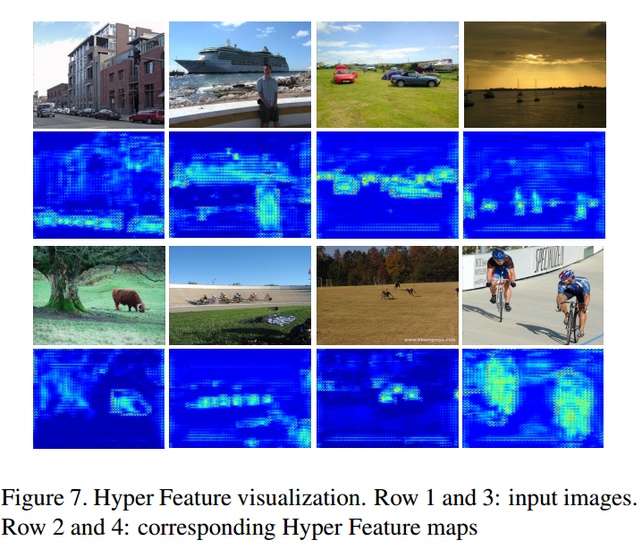

## 3.4 Running Time

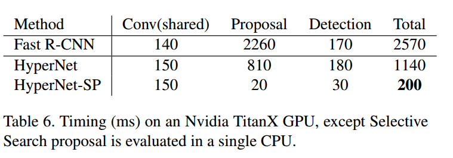

# 4 总结

整个网络就是 Faster R-CNN的改进版。最大的改进就是特征融合方法（Hyper Feature）和ROI 的提取方法（BING）。使得region proposals的数量最少降到了100，就可以获得比 Faster F-CNN高的mAP。

另外，虽然作者说对小目标的的预测效果有改善，但只是从定性的方面来表达的，个人认为应该针对 COCO数据集进行定量测试才更有说服力。

# 5 参考资料

1. 孔涛：对话CVPR2016：目标检测新进展：https://zhuanlan.zhihu.com/p/21533724
2. BING: http://mmcheng.net/bing/
3. http://blog.csdn.net/u012361214/article/details/51374012

