这篇文章提出了一种高效简洁的目标检测模型 R-FCN(Region-based Fully Convolutional Networks )，作者将FCN(Fully Convolutional Network)应用于 Faster R-CNN，实现了整个网络的计算共享，极大的提高了 检测速度，同时精度也可以与  Faster R-CNN相媲美。文章提出一种 position-sensitive score maps  用来平衡平移不变性(translation-invariance )和平移可变性(translation-variance )之间的矛盾，模型使用了 全卷积的 ResNet 结构，保证高检测精度的同时，将检测速度提高了 2.5~20倍。

# 1 从 Faster R-CNN 到 R-FCN

目前的目标检测模型一般分为两步检测模型（R-CNN系列）和一步检测模型（YOLO系列和SSD），两步检测精度高，一步检测速度快，各有优势。对于两步检测来说，最成功的模型莫过于R-CNN系列了。

R-CNN系列的检测思路一般是 先生成候选区域 region proposals，或者称为感兴趣区域 ROI (Region of Interest)，然后针对这些 ROI （后面都使用ROI一词）进行分类，也就是说本质上他是把目标检测问题（Object Detection）转化成了分类问题（Classification），不过实际上也是包含回归的，主要用于位置精修，提升准确率。

如果不考虑生成ROI的部分（比如RPN，Region Proposal Network），两步检测模型可以分为两部分子网络（subnetworks ）：

- 第一部分是**共享计算**的全卷积基础子网络 base，或称body，trunk ，这一部分是与ROI独立的，主要用于提取特征
- 第二部分是**不共享计算**的子网络 head，**生成的每一个ROI都要经过head部分**，主要用于分类

这个设计拓扑结构实际上是跟经典的用于分类的卷积神经网络很像的，比如用于分类的卷积神经网络前面一部分是用于特征提取的基础网络，后面是用于分类的全连接层，从卷积层到全连接层中间通过一个空间池化层连接。而在目标检测模型中，base与head部分之间使用的是 ROI 池化。

## 1.1 Faster R-CNN

首先回顾一下Faster R-CNN：

- 最初的 Faster R-CNN的base 部分使用的是VGG的卷积层，head是由全连接层构成的，如图1(a).
- 后来的使用ResNet网络做base部分的 Faster R-CNN, 它的head是由两部分组成，第一部分是 ResNet 中 的 第5个 卷积block，也就是 Conv5，第二部分是全连接层。这个跟最初提出的 以VGG为特征提取层的  Faster R-CNN不太一样。如图1(b)。

这两种结构，生成的每一个ROI都会经过head部分，head部分是不能共享计算的。这也是 Faster R-CNN速度慢的原因之一，其他的比如 生成的ROI数量等也是影响速度的因素，这里不讨论。

| 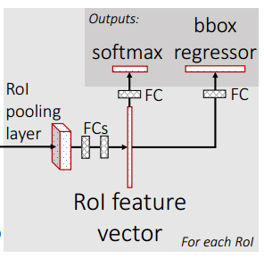 | 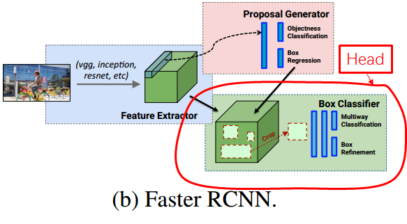 |
| :---------------------------------------------------------: | :---------------------------------------------------------: |
|             **(a) Head of Faster R-CNN - VGG**              |          **(b) Head of Faster R-CNN -ResNet 101**           |

 **图1 Faster R-CNN的两种结构**

实际上 后来的对于图片分类效果比较好的一些网络比如 GoogLeNet，ResNet都是属于全卷积网络的，他们的结构一般都是将一堆按照特定结构排列的卷积层堆在一起，最后一个feature map经过一个全局平均值池化，然后为了使输出与物体类别数（imagenet，C=1000）相等才会加一个 1000层的全连接层，最后加上softmax层。

------

之前讲过FCN（Fully Convolution Network）, 对于Faster R-CNN来说它的RPN部分已经是全卷积了，那很自然的会想到 以 ResNet 101 实现的 Faster R-CNN 的 head部分 能不能也使用FCN。如果使用FCN的话，最后一个卷积层的输出是一个代表原图的 heatmap，只需要将 ROI 映射到heatmap上，做一个 ROI Pool ， 然后对最后一个卷积层上的ROI区域 做一个全局平均值池化，像下面图2这样，channel=C对应于不同的类别。

这样的话基本上所有的计算量都能够共享，后面每个ROI经过的都是池化层，而池化层与卷积层和全连接层相比计算量大大减少，几乎可以忽略。

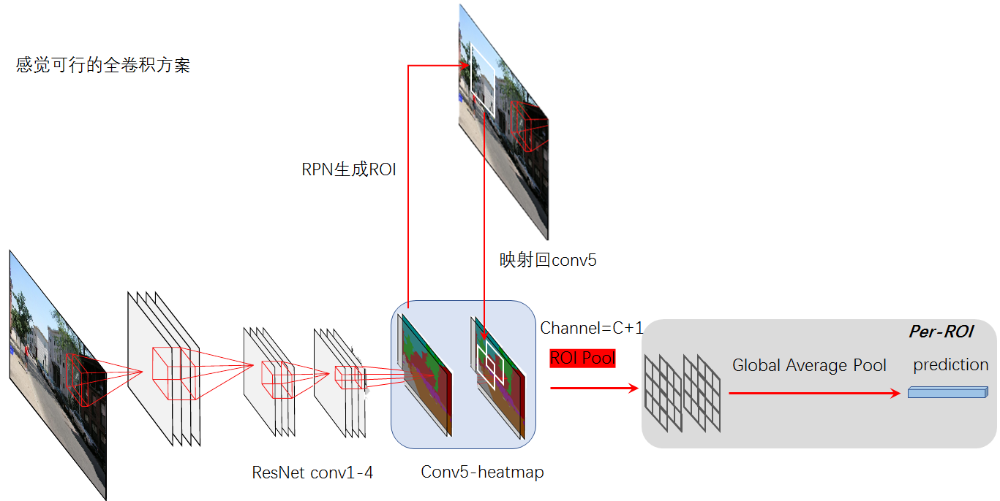

**图2 一种可行的全卷积方案**

但实际上通过实验验证这么做的效果很差，结果如下：

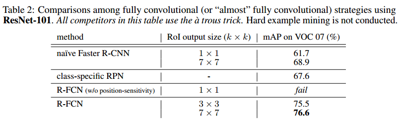

第三行就是 上面的结构，mAP那一栏写着 fail ，不及格，应该是连60 %都没到。这个表在第2节试验部分详细介绍。

这个原因文章中也分析了：

**平移不变性 translation invariance**  是深层CNN的特点，这对于图像分类问题来说是很好的一个特性，因为图像分类不管你物体在哪个位置都要求较高的准确性。但是对于目标检测来说，不仅要检测出图上有什么，还需要定位出物体在图片上的位置，也就是说目标检测需要 **平移可变性 translation variance**  。图2的方案中， 不变性与可变性是一对相互矛盾的问题。因为ROI放在Conv5后面的heatmap上，由于网络太深了，原图的变化已经很难反映在heatmap上了。所以它的效果才不好。

这也就是为什么图1 (b)中的 ROI 池化层不是放在 Conv5 输出的feature map后面，而是放在了Conv4和Conv5两组卷积层之间，Conv5和后面的全连接层构成了head部分。一来可以避免位置信息进一步损失，二来可以使用后面的Conv5卷积层学习位置信息。但是缺点就是 每一个ROI都要再经过Conv5这一组卷积，head部分的计算不能实现共享。图1 (b)可能不太清楚，可以看下图：

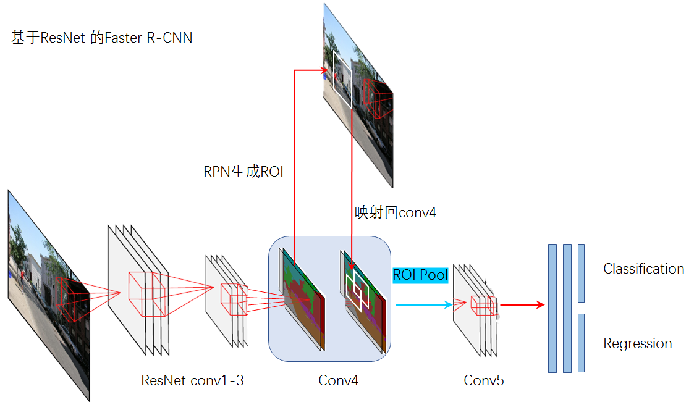

**图？ 基于ResNet 的 Faster R-CNN**

而R-FCN就是着重于解决这一问题的，**如何做到head部分使用FCN共享计算的同时，准确率不下降甚至是超过原来？** 

只要解决这个问题，即便准确率不比原来高，速度也会提升很多。实际上 R-FCN不仅提高了速度，准确率也提高了。下面详细讲解一下。

## 1.2 R-FCN

### 1.2.1 R-FCN的整体结构

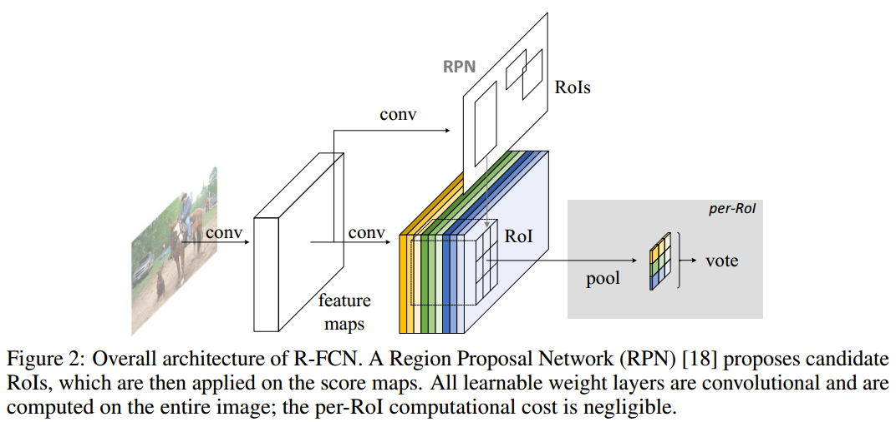

**图3 R-FCN 结构图**

网络仍然是包含两部分：

- region proposal
- region classification 

网络使用了ResNet-101，ResNet-101包含100个卷积层，一个全局平均值池化层，和一个1000维的全连接层。本文去掉了最后的全局平均值池化层和全连接层，最后加上了一个1024个 1×1 卷积核的卷积层用以降维（将Conv5输出的2048维降为1024维）。

看起来跟 图2 好像差不多，但其实是很不一样的，不一样的地方在于 R-FCN 改变了 ROI Pooling的使用方法，称为 Position-Sensitive ROI Pooling，位置敏感的ROI池化，简称PS ROI Pooling，这是为了增加平移可变性而引入的结构 。

------

### 1.2.2 Position-Sensitive ROI Pooling

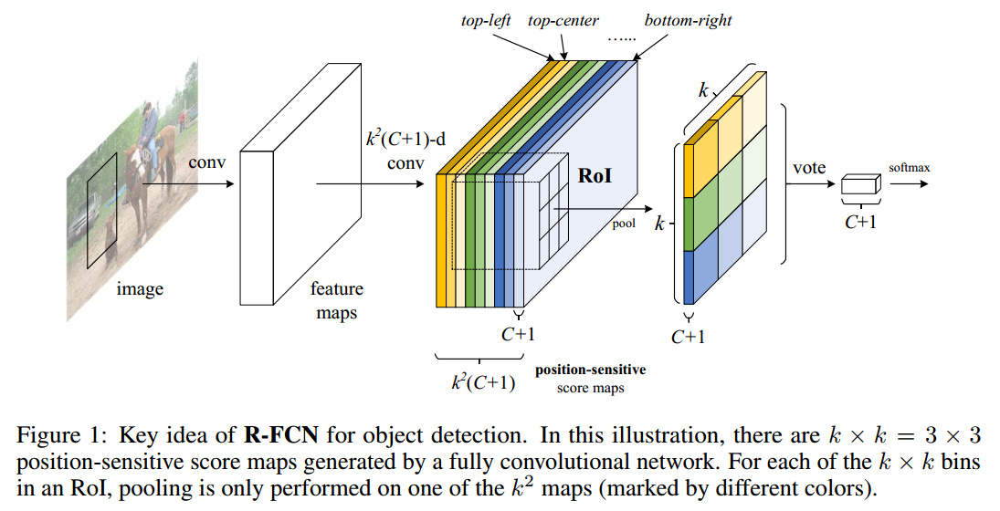

**图4 Position-Sensitive ROI Pooling**

- 文章设计了一个 position-sensitive score maps ，做法其实很简单就是通过调整Conv5的卷积核数量，使得输出的通道变为： $k^2(C+1)$ 个。也就是说每一个类别都用  $k^2$ 个通道的feature map来表示，图中不同的颜色就代表一组 $C+1$ 通道的 feature map。 
- $k×k$   代表ROI池化的网格大小，以 $k=3$ 为例 。图中最后那个由不同颜色组成的 $C+1$ 通道的 k×k 的  feature map 就是使用 Position-Sensitive Pooling得到的。最后一个PS ROI Pooling之后的feature map（9个格点，每个格点颜色都不一样）中的每一个网格都来自前面  position-sensitive score maps中不同组的  feature map，根据颜色一一对应。这个跟分组卷积的意思有点像，这个可以叫做分组ROI池化。原文称为 选择性池化：our position-sensitive RoI layer conducts **selective pooling**, and each of the k × k bin aggregates responses from only one score map out of the bank of k × k score maps.  
- 最后那个 颜色混合的 feature map 中每一个网格都是对应着不同的位置信息的，比如 {top-left, top-center,
  top-right, ..., bottom-right}  。随着学习过程的深入，对应的position-sensitive score maps中不同组的（不同颜色的）feature map 的激活值就会对目标的不同位置敏感，从而产生对位置敏感的激活。对目标的位置实现编码（见图5，图6）。原文：With end-to-end training, this RoI layer shepherds the last convolutional layer to learn specialized position-sensitive score maps. 
- vote操作其实就是一个全局平均值池化，生成一个 C+1 维的向量，这个向量就可以用于判断当前ROI是什么类别。

**也实现了所有的计算量都能够共享，后面每个ROI经过的都是池化层，而池化层与卷积层和全连接层相比计算量大大减少，几乎可以忽略。** 

实际这个过程就是人为给网络设定一些模式和期望的结果，然后让网络在训练过程中自己完成。就相当于老师丢给你一道很难的竞赛题，只告诉了你答案，但不告诉你怎么做，你要做的就是绞尽脑汁找到解题方法。这里也是一样的，这个对位置敏感，是人为地希望feature map对位置敏感。至于为什么会敏感，是网络在训练过程中学习到的。

文章也给出了一些可视化的图来解释，如图5，图6：

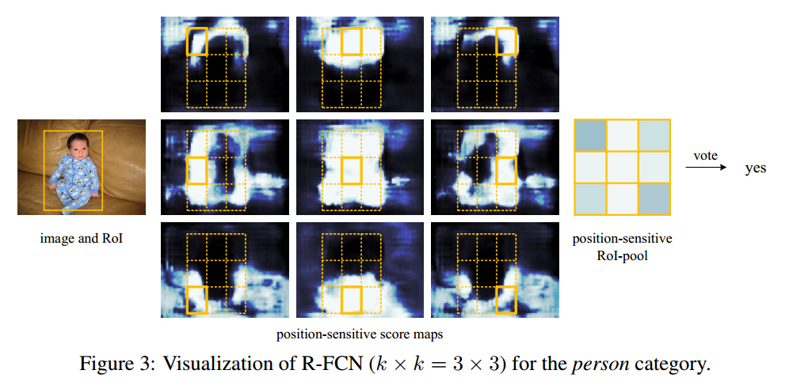

**图5 一个正样本的可视化**

**图6 一个负样本的可视化**

可以看到，以 k=3 为例，这9个 position-sensitive score maps的激活值确实是对位置敏感的，而且如果 某一个ROI如果与 ground truth 的IOU 比较大的话，最后的投票结构是yes（图5），否者是no（图6）。

**这个与图2 的结构的不同之处在哪呢?**

图2 中那个 channe=C+1 的feature map相当于 图4 中 $k^2$ 组feature map中的一组，也就是其中一个颜色。图2中最后ROI池化后的feature map中的每个像素都是来自上一层的同一组feature map，而图4是来自不同组。

就这么一点差别，其他基本上是一样的。但是就这么一点差别，导致 R-FCN可以做到 精度，速度都有提高。

池化时的公式表达：

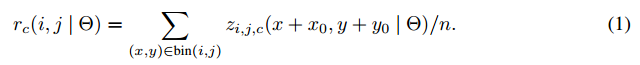

上式比较抽象，实际上表达的就是 ROI池化，如下图，表示某一组 score map 中的第c个类别的池化：

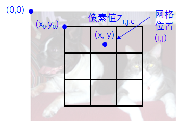

**图7 某一组 score map 中的第c个类别的池化**

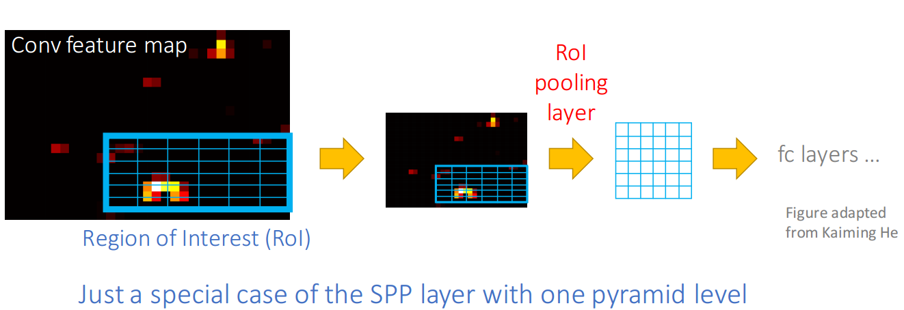

**图8 ROI 池化**

将每个ROI都分为 $k×k$ 大小的网格，对于某个 $w×h$ 大小的 ROI，每一个格点的大小约为 $\dfrac{w}{k} × \dfrac{h}{k}$ ，对于最后一个卷积层的 $k^2$ 组score feature map，PS ROI Pooling 之后的feature map上的 $(i,  j)$ $(0 ≤ i,  j ≤ k - 1)$位置处的格点的像素值也是由上一层的position-sensitive score feature map的对应通道中的 $(i,  j)$ 格点中的多个像素值池化得到的（图4中一一对应的颜色块）。

上式：

- $r_c(i， j)$ 是 $(i, j)$ 格点处第c个类别的响应值或者是池化输出值；
- $z_{i,j,c}$ 是 score map 中对应组的 $(i,  j)$ 格点中的，第c个类别的，多个像素值之一；
- $(x_0, y_0)$ 是ROI的左上角在图片中的坐标；
- n 是 score map 中对应组的 $(i,  j)$ 格点中的像素总数
- $Θ$ 是网络的学习参数；
- score map 中 $(i, j)$ 位置处的格点中的坐标跨度为： $\lfloor i {w \over k}\rfloor \le x \le \lceil (i+1){w \over k}\rceil$  和 $\lfloor j {h \over k}\rfloor \le y \le \lceil (j+1){h \over k}\rceil$ ,$\lfloor \cdot \rfloor$ 和 $\lceil  \cdot \rceil $ 分别代表下界和上界。
- 本文中上式使用的是平均值池化，但是最大值池化也是可以的。

PS ROI Pooling之后的feature map再做一个平均值池化，产生一个 C+1 维的向量，然后计算 softmax 回归值：

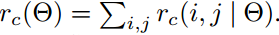

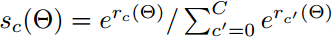

看上面的公式好像并没有做平均值处理，只是将不同网格的像素值求和。

同样的网络中也使用了回归层用于位置精修，与  $k^2(C+1)$ 个通道的score map并列，另外再使用 $4k^2$ 个通道的score map，同样是 $k^2$ 组，只不过每一组现在变成了4个通道，代表着坐标的四个值。最后PS ROI Pooling之后的feature map是 4×3×3的，平均值池化之后生成一个 4维的向量，代表着 bounding box位置的四个值 $t = (t_x,t_y,t_w,t_h)$ ,分别为中心坐标，和宽高。这里使用的是类别不明确的回归(class-agnostic bounding box regression) ，也就是对于一个ROI只输出 一个 $t$ 向量，然后与分类的结果结合。实际上也可以使用类别明确的回归(class-specific ) ，这种回归方式对一个  ROI 输出 C个 $t$ 向量，也就是说每一类别都输出一个位置向量，这跟分类时每一个类别都输出一个概率是相对的。

------

### 1.2.3 训练(Training  )

损失函数基本与Faster R-CNN是一样的：

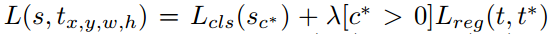

- $c^∗$ 是RoI的 ground-truth label ($c^∗ = 0$ 意味着是背景). 
- $L_{cls}(s_{c^∗}) = -log(s_{c^∗})$ 是用于分类的交叉熵损失；
- $L_{reg}$ ：是bounding box 回归损失 , $t^∗$ 代表ground truth box.
- $[c^∗ > 0]$ 是指示函数，括号中表达式为真则为1，否则为0；
- 设置 $λ = 1$ ；
- 定义 正样本为 ROI与ground-truth box的IOU (intersection-over-union) 至少为0.5，否则为负样本。

训练方法与参数设置

- It is easy for our method to adopt online hard example mining (OHEM)  during training. Our
  negligible per-RoI computation enables nearly cost-free example mining. 
- We use a weight decay of 0.0005 and a momentum of 0.9. 
- By default we use single-scale training: images are resized such that the scale (shorter side of image) is 600 pixels [6, 18]. 
- Each GPU holds 1 image and selects B = 128 RoIs for backprop. We train the model with 8 GPUs (so the effective mini-batch size is 8×). 
- We fine-tune R-FCN using a learning rate of 0.001 for 20k mini-batches and 0.0001 for 10k mini-batches on VOC. To have R-FCN share features with RPN (Figure 2), we adopt the 4-step alternating training, alternating between training RPN and training R-FCN. 

### 1.2.4 推理(Inference )

- an image with a single scale of 600.
- During inference we evaluate 300 RoIs. 
- The results are post-processed by non-maximum suppression (NMS) using a threshold of 0.3 IoU ， as standard practice. 

### 1.2.5 带孔卷积(Àtrous  algorithme )

带孔卷积：与FCN一样，本文也将网络的整体降采样步长改为了16。原先ResNet的Conv1-Conv5每一组都是2倍的降采样，总共是32倍降采样。本文中将Conv5的降采样倍数改为了1，提高了分辨率，这样整个结构是16倍的降采样，为了弥补由于降采样倍数改动导致网络后面的卷积层的感受野发生变化，文章使用了 À trous 技巧，也就是带孔卷积，不过带孔卷积只在Conv5中使用，Conv1-Conv4保持原来的不变，因此RPN不受影响。

带孔卷积的详细说明参考    [1](https://www.zhihu.com/question/49630217)  [2](http://blog.csdn.net/u012759136/article/details/52434826#t9)  .

带孔卷积对整个检测结果的影响还是蛮大的，如下是 R-FCN (k × k = 7 × 7, no hard example mining)的结果对比，带孔卷积提高了2.6个百分点。

**表？ 带孔卷积对检测结果的影响**

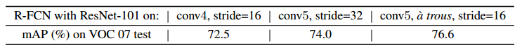

# 2 试验

## 2.1 Pascal VOC

试验条件：

- 类别C=20
- 训练集：VOC 2007 trainval and VOC 2012 trainval (“07+12”)  
- 测试集：VOC 2007 test set 
- 性能衡量指标：mean Average Precision (mAP) 

------

首先对比一些用于目标检测的 **不同全卷积网络设计策略** 的结果，以下是一些 不同的全卷积设计策略：

- **Naïve Faster R-CNN.** 使用了Conv1-Conv5作为base部分，用于特征提取，ROI直接映射在Conv5最后输出的feature map上，与图2类似，不一样的地方在于：ROI池化之后加了一个 21维的全连接层。使用了 The àtrous 技巧。是一个近似的全卷积网络。

- **Class-specific RPN.** 与标准的Faster R-CNN中使用的RPN类似，RPN训练方法也一样，不一样的在于：RPN部分不是一个二分类，而是一个类别为21的多分类。 为了对比公平，RPN的head使用的是 ResNet-101的 Conv5 层，也使用了àtrous 技巧。注意这个只是Faster R-CNN中的RPN，是一个全卷积网络。

- **R-FCN without position-sensitivity.** 在图4的结构中设置k = 1，就跟图2是一样的，只是ROI池化的尺寸变成了 1×1 ，相当于全局池化。使用了àtrous 技巧。这是一个全卷积网络。

先展示一个 baseline的结果，如表1。这是使用 ResNet101 的标准 Faster R-CNN的测试结果。 我们只关注与本文本节实验条件相同的项，也就是红色方框框起来的那一行。可以看到mAP是 **76.4%**。标准的 Faster R-CNN 结构我们上面说过，首先这不是一个全卷积网络，其次 ROI pooling位于Conv4 和 Conv5之间， head 部分没有共享计算。

|      表1 baseline：使用 ResNet101 的标准 Faster R-CNN       |
| :---------------------------------------------------------: |
| 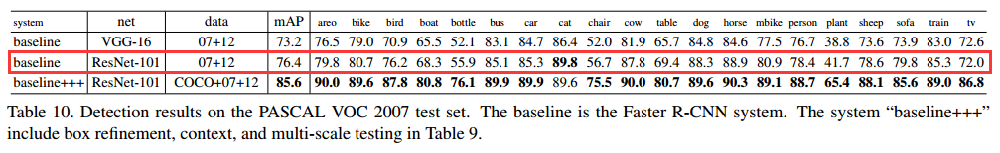 |

以上提到的三种全卷积设计策略的结果对比如表2：

|             表2 不同全卷积网络设计策略结果对比              |
| :---------------------------------------------------------: |
| 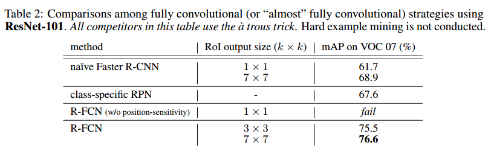 |

- Naïve Faster R-CNN的结果最高只有 68.9%，与标准 Faster R-CNN相比，说明 将ROI pooling放置在Conv4 和 Conv5之间，是有效保证位置信息的关键。而深层的全卷积网络损失了位置信息，对位置不敏感。
- Class-specific RPN的结果是67.6%，这实际上相当于特殊版本的 Fast R-CNN，相当于在head部分使用了sliding window的稠密检测方法。
- R-FCN without position-sensitivity直接fail，不及格，应该是连50%都不到，因为文中提到这种情况下网络不能收敛，也就是说这种情况下，从ROI中提取不到位置信息。这个跟 Naïve Faster R-CNN 的1×1 ROI输出的版本挺像的，不一样的是 Naïve Faster R-CNN中加了全连接层，而且Naïve Faster R-CNN是可以收敛的，只是精度比标准的低很多。
- R-FCN的mAP分别为 75.5和76.6，使用 7×7 ROI输出时，超过了标准的  Faster R-CNN。与R-FCN without position-sensitivity相比 ，说明Position-sensitive RoI pooling 起作用了，它可以对位置信息进行编码。

**经过以上的试验分析，基本可以确定了 R-FCN with RoI output size 7 ×7 的效果是最好的。** 以下的试验中涉及到 R-FCN的都采用这样的设置。

------

表3 是 Faster F-CNN 与 R-FCN 的 测试结果对比：

|                表3 Faster R-CNN与R-FCN的对比                |
| :---------------------------------------------------------: |
| 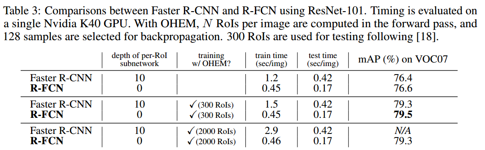 |

- depth of per-RoI subnetwork 指的是 head部分的深度，这里Faster F-CNN使用的是 ResNet101 版本的，Conv5有9个卷积层，再加一个全连接层，共10层。而R-FCN的head就是PS ROI Pooling和全局平均值池化，所以深度为0；
- online hard example mining 是否使用了OHEM策略进行训练，这个策略并不会额外增加训练时间，这个训练方式有待研究。
- 可以看到 R-FCN不管是训练还是测试都要比 Faster R-CNN快很多，平均精度也部落下风。
- 很明显的看到，当 ROI 数量是300时，Faster R-CNN训练平均一张图片需要1.5s，R-FCN需要0.45s；而当ROI 数量为300时，Faster R-CNN训练平均一张图片需要2.9s，R-FCN需要0.46s。Faster R-CNN的训练时间受 ROI是数量影响很大，而R-FCN几乎没有影响，只增加了0.01s。这也是使用全卷积，和 PS ROI Pooling 带来的好处。然而增加 ROI 数量并没有良好的精度收益。所以后面的试验中基本上都是使用的是 300个ROI。

------

更多的测试结果，见表4，表5.

|               表4 PASCAL VOC 2007测试结果对比               |
| :---------------------------------------------------------: |
| 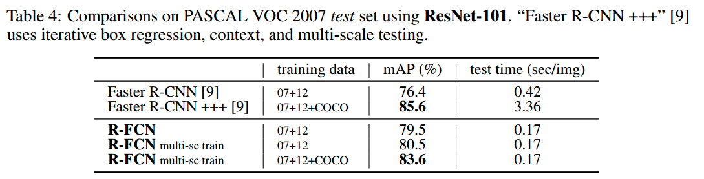 |

|               表5 PASCAL VOC 2012测试结果对比               |
| :---------------------------------------------------------: |
| 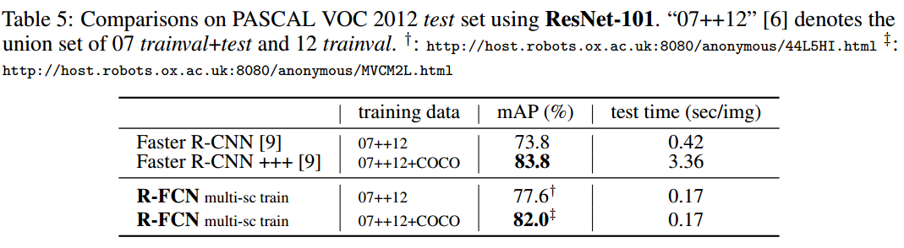 |

- multi-scale training ：resize the image in each training iteration such that the scale is randomly sampled from {400,500,600,700,800} pixels. And still test a single scale of 600 pixels, so add no test-time cost. 使用这个策略后 mAP80.5。
- 如果先在COCO 数据集（trainval set ）上训练，然后再 PASCAL VOC数据集上 fine-tune，可以获得 83.6%的mAP。但是精度不敌使用了各种技巧的 Faster R-CNN+++。但也不差。Faster R-CNN+++是ResNet论文中提出的。注意R-FCN并没有使用相应的技巧，比如 iterative box regression, context, multi-scale testing. 
- Faster R-CNN+++虽然精度高，但是速度慢，简直被R-FCN 吊打，R-FCN的0.17s比Faster R-CNN+++快20倍。
- 表5展示了 PASCAL VOC 2012的测试结果，结论基本差不多，R-FCN精度稍逊Faster R-CNN+++，速度吊打Faster R-CNN+++。不过与 Faster R-CNN相比，精度还是高出很多的。

------

ResNet深度对检测结果的影响见表6：

|               表6 ResNet深度对检测结果的影响                |
| :---------------------------------------------------------: |
| 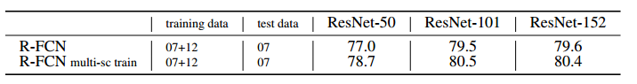 |

- 从50到101，精度是上升的，但是到152就趋于饱和了。

------

不同的  region proposal 方法对检测精度的影响，见表7：

|      表7 不同的  region proposal 方法对检测精度的影响       |
| :---------------------------------------------------------: |
| 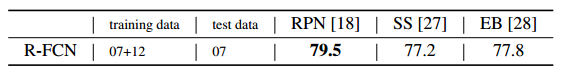 |

- SS: Selective Search , EB: Edge Boxes , RPN最牛。

## 2.2 MS COCO

这一部分是 MS COCO数据集上的测试结果。

试验条件：

- 总类别数 C=80;
- 80k train set, 40k val set, and 20k test-dev set；
- 评价指标：AP@[0.5; 0.95]，指的是阈值在0.5到0.95之间的平均精度（average precise）；AP@0.5，指的是阈值为0.5的平均精度（average precise）。

训练方法，直接把原文的搬过来：

- We set the learning rate as 0.001 for 90k iterations and 0.0001 for next 30k iterations, with an effective mini-batch size of 8. 
- We extend the alternating training [18] from 4-step to 5-step (i.e., stopping after one more RPN training step), which slightly improves accuracy on this dataset when the features are shared;
- we also report that 2-step training is sufficient to achieve comparably good accuracy but the features are not shared. 

|                 表8 COCO 数据集上的测试结果                 |
| :---------------------------------------------------------: |
| 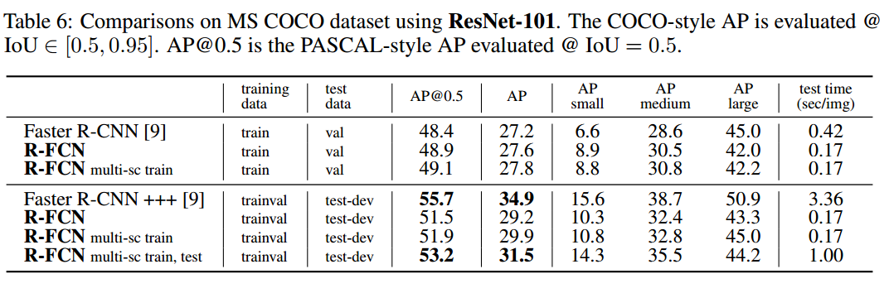 |

- multi-scale testing variant following ResNet’s Faster R-CNN, and use testing scales of {200,400,600,800,1000} 
- 结果也是类似的 精度不敌 Faster R-CNN+++，速度吊打Faster R-CNN+++。注意R-FCN并没有使用 iterative box regression, context等技巧。

# 3 总结

文章结合Faster R-CNN和FCN，提出了一个简单高效的网络 R-FCN，可以达到与 Faster R-CNN几乎同等的精度，而速度比Faster R-CNN快2.5-20倍。

从 R-CNN， Fast/er R-CNN 到 R-FCN，改进的路线主要就是为了实现共享计算：

- R-CNN ：ROI（Region of Interest）直接在原图上提取（使用 seletive search算法），每个ROI都通过 base和head进行计算。**每个ROI的特征提取和最终分类都不共享计算。**
- Fast R-CNN ：ROI直接在原图上提取（使用 seletive search算法），将ROI映射到base部分最后一个卷积层，然后每个ROI就只通过 head 部分，head由几个全连接层构成。**ROI之间的特征提取共享计算，ROI生成与base部分不共享计算，ROI通过head部分也不共享计算。**
- Faster R-CNN ：ROI 通过RPN（Region Proposal Network）提取，RPN与base共享特征提取层，将ROI映射到base最后一个卷积层，然后每个 ROI 只通过 head部分，head由卷积层 和\或 全连接层构成。**ROI之间的特征提取共享计算，ROI 提取与base部分共享计算，ROI通过head部分不共享计算。**
- R-FCN：ROI通过RPN提取，提取之后的ROI仍然只通过一个网络（FCN），实现计算共享，分类层和回归层直接作用于最后一个卷积层。**ROI之间的特征提取共享计算，ROI 提取与base部分共享计算，ROI通过head部分共享计算。所有层计算共享。** 

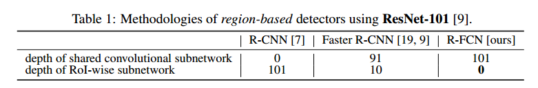

# 参考

1. 文章链接：https://arxiv.org/abs/1605.06409
2. 带孔卷积：http://blog.csdn.net/u012759136/article/details/52434826#t9
3. 带孔卷积：https://www.zhihu.com/question/49630217