> 论文地址：https://arxiv.org/abs/1512.02325
> 源码：https://github.com/weiliu89/caffe/tree/ssd

这篇文章提出了一个新的目标检测模型SSD，这是一种 single stage 的检测模型，相比于R-CNN系列模型上要简单许多。

其精度可以与Faster R-CNN相匹敌，而速度达到了惊人的59FPS，速度上完爆 Fster R-CNN。

速度快的根本原因在于移除了 region proposals 步骤以及后续的像素采样或者特征采样步骤。（The fundamental improvement in speed comes from eliminating bounding box proposals and the subsequent pixel or feature resampling stage.）

当然作者还是使用了比较多的trick的。

# 1 Model

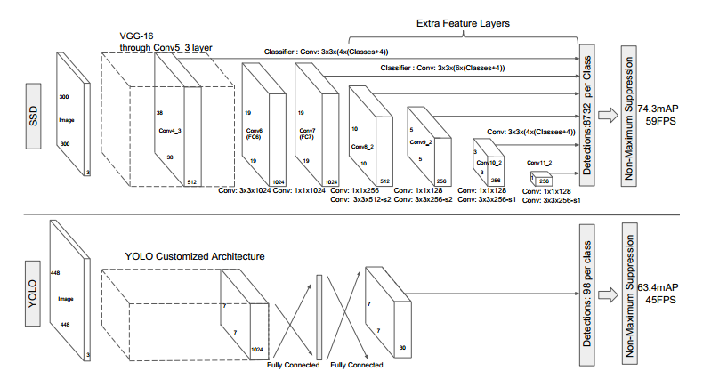

- 网络模型如上图，前面是一个VGG层用于特征提取，与VGG的区别是把FC6和FC7换成了卷积层，SSD在后面又加了8个卷积层。

- 最终用于预测的是从这些具有金字塔结构的层中选出的特定层，这些层分别对不同scale（scale的平方是面积，这个参数是假设不考虑纵横比的时候，box的边长）和不同aspect ratios（也就是纵横比）的 bounding box进行预测。

- bounding box是 detector/classifier 对 default box 进行回归生成的，而 default box 是由一定规则生成的，这里可以认为 default box 比较像 Faster R-CNN 中的RPN生成的region proposal ，也就是两步检测方案中候选框的作用。

  实际上更精确的说 default box 是与 RPN 中的 anchor 机制类似的，而 anchor 实际上在 RPN 中 也就是起到了一种region proposals 的作用。

- detector/classifier （图中没有显示）对这些 default box 进行关于 类别 和 位置的 回归，然后得出一个类别得分和位置坐标偏移量。根据坐标偏移量可以计算出bounding box的位置，根据得分确定此bounding box里的物体类别（每个类别都包含 8732个 bounding box，大部分都是背景 或者说共有 8732个bounding box，每个bounding box 都对一个 C 维的得分，C为类别总数）。

- 最后通过NMS（非最大值抑制）过滤掉背景和得分不是很高的框（这个是为了避免重复预测），得到最终的预测。

上图下半部分也展示了SSD与YOLO两种方案的不同，主要有两点：

- SSD是在多个feature map上进行的多尺度（multi-scale）预测（每个feature map预测一种 scale）。而YOLO是只在一个feature map上进行 多尺度预测。 两种方案的对比还可以从下面两张图中对比，这图是从FPN的论文里找的。
- SSD中用于预测的层也就是 detector/classifier 是全卷积的（上图中没有显示detector，后面有图示），而YOLO中是全连接的。

| 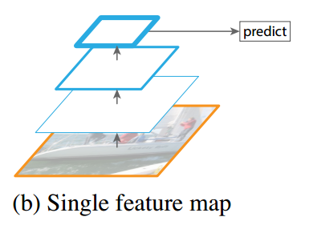 | 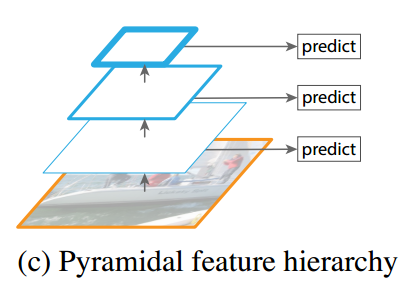 |
| :-------------------------------------------------------: | :-------------------------------------------------------: |
|                         **YOLO**                          |                          **SSD**                          |

上面的模型结构图可能看着不清楚，看下面这个图[参考资料2]，这个是 inference 时 模型从一张图片中提取目标的过程。

再总结一下，网络模型的主要特征：

- Multi-scale feature maps for detection 

  VGG中的 conv5_3 以及VGG后面又添加的一些层中的某些层，被用来检测和分类。不同的feature layer 预测的bounding box的scale是不一样的，因此不同feature layer上的卷积模型也是不一样的（体现在参数和回归效果上）。

- Convolutional predictors for detection  

  每一个被选中用于预测的feature layer，是用一个 3×3 的卷积层用于预测的，比如说某个feature layer的是 m×n×p 大小的，那么卷积核就是 3×3×p，这也是某一个 detector/classifier的参数量，它的输出是对应 bounding box中类别的得分或者相对于default box的坐标偏移量。对应于 feature map 上每个位置（cell），都会有 k 个 default box（下面再说怎么生成），那么无疑预测的时候要对每个位置上的每个default box都输出类别得分和坐标偏移。

- Default boxes and aspect ratios 

  每一个被选中预测的feature layer ，其每个位置（cell）都关联k个default box，对每个default box都要输出C个类别得分和4个坐标偏移，因此每个default box有（C+4）个输出，每个位置有 (C+4)k 个输出，对于m×n 大小的feature map输出为 (C+4)kmn 个输出，这个机制跟anchor非常相似，具体可以看后面那个图。

# 2 Training

以上是inference 时模型的结构。接下来介绍模型在训练时需要做的工作。

## 2.1 Matching strategy

匹配策略。分类问题中是不需要匹配策略的，这里之所以要使用匹配策略是由于定位问题引入的。可以简单的认为       检测=分类＋定位，这里的定位使用的是回归方法。那么这里SSD中的回归是怎么弄的？

我们知道平面上任意两个不重合的框都是可以通过对其中一个框进行一定的变换（比如线性变换+对数变换）使二者重合的。

在SSD中，通俗的说就是先产生一些预选的default box（类似于anchor box），然后标签是 ground truth box，预测的是bounding box，现在有三种框，从default box到ground truth有个变换关系，从default box到prediction bounding box有一个变换关系，如果这两个变换关系是相同的，那么就会导致 prediction bounding box 与 ground truth重合，如下图：

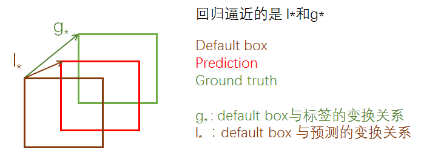

所以回归的就是这两个 变换关系：  $l_{\*}$ 与  $g_{\*}$ ，只要二者接近，就可以使prediction bounding box接近 ground truth box 。上面的 $g_{\*}$ 是只在训练的时候才有的，inference 时，就只有  $l_{\*}$ 了，但是这时候的  $l_{\*}$ 已经相当精确了，所以就可以产生比较准确的定位效果。

现在的问题是生成的 default box （下面讲怎么生成）是有很多的，那么势必会导致只有少部分是包含目标或者是与目标重叠关系比较大的，那当然只有这以少部分才是我们的重点观察对象，我们才能把他用到上述提到的回归过程中去。因为越靠近标签的default box回归的时候越容易，如果二者一个在最上边，一个在最下边，那么回归的时候难度会相当大，而且也会更耗时间。

确定这少部分重点观察对象的过程就是匹配策略。原文是这么所的：ground truth information needs to be assigned to specific outputs in the fixed set of detector outputs ，实际上就是确定正样本的过程，这在YOLO，Faster R-CNN ,Multi-box中也都用到了。

做法是计算default box与任意的ground truth box之间的 杰卡德系数（jaccard overlap ），其实就是IOU，只要二者之间的阈值大于0.5，就认为这是个正样本。

## 2.2 Training objective

损失函数，同样的是multi-task loss，即包含了定位和分类。

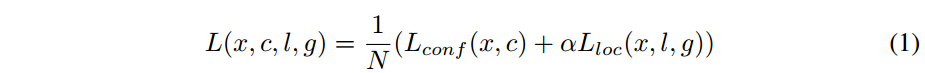

- N是匹配成功的正样本数量，如果N=0，则令 loss=0.
- $\alpha$ 是定位损失与分类损失之间的比重，这个值论文中提到是通过交叉验证的方式设置为 1 的。

定位损失，这与Faster R-CNN是一样的，都是用的smooth L1 loss：

- $l$ 代表预测bounding box与default box之间的变换关系，  $g$ 代表的是ground truth box与default box之间的变换关系。
- $x_{ij}^p=\{0,1\}$  代表 第 i 个default box 与类别 p 的 第 j 个ground truth box 是否匹配，匹配为1，否则为0；

分类损失，softmax loss，交叉熵损失：

- 注意一点：定位损失中是只有正样本的损失的，而分类损失中是包含了正样本和负样本的。因为对于定位问题来说，只要回归出精确的变换关系，在预测的时候是不需要区分正负样本的（或者说是依靠分类来区分的），只需要将这个变换关系应用到所有的default box，最后使用NMS过滤掉得分少的样本框即可。但是分类就不一样了，分类是需要区分出正负样本的。

## 2.3 Choosing scales and aspect ratios for default boxes

首先是 default box 的生成规则。

default box 是 bounding box 的初始参考，也就相当于region proposals，那么为了保证预测时对不同面积大小（等同于scale）和不同纵横比（aspect ratio）的目标进行预测，很明显default box也应该是具有不同scale 和 aspect ratio的。RPN中，每个feature map cell所关联的 9 种 anchor box 也是具有不同scale 和aspect ratio的，他们的作用是类似的。

在其他一些目标检测模型中比如 overfeat 和 SPPNet中，为了达到对不同 scale 和 aspect ratio的目标的预测效果，采用的方法是对原始图片进行不同程度的缩放，以达到数据扩增。这种方式可以称为 Featurized image pyramids ，如下图示，实际上每个尺度都是一个独立的网络和预测结果。

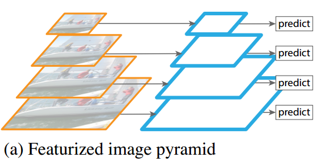

这种方式输入尺寸在变化，然而网络中的全连接层要求固定的输入，所以 overfeat 和 SPPNet 为了解决这个问题，分别使用了 offset pooling和SPP pooling的结构，使得从卷积层输入到全连接层的特征维度固定。

SSD的解决方法比较新颖：

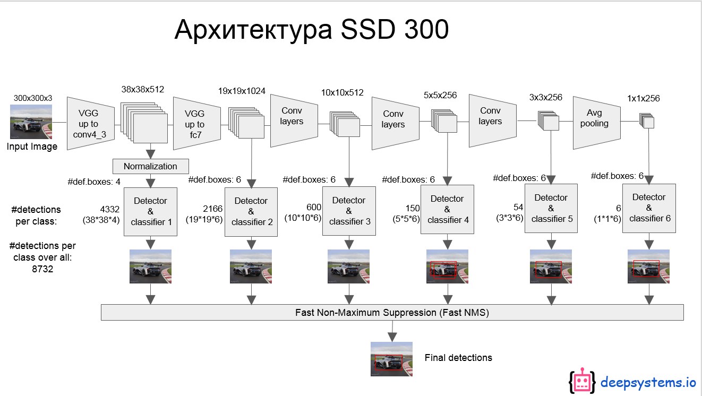

还是看图说话，如上图，每个feature layer预测一种scale，feature layer 上每个位置（cell ）的k个default box 的纵横比（aspect ratio）是不同的，这就实现了 multi-scale 预测的方式。

下面这个图就很好的说明了这种方式，(b)和(c)代表不同的预测feature layer，其中的 default box的 scale 是不一样的，同一个 feature layer 中的同一个cell位置处的 default box的 aspect ratio也是不一样的。

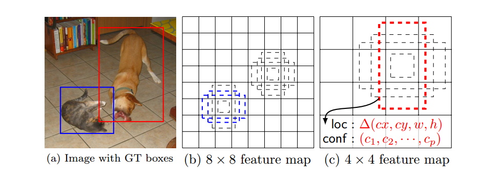

一般对于不同的feature map对原图的 感受野（receptive field sizes ）大小是不一样的，然而不同 feature layer上的 default box 与其对应的感受野是不需要对应的，这个不太理解是什么意思。难道是default box的大小与感受野的大小不需要成固定比例？

（Feature maps from different levels within a network are known to have different (empirical) receptive field sizes [13]. Fortunately, within the SSD framework, the default boxes do not necessary need to correspond to the actual receptive fields of each layer. We design the tiling of default boxes so that specific feature maps learn to be responsive to particular scales of the objects. ）

不过文中还提到：

An alternative way of improving SSD is to design a better tiling of default boxes so that its position and scale are better aligned with the receptive field of each position on a feature map. We leave this for future work. 

所以应该说的是 default box与感受野的对应关系。

假设模型在k个feature layer上进行预测，那么每个feature layer上的default box的scale怎么选呢？如下式：

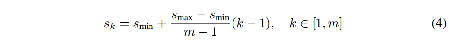

- $s_{min}=0.2,   s_{max}=0.9$    ，也就是说最底层的scale是0.2，最高层的feature layer的scale是0.9.
- 中间其它层的scale按照公式依次递增。
- 每个feature layer都负责对不同面积大小的目标进行预测。

但是我们知道目标不仅有大小之分，长宽比也是有变化的，即便两个目标大小是接近的，他们的长宽比（aspect ratio）也有可能是不同的，也即不可能也不应该把所有的目标都当成正方形的形状。那aspect ratio怎么确定呢？

这里与Faster R-CNN中的解决方法是一样的：也是人为设定几种 aspect ratio，SSD中设定的几种aspect ratio分别是 $\{1,2,3，{1\over2},{1\over3}\}$ ，然后根据scale和aspect ratio 就可以计算出default box真实的宽和高了，如下两式：
$$
w^a_k=s_k \sqrt{a_r} \\
h^a_k=s_k/\sqrt{a_r}
$$
这样对于feature layer上的每个cell都有5个不同比例的default box，然后作者在 aspect ratio=1 时，又添加了一种scale， 即 $s^{\prime}_{k}=\sqrt{s_k s_{k+1}}$  ,这样一来每个cell就有6个不同的default box。

那么default box的中心坐标怎么确定呢？如下：
$$
\left( \frac{i+0.5}{\vert f_k \vert}, \frac{j+0.5}{\vert f_k \vert} \right)
$$

- $|f_k|$  是第k个square feature map 的大小

- $i，j\in [0,|f_k|]$，这个公式是一个归一化坐标，最终会映射到原图上，以确定原图上对应的区域。之所以加0.5是为了把default box的中心设在与之关联的cell的中心，如下图

  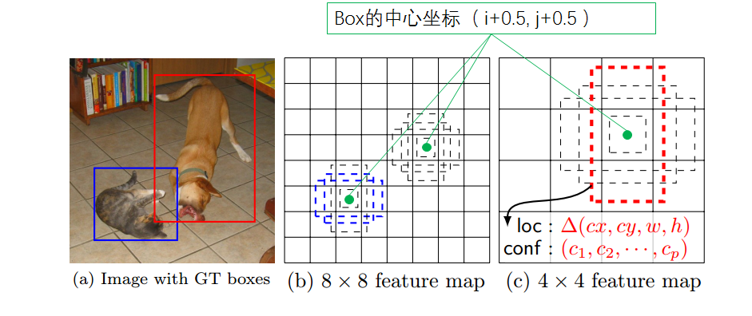

这样生成一系列default box之后，就有了预测bounding box的初始参考，最终的bounding box会在default box的基础上产生偏移，也就是说由于不同 scale 和 aspect ratio 的default box的存在 会使网络产生很多的预测bounding box，这些预测包含了不同尺寸和形状的目标物体，如上图，在 4×4 的feature map中只有狗（红色框）是正样本，这是因为 不同的feature map 负责预测的 scale和aspect ratio是不同的，所以在 8×8 的feature map中由于猫的scale不匹配，会被认为是负样本。同理，在 8×8 的feature map中只有猫（蓝色框）是正样本。

关于default box的设计方式，文章提到这是一个开放性的研究内容：

An alternative way of improving SSD is to design a better tiling of default boxes so that its position and scale are better aligned with the receptive field of each position on a feature map. We leave this for future work. 

这应该跟上面提到的关于default box与感受野的对齐是同样的问题。

## 2.4 Hard negative mining

由于存在大量的负样本，所以导致严重的类别不平衡问题，训练时难以收敛。

解决方法是：对负样本根据 confidence loss（也就是分类损失）排序，选取损失最高的一部分保留（也就是最不像目标的那些），使得负样本和正样本的比例保持在 3:1，文章使用这个比例获得了稳定的训练性能加快了优化速度。

## 2.5 Data augmentation

为了使模型对于不同尺寸和纵横比的目标更加鲁棒性，使用了数据扩增。

每张训练图像随机进行如下操作：

- 使用原图
- 在原图上采样一个patch，这些patch与目标的杰卡德系数为 0.1, 0.3, 0.5, 0.7, 或者 0.9 
- 随机采样一个patch

采样的patch与原图的比例在[0.1-0.9]之间，aspect ratio在 1/2 到 2之间。经过以上采样之后，采样的patch会被resize到固定大小并以0.5的概率进行水平翻转。

这种扩充数据集的方式增强了模型对目标平移的敏感程度。

## 2.6 训练流程

下图是根据SSD的源码绘制的详细模型结构，caffe自带的 draw_net.py 画图工具生成的图片看起来就跟蜘蛛网一样。建议看图跟看prototxt文件相结合，更容易理解。

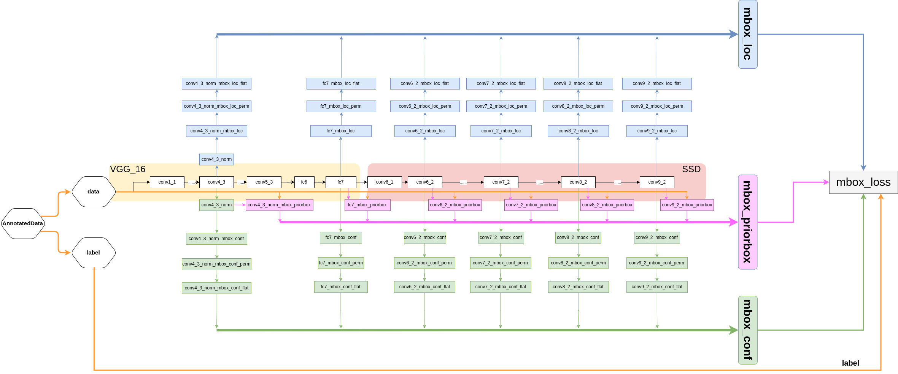

[参考资料1] 中还有个简化版的图，这里借鉴一下：

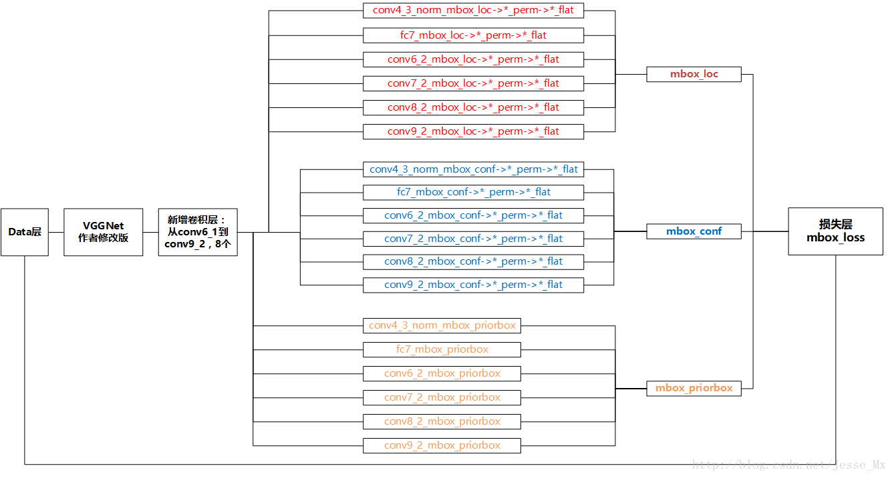

# 3 Inference

下面说一下inference的流程，主要参考 [参考资料2]，有些流程在训练时也是类似的。

- **整体预测流程如下图，一目了然：** 

  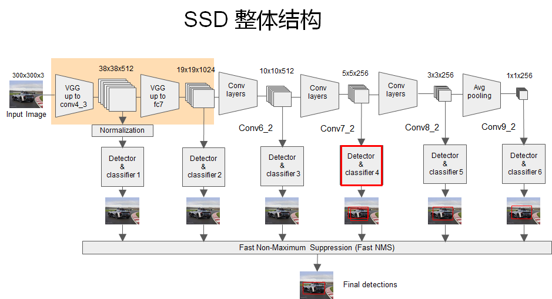

- **上面图中被红框框起来的 detector和classifier的详细结构如下图：** 

  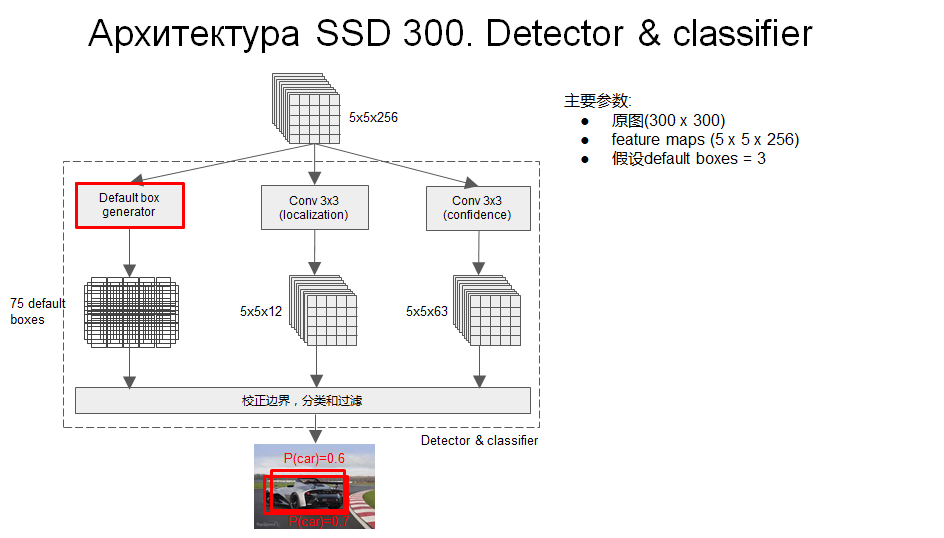

  - 这是其中一个scale的预测流程
  - 可以看出分类和定位都是通过卷积层预测的，假设某个用于预测的feature map是5×5×256的， default box=3，那么用于定位的卷积层输出是 5×5×12 的（4×3=12，每个通道代表一个位置因素（x,y,w,h）），用于分类的卷积层输出是 5×5×63的（21×3=63，每个通道代表一个类别）
  - 每个用于预测的feature map后面可以认为接了三个并行的层，一个default box generator，一个detector，一个classifier。

- **上面图中的default box generator如下图：**  

  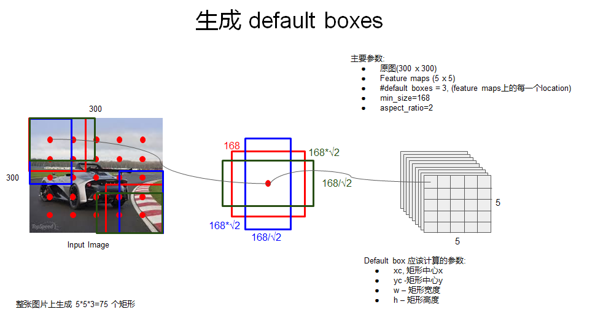

- **detector 和 classifier对某个 bounding box的回归：** 

  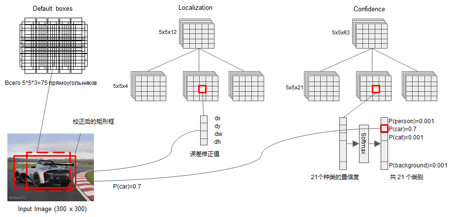

- **所有的bounding box回归之后，是很乱的，然后再通过NMS过滤掉一大部分：**  

  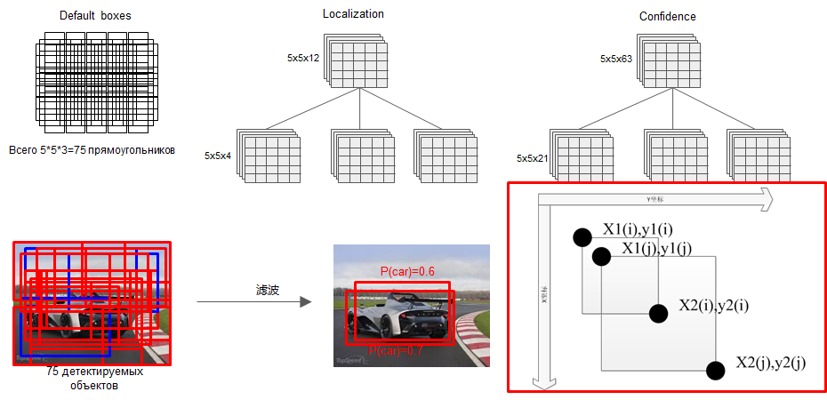

  - 这只是其中某一个feature map的预测结果

- **当把所有用于预测的feature map进行预测之后（multi-scale），再通过一个NMS，又过滤掉一部分，保留下来的即是最终的结果** 

  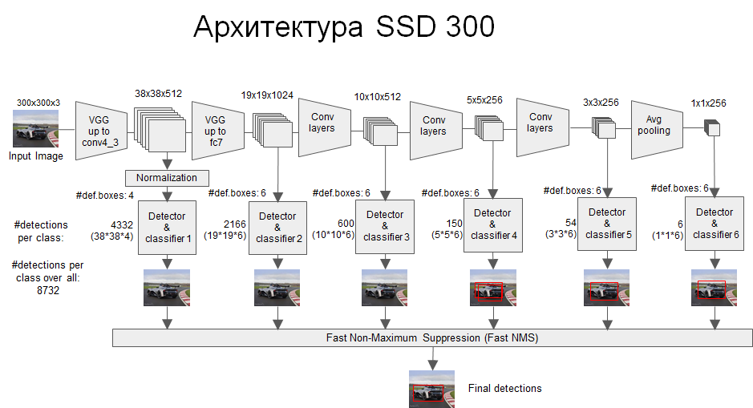

# 4 Experimental Results

这部分不同的数据集上训练策略可能有些不同，具体的训练参数不详细说了。

## 4.1 PASCAL VOC

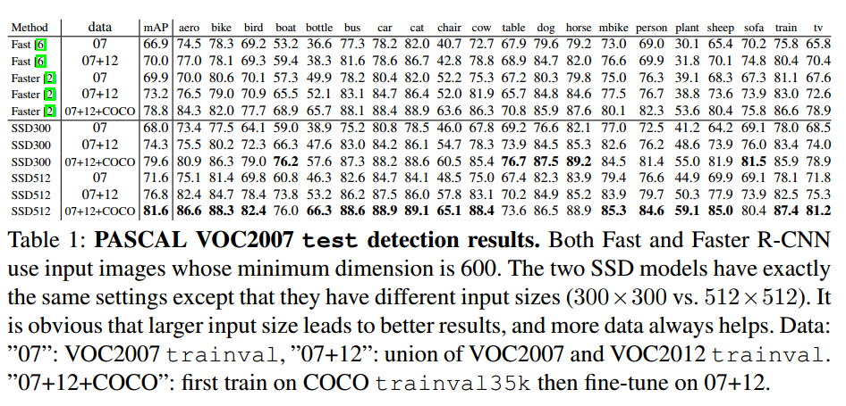

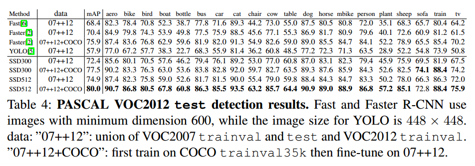

## 4.2 Model analysis

对照试验：

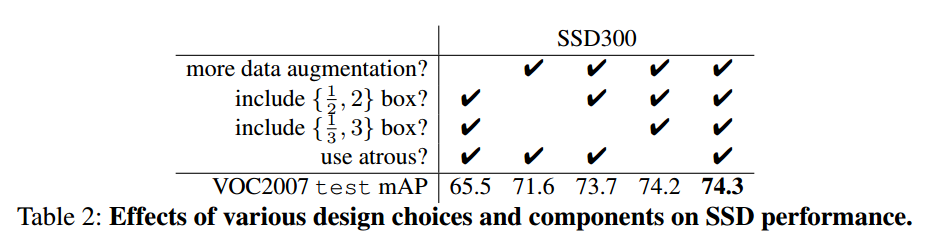

- Data augmentation is crucial ：Fast R-CNN和Faster R-CNN使用的数据扩增方式是原图及其水平翻转。本文使用的数据扩增的方式对预测精度的提升特别明显，使用比不使用提高了8.8%。作者估计本文的数据扩增方式对 Fast R-CNN和Faster R-CNN的预测效果提升不会太多，因为Fast R-CNN和Faster R-CNN中使用的 ROI池化本来就对目标的平移很敏感，这比人为扩充数据集鲁棒性更强。
- More default box shapes is better ：更多样性化的default box 显然会产生更好的结果。
- Atrous is faster ：论文使用了 atrous algorithm ，这是一种称为 带孔卷积的 卷积方式[参考资料4]。

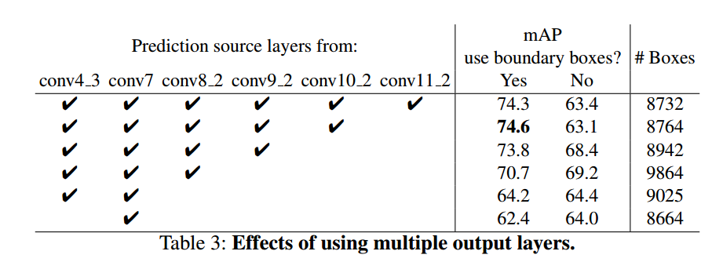

- Multiple output layers at different resolutions is better ：做这个对照实验的时候，为了保证公平，删掉某一层的时候，会把这一层的default box挂载在剩下的层上面并调整scale，以保证总的default box数量不变（8732），堆叠default box时会有很多box是在图像的边缘位置，对这种box的处理方式跟Faster R-CNN的一样，就是直接忽略。
- 结合高层的粗粒度的feature map，比如 conv11_2(1×1)，进行预测时，效果会下降，这是显然的，网络越深，感受野越大，目标如果没有那么大的话，越到后面目标的信息越少，甚至就缺失了。

## 4.3 MS COCO

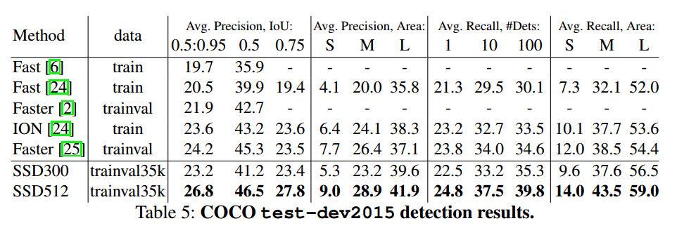 

- 这篇论文对比的还是最初版本的Faster RCNN，即VGG16版的，SSD的效果还是要好于Faster RCNN的，不过后来 Faster RCNN用上了 ResNet后，SSD的精度就比不上Faster RCNN了。可能的原因是Faster R-CNN 第一步关注proposal的效果，第二步关注refine的效果, 提取的ROI区域会有一个zoom in的效果，因而会比SSD混杂在一起单步学习精度更高。而且Faster R-CNN对于小目标的预测更有优势。

## 4.4 Data Augmentation for Small Object Accurac

没有使用特征重采样也就是在feature layer 后面再进行特征提取，这使得SSD对于小目标的预测很困难。前面提到的数据扩增的方式小目标的预测效果有很大的提升作用，特别是对于PASCAL这种小数据集来说。随机剪裁相当于对图片上某一部分进行了zoom in（放大）操作，这使得目标可以变得比较大，也会产生较多的大目标样例。但是不能完全没有小目标，为了产生一种 zoom out（缩小）的效果，文章还将原始图片放置于 16 倍原图大小的画布上，周围空间填充图片均值，然后再进行随机裁剪。使用这个方法之后就有了更多的训练数据。效果如下：

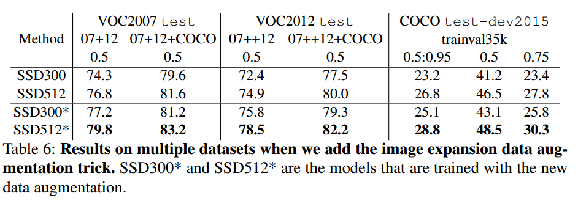

- 这说明这种数据扩增方式对于提升预测效果以及小目标预测效果都是很重要的技巧。

## 4.5 Inference time

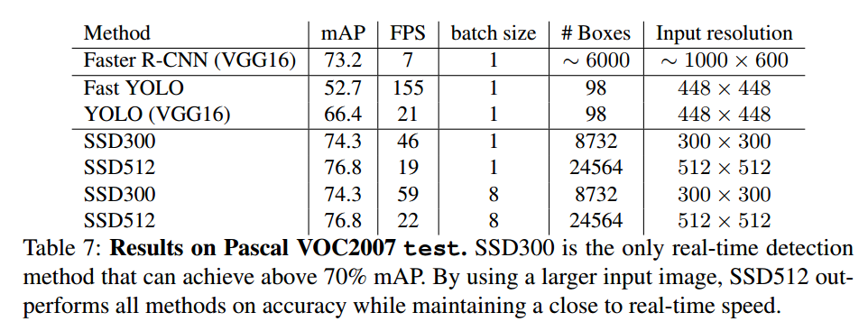

- We measure the speed with batch size 8 using Titan X and cuDNN v4 with Intel Xeon E5-2667v3@3.20GHz 
- Note that about 80% of the forward time is spent on the base network (VGG16 in our case). Therefore, using a faster base network could even further improve the speed, which can possibly make the SSD512 model real-time as well 。

# 5 可能的改进方向

- An alternative way of improving SSD is to design a better tiling of default boxes so
  that its position and scale are better aligned with the receptive field of each position on a feature map. We leave this for future work. 

  没看到有针对这个做改进的。

- Note that about 80% of the forward time is spent on the base network (VGG16 in our case). Therefore, using a faster base network could even further improve the speed, which can possibly make the SSD512 model real-time as well 。

  比如Mobilenet-SSD，还有一些基于其他框架的轻量级检测模型：SqueezeDet，PVANet，Tiny YOLO，Tiny SSD等。

- 特征融合方式，现在已经很多人在做了，DSSD, HyperNet，RON, FPN等。

# 参考资料

1. [SSD: Single Shot MultiBox Detector 模型fine-tune和网络架构](http://blog.csdn.net/Jesse_Mx/article/details/74011886)
2. [一个很棒的讲解SSD的PPT](https://docs.google.com/presentation/d/1rtfeV_VmdGdZD5ObVVpPDPIODSDxKnFSU0bsN_rgZXc/pub?start=false&loop=false&delayms=3000&slide=id.g179f601b72_0_51) 
3. [一个汇集了很多目标检测模型的博客](https://handong1587.github.io/deep_learning/2015/10/09/object-detection.html) 
4. [知乎：atrous convolution是什么？](https://www.zhihu.com/question/49630217)