> 论文：[SqueezeDet: Unified, Small, Low Power Fully Convolutional Neural ...](https://arxiv.org/abs/1612.01051)
> 代码：https://github.com/BichenWuUCB/squeezeDet

# 1 简要介绍

这篇文章提出的SqueezeDet 网络主要是适用于自动驾驶领域的。

SqueezeDet : 基于SqueezeNet 的Detection模型，故称SqueezeDet 。

对于自动驾驶领域来说，几个关键因素如下：

- 精度。高精度，和尽可能高的 recall，最好使100%的recall；
- 速度。应该具备实时检测的速度（30FPS）；
- 较小的模型。小的模型好处有：训练时更加高效，车载客户端进行模型更新时需要较少的无线网络带宽和通信消耗，消耗更少的能量，更适用于嵌入式设备部署。
- 能量效率。一些桌面和框架级别的神经网络往往都需要很大的能量耗散（250W），但是对于自动驾驶领域来说，嵌入式处理器才是应该考虑的主要对象。毫无疑问，如何让神经网络模型适应小的能量消耗是个关键问题。

目前很多公司都在研发适用于自动驾驶的处理器，英伟达 的 [Xavier](https://blogs.nvidia.com/blog/2016/09/28/xavier/) 号称实现每秒 30 万亿次计算(TOPS)，整个系统功耗（包含CPU,GPU在内）为 30W；英特尔的 [EyeQ5](http://www.mobileye.com/our-technology/evolution-eyeq-chip/) ，号称实现15万亿次计算功耗为 5-6W。

SqueezeDet 主要就是针对以上几个方面提出了自己的架构。

SqueezeDet 主要参考了 SqueezeNet，YOLO和SSD，还有FCN全卷积网络。

最终的效果是，在KITTI 数据集上，输入分辨率为1242×375的情况下，其速度达到了57.2FPS，模型体积仅为不到8MB；在TITAN XGPU上 检测一张图片的能耗为 $1.4J$，这是Faster R-CNN 的1/84. 而精度也达到了目前 state-of-the-art水平。在某些方面甚至超过了其他的模型。

# 2 结构设计

先回顾一下跟这篇文章有关的，其他的网络结构。

## 2.1 YOLO

与Faster R-CNN相比，YOLO是属于一步到位的模型，不需要预先生成候选框，然后再去提取特征进行分类和回归。

YOLO的模型结构，如下：

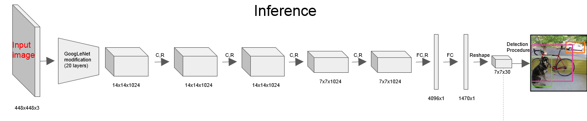

但实际上YOLO也是有生成候选框的步骤的，只是 这个步骤跟检测合并到一起了。那这个生成候选区域的步骤在哪呢。

先看下面这两张图

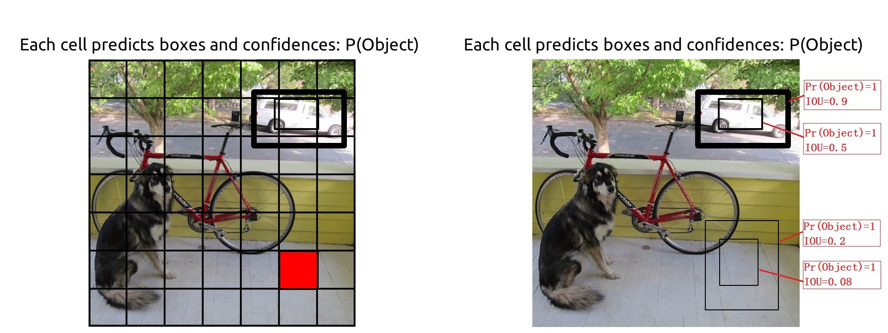

YOLO的方法是这样的，将原图分成一个 7×7的网格：

1. **对于每一个网格都预测两个 形状不同的bounding box（box的尺寸可以大于网格的大小），那么图片上目标的bounding box 肯定跟某几个不同的网格中的bounding box 距离最近。**

   那也就是说每一个网格所关联的两个 box （类似Faster R-CNN中的anchor）里面的区域有可能是目标，也有可能不是目标，或者只包含目标的一部分，或者一部分是目标，一部分不是目标。

   那么这样一来每个 bounding box 都有一个概率，表示他是目标的概率。这个概率 是  
   $$
   P_r(Object)*IOU_{truth}^{pred}
   $$
   其中 $P_r(Object)$  表示这个box中是否存在目标，存在就为1，不存在就为0. 比

   如上面两张图中，不同的两个格点（红色）对应着不同的两组 boxs，每个格点对应两个box，由于这四个box都与目标的区域有重叠（IOU不为0），所以这个四个box的  $P_r(Object)$   都为1. 其实这个  $P_r(Object)$  就是用 IOU （与ground truth之间的IOU）衡量的，首先计算IOU，只要IOU 不为0， $P_r(Object)$  就是1. 一个box中有目标的概率其实就是IOU的值。

   除此之外，每个box还都有位置信息，用坐标来表示，中心点坐标(x, y),以及box宽和高，w，h。

   到此为止，每个格点关联的每个box有5个属性，4个位置信息，1个confidence信息。那一个格点关于box 的定位信息有10个。

2. **但是检测不仅要检测出目标，还要识别出目标是什么物体，因此还需要额外的信息。假设要识别的类别总数为C，YOLO中，对于每个格点（不是关联的两个bounding box）都做一个物体类别预测。**

   那么一个格点还会产生C个物体类别预测信息。对于PASCAL 数据集来说 C=20。那此处

那也就是说一个格点经过网络之后，要得到 共30个信息，这里面包含定位（10）和识别信息（20维）。

所以我们观察一下YOLO的最后全连接层那一部分，可以看到YOLO用了两个全连接层，一层是4096×1的，还有一个是 1470×1的。前面的4096可以认为是根据经验选取的（alexnet，VGG第一个全连接层都是4096维的），但是后面的1470×1就不是经验值了，其实是 1470=7×7×30。

那这个是什么意思已经很明白了。此处的 7×7 就是要把图片分成多少 格点，后面的30就是每个格点要预测的信息维数。结合下图更明了。

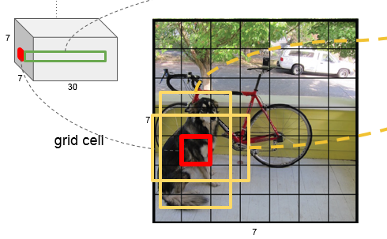

那其实到这里就可以看出来了，YOLO解决的方式其实属于是回归问题。前面24个卷积层提取特征，后面两个全连接层，用于回归。回归的是什么？回归拟合的是每个格点两个box的坐标值（5×2），和每个格点的分类向量（20）。

## 2.2 Faster R-CNN

Faster R-CNN的结构见下图，很显然是两步检测的，先生成一系列可能是目标的区域（stage 1），然后对这些区域进行检测（stage 2）。stage 2的箭头起点不太对，应该是从 proposals开始，前面的卷积部分是共享的。

实际上，Faster R-CNN的stage 1就已经产生目标检测的区域了，可以认为这已经是一个 弱的检测器了（这个称为RPN），这个stage 1已将包含了定位的信息，只是它只确认区域中是否包含目标，而不关心包含的是什么类别的目标。stage 2是一个强检测器，除了进一步精修定位信息，最主要的是把目标类别识别来。

假设我们在stage 1中把候选区域中的目标类别也预测出来，那其实stage 2可以不用了。

YOLO 其实就相当于 Faster R-CNN的stage 1步骤，当然细节上会有不同。比如

- YOLO后面使用的是全连接层，而Faster R-CNN stage 1步骤（RPN）后面使用的是全卷积层。
- YOLO每个格点的是预测目标类别的（多分类），RPN只预测是否是目标（二分类）。

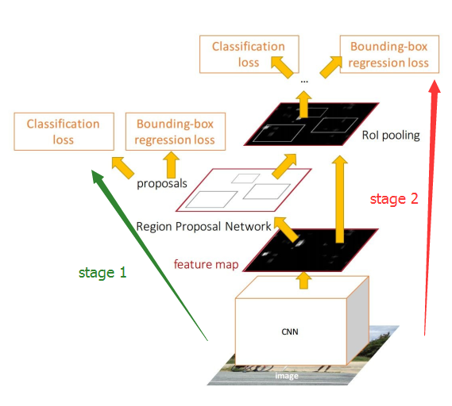

再看看RPN的主要结构，如下图：

主要就是 anchor这个机制，假设feature map上每个像素关联k个anchor。

假设前面用的ZFNet，那么最后一个卷积层输出的feature map是13×13×256的。

先看其中一个window，如果后面使用256个3×3×256的卷积核，那么 256-d那个地方输出的就是 1×1×256维的，那么后面的cls层（二分类）就是2k个1×1×256的卷积，输出为1×1×2k；reg层（定位）就是4k个1×1×256的卷积，输出为1×1×4k。

**与YOLO不同的是，每一个anchor（对应YOLO中每个格点内的两个box）都输出类别概率。**

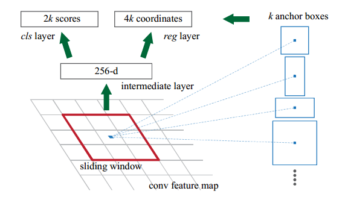

图上那个sliding window的做法，在实际操作的时候，其实就是用了卷积的方式，步长为1，pad为1.

所以实际上  256-d那个地方其实是 13×13×256。对应的cls层和reg层的输出分别是13×13×2k，13×13×4k，如下图。13×13维度上每一个 1×1×2k或4k的长条，都代表图片上不同位置的anchor box的类别信息或者位置信息。

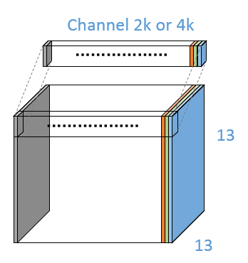

## 2.3 SSD

先看下SSD的宏观结构，如下图，FC6和FC7以及之前的部分是VGG的内容，后面是SSD里面加的。SSD添加的层 

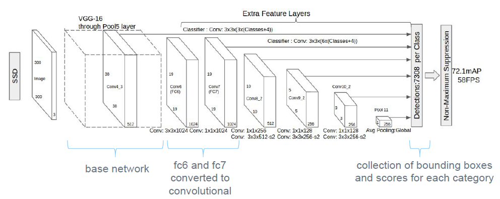

这是一个多尺度预测（Multi-scale）的网络，如下图从FPN的论文里找来的图。就是从不同的feature map上预测，然后将各个预测结果融合到一起。

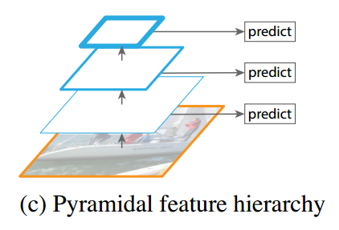

然后将SSD与YOLO相比较一下，如下图。可以看出YOLO是单一尺度的。二者最大的区别也在此。当然在框的生成方面SSD也是一步到位的，一边生成框，一边检测。

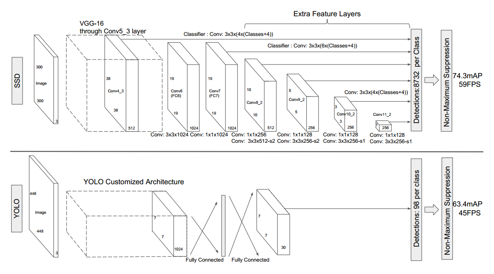

更详细的看一下SSD的检测流程如下：

总共6个尺度，每一个尺度上都进行框的生成和预测。最后使用NMS（非最大值抑制）进行过滤，得到最后的结果。

与YOLO的不同主要在于：

- 多尺度
- 主干部分，全卷积
- 预测部分也是卷积（YOLO的预测部分是全连接层）

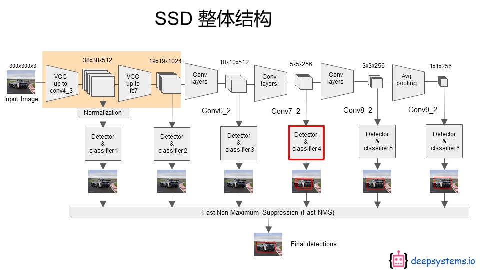

接下来看看SSD是如何检测的。如上图红色框，这一部分其实是使用 3×3的卷积实现的。具体细节看下图：

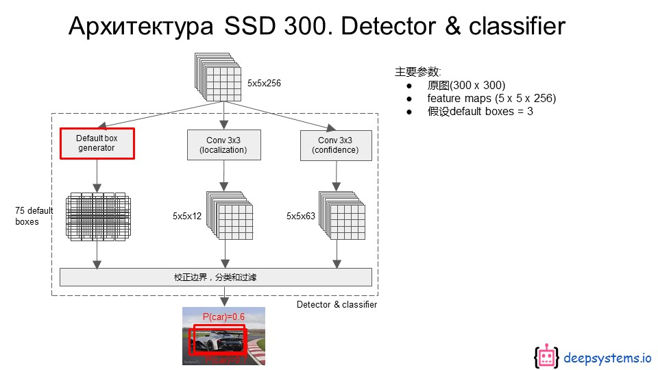

再看看是怎么生成default box的，如下图。最右边那个就是对应的feature map的尺寸，然后将feature map上的每一个像素点都映射到原图上（最左边），然后映射到原图上的每一个像素都关联三个不同的default box。

有没有发现这跟 YOLO中的 网格划分很像，只不过YOLO是划分成网格，这个网格划分对应于最后一个全连接层做了reshape 的feature map，每一个网格也只包含一个像素，每一个像素再映射到原图上。

**但其实更像的是Faster R-CNN中的 anchor box。** 

- 与YOLO不同的是，每个 default box（对应YOLO中每个格点内的两个box），都输出4个位置信息和 (C+1) 个类别信息（包含1个背景）。
- 与Faster R-CNN 不同的是，每个  default box（对应Faster R-CNN 中的两个anchor box），都输出(C+1) 个类别信息，而不是一个二分类标记box是不是目标。

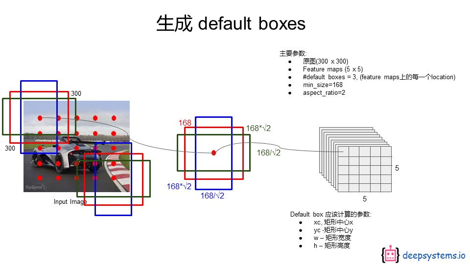

看下图这个就是分类和检测的实现方法，跟Faster R-CNN中的RPN如出一辙。

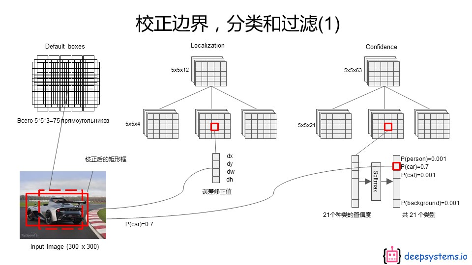

## 2.4 SqueezeDet

### 2.4.1 结构分析

网络结构如下：

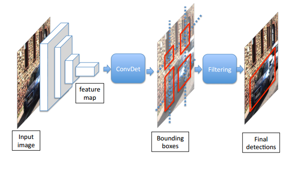

前面是特征提取网络，这里用的SqueezeNet，中间是本文提出的ConvDet层，后面是Filtering层。Filtering层就是NMS（非最大值抑制）。

ConvDet层意即，使用卷积层来检测（Detection），因为经典的用法是使用全连接层来进行检测（比如YOLO），不过Faster R-CNN中的RPN相当于一个全卷积的弱检测器。**这个方面来说SqueezeDet,跟RPN也挺像。**

**但是SqueezeDet更像SSD.** 就相当于SSD的一个尺度分支，只不过前面卷积层提换成了squeezenet。

再看一下 SqueezeDet 关于anchor box的图，是不是跟SSD和RPN很像，简直如出一辙。

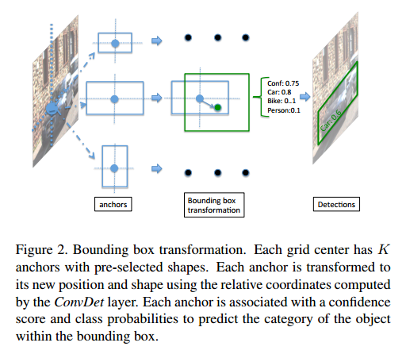

### 2.4.2 计算量分析

**以下图中 蓝色的为某一层的输出特征，而黄色的是神经元的参数分布（权值和偏置）** 

**以下3D卷积写法均略去前一层的输入通道数**

- **首先看下RPN的参数量：**

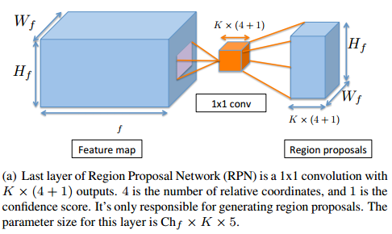

输入是 $W_f× H_f×Ch_f$ 的feature map，

中间黄色的部分是 $1×1$ 的卷积核，如果把分类和回归放在一起，那么卷积核的个数就是 $K×(4+1)$  个，4是四个坐标，1是一个概率，K是K个anchor。

把分类和回归的输出也放在一起，那么输出feature map就是$W_f× H_f×(K×(4+1))$ 大小的。

参数量为 ： $1×1×Ch_f ×K×5$ 

------

- **再看下 YOLO中的参数量：**

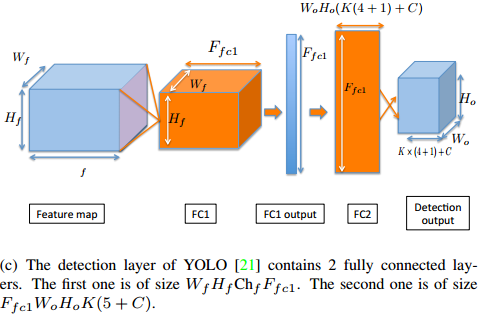

**这个检测模块称之为 FcDet**

同样输入是 $W_f× H_f×Ch_f$ 的feature map，

假设将图片分成 $W_o ×H_o$ 个网格（比如7×7）；每个网格关联K个box（比如K=2）；每个box输出（4+1）个信息（4个位置信息，1个类别信息）；每个格点输出C个类别概率（比如20）。

首先看第一个卷积层，FC1标号的是神经元的参数分布，可以看到从卷积层到全连接层的参数分布其实是一个 $W_f× H_f$ 的卷积核，这个卷积核与一整张feature map卷积，只输出一个激活值；这样的卷积核共有 $F_{fc1}$ 个，因此FC1输出为 $1×F_{fc1}$ 。

这一层参数量为：$W_f× H_f×Ch_f×F_{fc1}$  

接着第二个全连接层，FC2标号的也是神经元的参数分布，这里用的是 $1×1$ 的卷积层实现的，由于上述假设，FC2的输出应该是 $1×\{W_o ×H_o×(K(4+1)+C)\}$ ，是一个二维的tensor；但是为了与划分的网格匹配，需要将这个输出reshape成$W_o ×H_o×(K(4+1)+C)$ 这样的三维tensor。

这一层参数量为： $F_{fc1}×W_o ×H_o×(5K+C)$ 。

FcDet整个结构的参数量为：$W_f× H_f×Ch_f×F_{fc1} + F_{fc1}×W_o ×H_o×(5K+C)$  

------

- **看下这篇文章提出的ConvDet结构的计算量：**

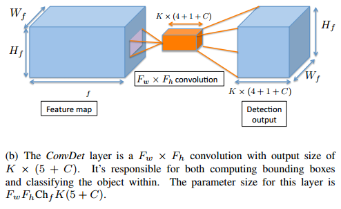

这个结构说白了就是SSD的一部分，再来对比一下，看看下图SSD中相对应的部分，这个图中把分类和回归定位分开画了，不过SSD的代码中实际上也是分开做的，其实这部分可以合并到一块的，因为卷积都是用的3×3，输出也都是 5×5，所以合并到一块也是可以的，只是不同的通道对应着不同的分类或者定位结果。

基本上二者相同，只不过这里起了个名字，叫做ConvDet。

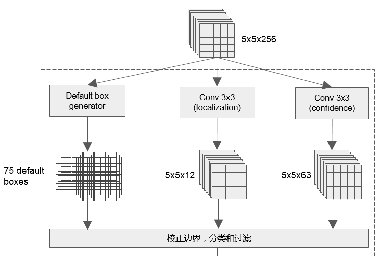

同样输入是 $W_f× H_f×Ch_f$ 的feature map，

只不过这里假设 卷积是 $F_w×F_h$ 的（SSD对应结构中用的是3×3），通道数为 $K×(4+1+C)$ , K为 anchor（或 default box 或 格点内关联的box）的个数，4为每个anchor的位置信息，1为是目标的概率，C为C个分类。这样输出为  $W_f× H_f×\{K×(4+1+C)\}$ 。

ConvDet的参数量为：  $F_w×F_h×Ch_f×\{K×(5+C)\}$ 

**与YOLO 相比，没有使用全连接层，而是使用了全卷积的（FCN）方式。其实就是SSD中的一部分。**

------

- **三者参数量对比：**

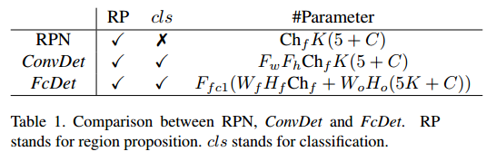

举个例子计算下：

假设输入feature map 为 $7×7×1024， F_{fc1} = 4096, K = 2, C = 20, W_o = H_o = 7,$ ConvDet 使用3x3 的卷积核

YOLO: $4096×（7×7×1024+7×7×（5×2+20））=212×10^6$ 

ConvNet: $3×3×1024×2×（5+20） =0.46 ×10^6$ 

## 2.6 训练

- **先看一下，网络预测的是什么**

  如下图：

  - 绿色框为ground truth
  - 红色为anchor
  - 蓝色为预测的box

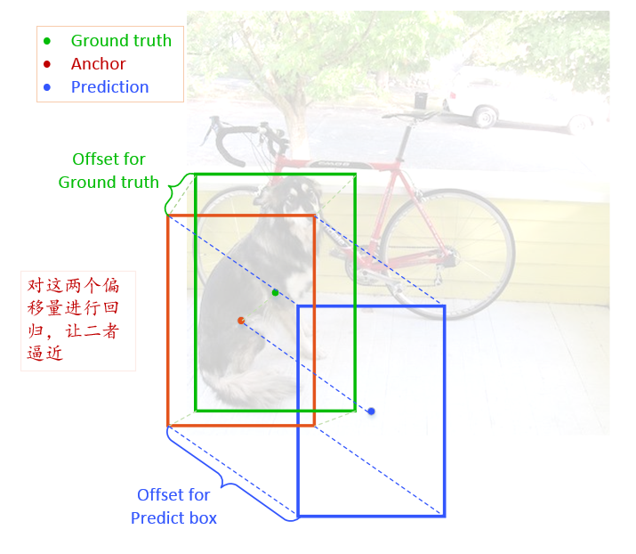

首先，Ground Truth 与 Anchor 有个偏移值，如下：
$$
Offset^{GT}=\{\delta ^G(x_{ijk}),\delta ^G(y_{ijk})，\delta ^G(w_{ijk})，\delta ^G(h_{ijk})\}
$$
其次，Prediction 与 Anchor 有个偏移值, $Offset^{P}$，如下：
$$
Offset^{P}=\{\delta (x_{ijk}),\delta (y_{ijk})，\delta (w_{ijk})，\delta (h_{ijk})\}
$$
对于定位来说：可以认为，这个网络预测输出的是 $Offset^{P}$ ，标签是 $Offset{^GT}$ ，转化一下，实际上网络输出的是 $ \delta (x_{ijk}), \delta (y_{ijk}), \delta (w_{ijk}), \delta (h_{ijk})$  ，因为这四个参数决定了 $Offset^{P}$ 。

分类就是输出类别，标签为真实类别。

------

以上偏移是由网络学习得到的。

偏移与最终的输出之间还有一个映射关系，这个关系是人为指定的。这个关系最先在R-CNN系列的目标检测模型中提出。下述。

最终的预测框的中心坐标 $(x_i^p,y_i^p)$ 和宽高  $(w_k^p,h_k^p)$  的计算方式如下：

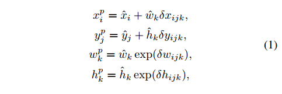

$\hat x_i,\hat y_i$ 是与box关联的feature map中的像素（或者说类似于YOLO中的格点）的坐标，如下图中的 $C_x，C_y$ 。

$\hat w_k,\hat h_k$  是 每个像素（或格点）关联的第k个anchor的 宽和高，如下图中的 $b_w,b_h$ 

偏移与真实位置之间的映射有两种，线性映射（中心点坐标）和指数映射（宽，高）。

这个地方可以结合 YOLO9000论文中的一张图理解。不过对于预测和anchor的关系，二者刚好反过来。

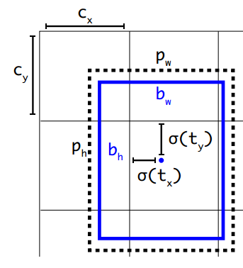

------

- **再来看一下损失函数，如下：**

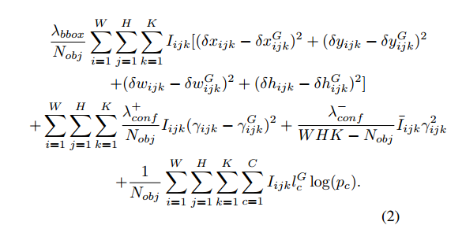

损失函数与YOLO的损失函数差不多，放一张YOLO的对比一下：

解释一下SqueezeDet的损失函数:

主要分为三部分：

- 第一部分是回归损失，或者说定位损失，就是下图这个：

  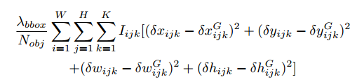

  - $I_{ijk}$ 表示：位于 输出feature map上 $(i,j)$ 坐标处的第 $k$ 个anchor 是否包含有目标。也就是 这个$P_r(Object)*IOU_{truth}^{pred}$  是否为0.
  - $\delta x_{ijk},\delta^G x_{ijk}$ 分别表示anchor与预测box和ground truth 的 x 坐标的偏移。后面其他的参数，y，w，h类似。
  - 这是一个均方误差。没有采用YOLO那样的将 宽度w和高度h开根号，再做均方误差。YOLO这么做是考虑了对于大小目标计算损失时的公平问题。

- 第二部分是二分类损失，这个二分类决定的是这个anchor是否是目标，如下：

  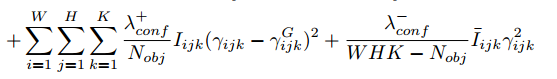

  - $\gamma _{ijk}$ ：$P_r(Object)*IOU_{truth}^{pred}$ 

## 2.5 试验结果

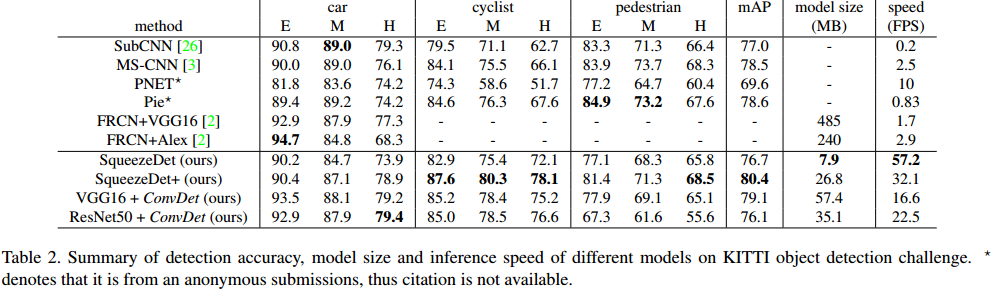

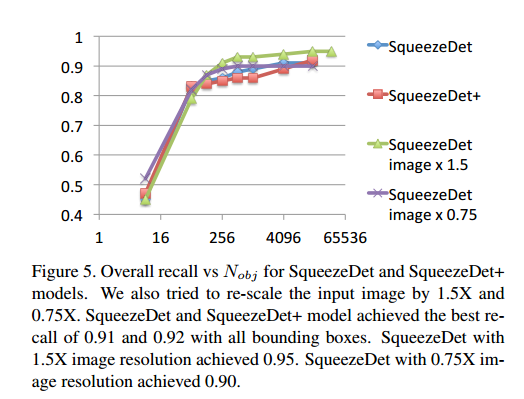

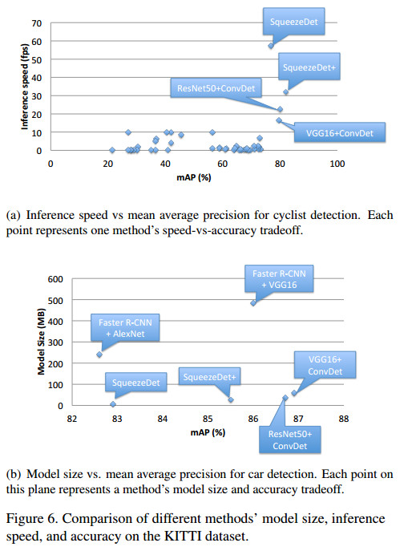

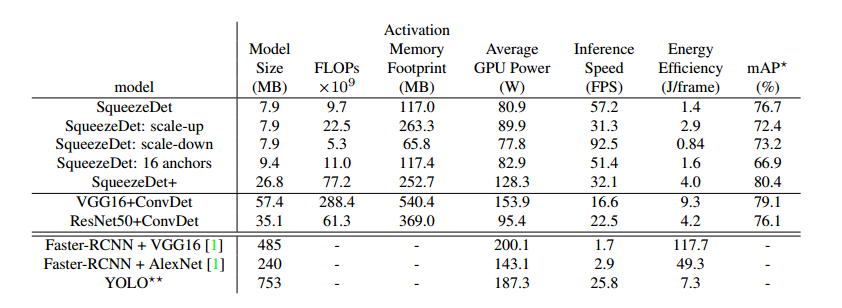

