目标检测中两步检测算法的总结对比，持续更新……

R-CNN, SPPNet, Fast R-CNN, Faster R-CNN, R-FCN, Light-head R-CNN, Mask R-CNN

# R-CNN

Rbg提出的R-CNN的方法

1. 一张图像先通过selective search的方法，生成1K~2K个**候选区域**，这个步骤生成的候选区域大小是不一样的，因此需要 warped region，也就是将不同大小的 region 缩放到同样的尺寸，因为CNN后面的全连接层要求输入尺寸固定。
2. 对每个 warped 后的候选区域，使用CNN**提取特征** ，提取的特征需存储到磁盘；
3. 读取特征，送入每一类的 SVM **分类器**，判别是否属于该类；
4. 最终还有一个位置回归器用于精细修正。

回归方法：

|        region proposals 与 ground truth之间的逻辑关系        |                可以推出回归目标（也就是标签）                |
| :----------------------------------------------------------: | :----------------------------------------------------------: |
| 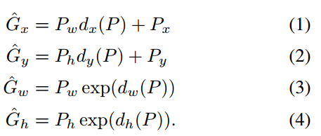 | 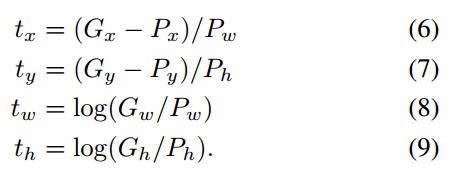 |

回归函数：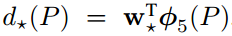 

损失函数：

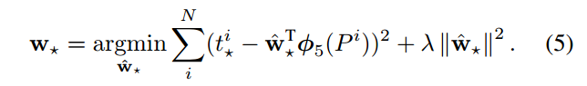

**训练方法：**  

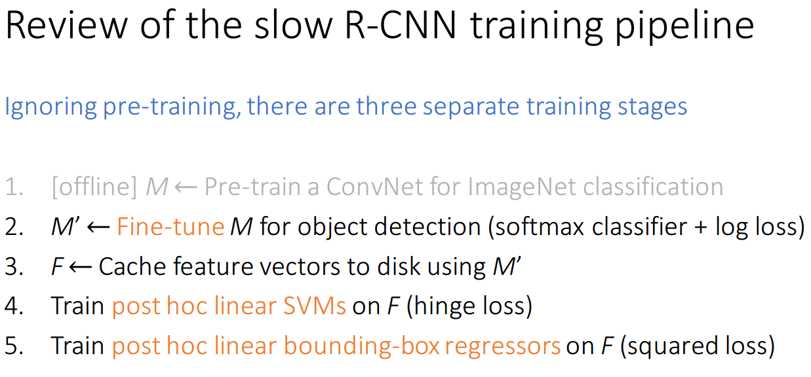

**优点：** 

- 结构简单明了，容易理解；
- CNN自动提取特征，省去手工设计特征的复杂操作，以及对经验和运气的依赖性；
- 使用 selective search方法来生成候选区域，显著减少候选区域的数量，增加候选区域的质量（包含目标的可能性更大），因为这相当于一个弱检测器，相比于sliding window穷举搜索的方式肯定要好很多；
- 预测精度提高了30%。

**缺点：**

- 提取特征时，CNN需要在每一个候选区域上跑一遍；候选区域之间的交叠使得特征被重复提取, 造成了严重的
  速度瓶颈, 降低了计算效率; 
- 将候选区域直接缩放到固定大小, 破坏了物体的长宽比, 可能导致物体的局部细节损失;  
- R-CNN还不是端到端的模型，训练步骤繁琐multi-stage（先预训练、fine tuning、存储CNN提取的特征；再训练SVM ；再regression）。从fine tuning 到训练SVM时，不能一步到位，要分成两步；
- 训练SVM时需要将之前CNN提取到的特征全部存储在磁盘上，磁盘读写耗时，且占用空间大，（Pascal 200G）；
- 使用额外的selective search 算法生成候选区域的过程也很耗时；
- 预测时间很慢，一张图片要49s。

# SPPNet

针对R-CNN的两个缺陷：

- 先生成候选区域，再对区域进行卷积，候选区域之间的交叠使得特征被重复提取, 造成了严重的
  速度瓶颈, 降低了计算效率; 
- 将候选区域直接缩放到固定大小, 破坏了物体的长宽比, 可能导致物体的局部细节损失;  

何凯明提出的改进方法如下：

|                    改变生成候选区域的顺序                    |
| :----------------------------------------------------------: |
| 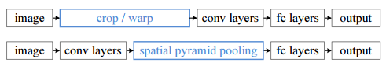  |
|                         **SPP池化**                          |
| 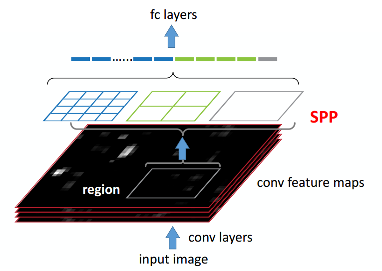 |

- 改变生成候选区域的顺序。从先生成候选区域再提取特征，变成先提取特征再生成候选区域，实现了特征提取部分的计算共享，极大的减少计算量。生成候选区域的方式还是 selective search算法，在原图上生成候选区域后，映射到特征图上去。
- 使用SPP池化（Spatial pyramid model, 空间金字塔池化池化）：传统的池化方式是 **已知输入尺寸**和 **固定池化核大小**，**确定输出尺寸**，那么这时候输出尺寸肯定是随输入尺寸变化的，所以这时候就要求输入图片是固定尺寸。而SPP池化是 **已知输入尺寸** 和 **固定输出尺寸**，**来确定确定池化核的大小**。SPP 层用不同大小的池化窗口作用于卷积得到的特征图，池化窗口的大小和步长根据特征图的尺寸进行动态计算，最终可以组合成一个特定维度的特征输出。这里的输入可以是一个feature map（分类问题），也可以是一个window（检测问题）。

**训练过程：** 

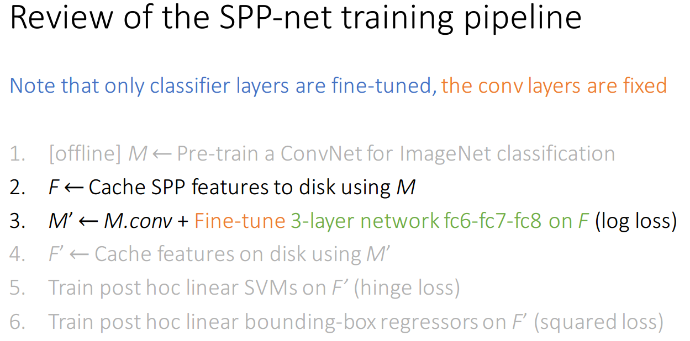

**优点：**

- SPP-net 对于一幅图像的所有候选区域, 只需要进行一次卷积过程, 避免了重复计算, 显著提高了计算效率。该方法在速度上比 R-CNN 提高 24 ~102 倍 .
- SPP池化层使得检测网络可以处理任意尺寸的图像, 因此可以采用多尺度图像来训练网络, 从而使得网络对目标的尺度有很好的鲁棒性. 

**缺点：**

- SPP-net 的训练过程更复杂了，（先预训练、存储SPP特征、使用SPP特征fine tuning全连接层、存储CNN提取的特征；再训练SVM ；再regression）。
- CNN 提取的特征存储需要的空间和时间开销增大;
- 在微调阶段, SPP-net 只能更新空间金字塔池化层后的全连接层, 而不能更新卷积层(好像是梯度不连续), 这限制了检测性能的提升。 

# Fast R-CNN

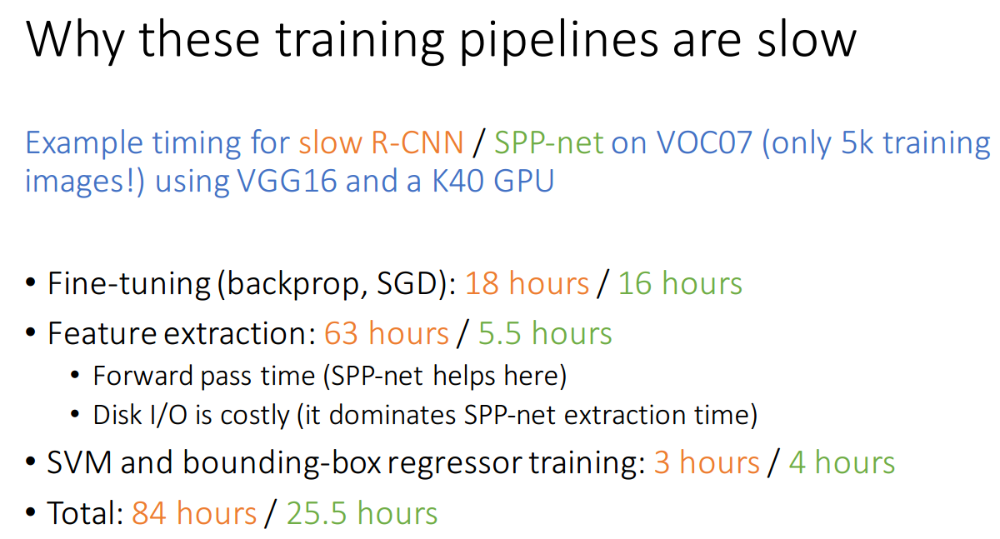

**为什么 SPPnet和 R-CNN训练很慢？**

主要原因有两点

- 使用SVM做分类器时，需要将特征事先存储到磁盘上，磁盘交互耗时；
- 训练步骤繁琐，不能联合训练。

针对 R-CNN 和 SPPNet 的这两个问题, rbg 提出 能够端到端联合训练的  Fast R-CNN 算法 ，如下：

- 首先在图像中提取感兴趣区域 (Regions of Interest, RoI)，还是使用selective search算法，生成的候选区域这里称为ROI，将ROI映射到feature map上; 
- 然后采用与 SPP-net 相似的处理方式,对每幅图像只进行一次卷积, 
- 在最后一个卷积层输出的特征图上对每个 RoI 进行映射, 得到相应的RoI 的特征图, 并送入 RoI 池化层 (相当于单层的SPP 层, 通过该层把各尺寸的特征图统一到相同的大小); 
- 最后经过全连接层得到两个输出向量, 一个进行 Softmax 分类, 另一个进行边框回归. 

|                           SPP池化                            |
| :----------------------------------------------------------: |
| 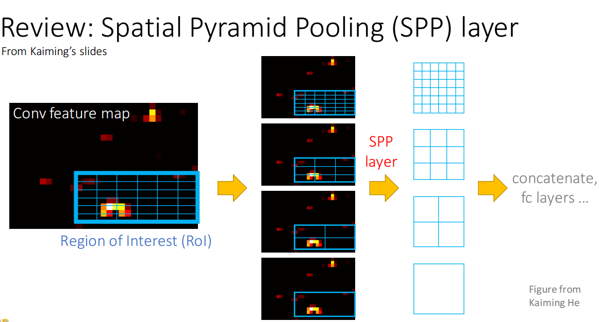 |
|                         **ROI池化**                          |
| 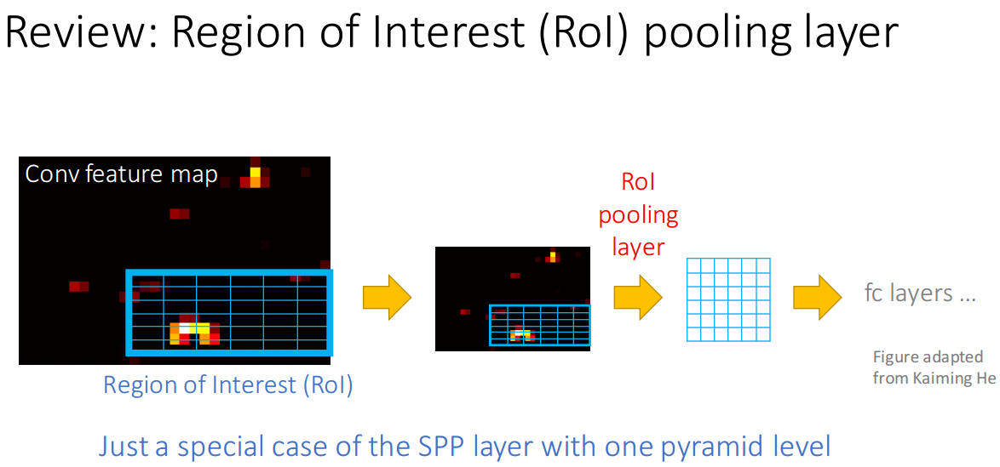 |

**改进的方法：** 

- 串行结构改成并行结构 ：原来的 R-CNN 是先对候选框区域进行分类，判断有没有物体，如果有则对 Bounding Box 进行精修 回归 。这是一个串联式的任务，那么势必没有并联的快，所以 rbg 就将原有结构改成并行，在分类的同时，对 Bbox 进行回归；
- ROI池化：在这个模型里，ROI就是感兴趣区域(Regions of Interest, RoI) ，也就是之前模型中的候选区域。SPP池化的改进，相当于只用了一种尺寸的 SPP池化；
- 不用SVM分类，改用SoftMax分类，可以省去特征存储；
- 使用multi-task loss 多任务损失函数（分类+回归），端到端（end-to-end）训练。

**训练方式：** 

| 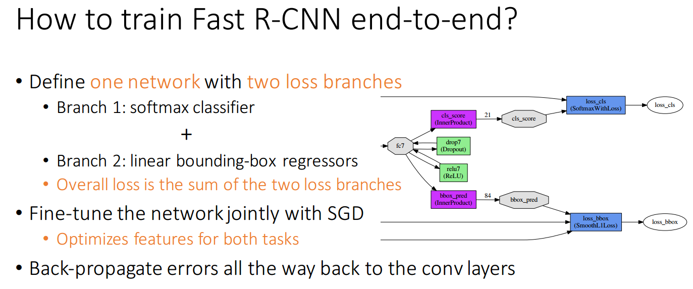 |
| ------------------------------------------------------------ |
| 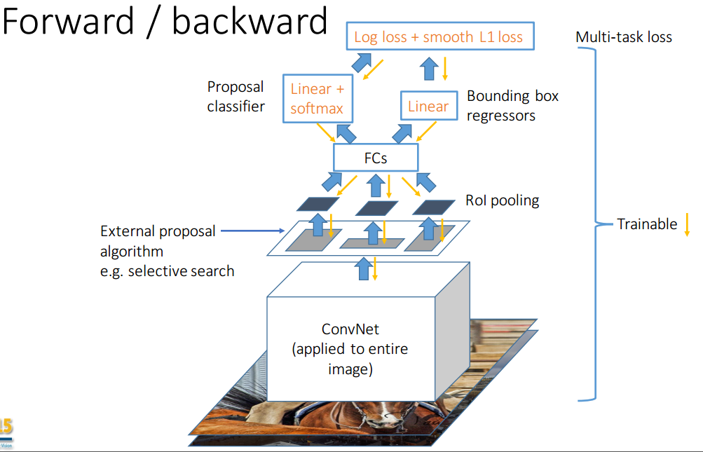 |

**multi-task 损失函数：** 

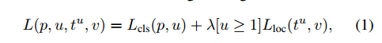

**新的挑战及解决方法：** 

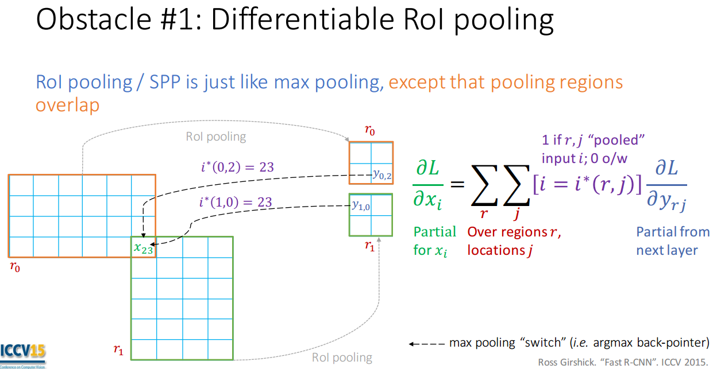

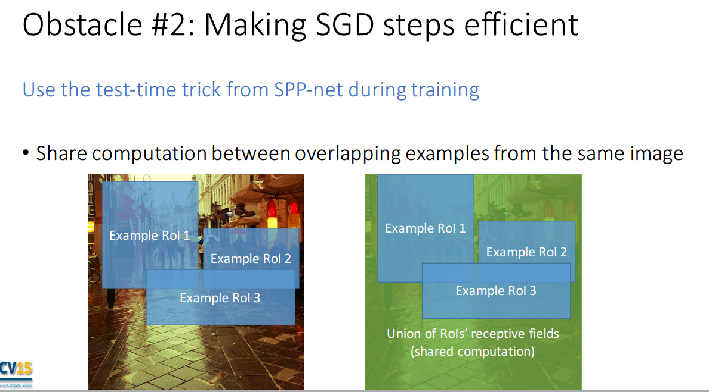

**ROI池化：**

一句话概括作用：将不同尺寸输入的feature map或者 ROI，降采样成固定尺寸的输出 feature map，再送入全连接层。

做法：

- 将image中的ROI 映射到feature map 中对应位置的区域，这些区域大小是不统一的（**已知输入**）；
- 将映射后的区域划分为相同大小的sections（sections数量与输出的维度相同，**固定输出尺寸**）；这个过程中，每个ROI分好的section中的像素数量是不一样的（池化核的大小和步长根据输入和输出尺寸进行动态计算），最终可以组合成一个特定维度的特征输出；
- 对每个sections进行max pooling操作；

参考：[Region of interest pooling explained](https://blog.deepsense.ai/region-of-interest-pooling-explained/) 

**优点：**

- 精度有提高
- 通过使用 multi-task loss ，可以实现 end-to-end训练，single-stage，除了预训练之外，其他的都是可以一气呵成的。
- 分类和回归任务可以共享卷积特征,相互促进. 
- Fast R-CNN 采用 Softmax 分类与边框回归一起进行训练, 省去了特征存储, 提高了空间和时间利用率。 与 R-CNN 相比, 在训练 VGG 网络时,Fast R-CNN 的训练阶段快 9 倍, 测试阶段快 213倍; 与 SPP-net 相比, Fast R-CNN 的训练阶段快 3倍, 测试阶段快 10 倍。

**缺点：** 

- Fast R-CNN 仍然存在速度上的瓶颈, 就是候选区域生成步骤耗费了整个检测过程的大量时间.

# Faster R-CNN

为了解决候选区域生成步骤消耗大量计算资源, 导致检测速度过慢的问题, 任少卿，何凯明，rbg联合提出区域生成网络 (Region proposal network, RPN), 并且把RPN 和 Fast R-CNN 融合到一个统一的网络 (称为 Faster R-CNN), 二者共享卷积特征. 如下：

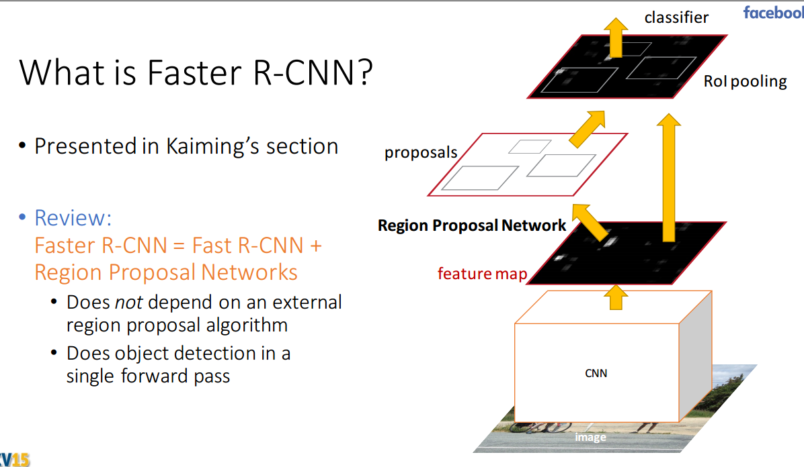

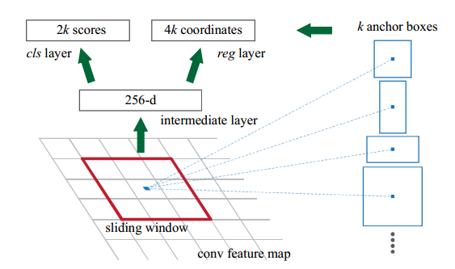

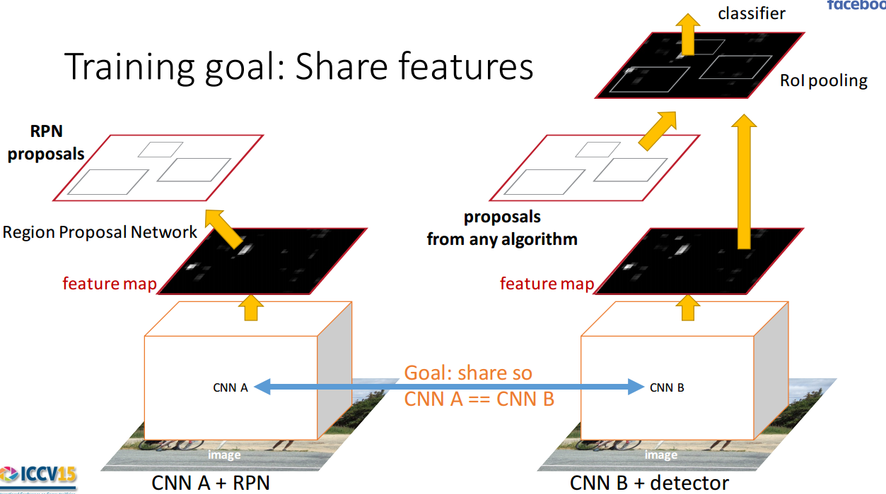

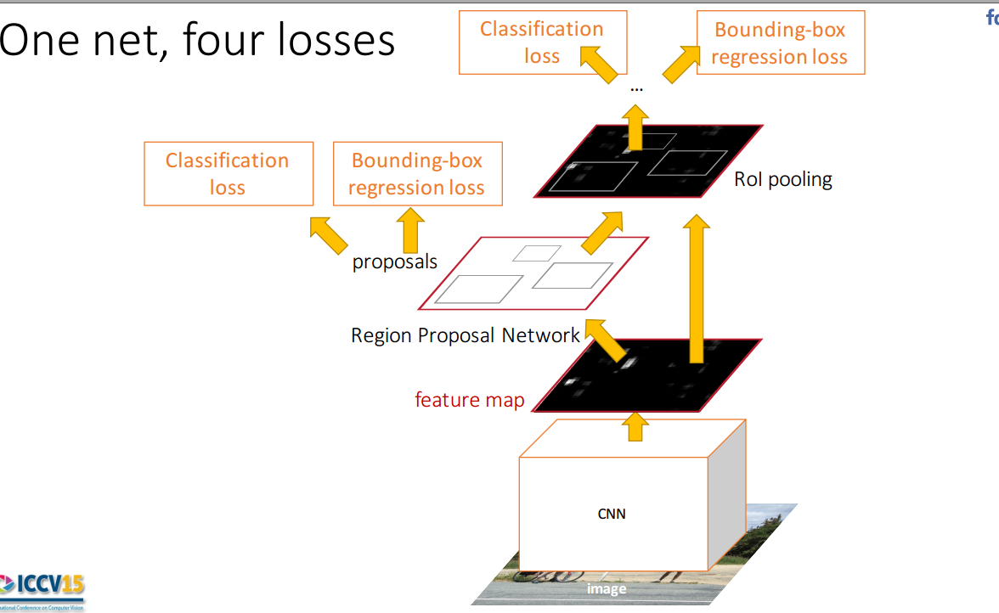

RPN 将一整幅图像作为输入, 输出一系列的矩形候选区域. 它是一个全卷积网络模型, 通过在与 Fast R-CNN 共享卷积层的最后一层输出的特征图上滑动一个小型网络（sliding window）, 这个网络与特征图上的小窗口全连接, 每个滑动窗口映射到一个低维的特征向量, 再输入给两个并列的全连接层, 即分类层 (cls layer) 和边框回归层(reg layer), 由于网络是以滑动窗的形式来进行操作, 所以全连接层的参数在所有空间位置是共享的. RPN的结构在实现时实际上是一个全卷积网络。

RPN是一个弱检测器，RPN的输出是一些可能包含目标的候选框（ region proposals 或者称为 region of interest ,ROI）,这些ROI 将会输入Fast R-CNN中，用于最后的检测。

**训练方式：** 

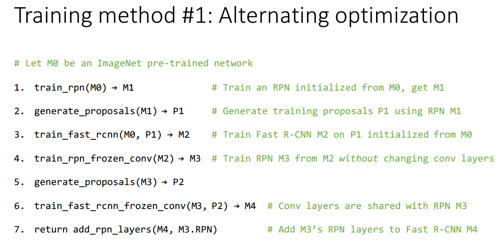

**Anchor的作用** 

按照两步检测的惯例，应该要先有初步的ROI ，然后才是最终的分类和回归，对于原版的Fast R-CNN来说，它的ROI是由selective search算法提供的；而Faster R-CNN中的 Fast R-CNN的 ROI 则是由RPN网络产生的。

那么RPN既然是一个弱检测器，那么RPN的ROI或者 region proposals从哪来？ 答案是从 anchor 中来。

结合上面的图，RPN在CNN提取特征之后以sliding window的方式在最后一个feature map上提取特征，每个滑动窗口中心都关联着 k个 box，这些box就称为anchor，或者叫anchor box。这些关联的box 可以通过逆向映射对应到原图上，对应到原图上的区域就是region proposals，不过这些region proposals都是位于同一个中心点。就是说sliding window时的window（大小固定）是由这些原图上的不同大小和比例的 region proposals 生成的（类似于ROI池化的功能）。

实际上sliding window时每个 window 起到了一部分region proposals 的作用，但是由于这里的sliding window的尺寸是固定的，所以不能起到多尺度，多尺寸（multiple scales and sizes ）预测的作用，因此提出关联k个不同大小和长宽比的anchor box，这样二者结合即可起到多尺度，多尺寸预测的作用。参考下图：

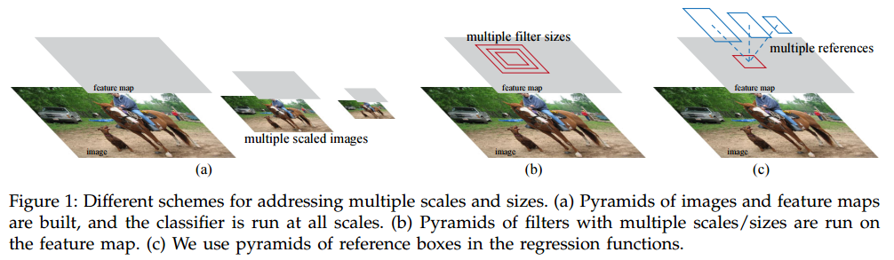

使用anchor的好处是，RPN最后sliding window 时可以使用 卷积的方式实现（因为 window的大小是固定的），使网络变得很简单。

而后面的 256维向量的输入 由于用卷积层实现所以也由 （1,1,256），变成了（W,H,256）.

但是我们知道后面的输入是固定尺寸的 window ，那么在分类和回归时是如何来反映不同尺寸和比例的 region proposals呢？答案是通过 标签和损失函数。

以下引用自 [参考资料 1]，在那位大兄弟的博客中，一开始他的理解是对的，但是后面的补充他又给改错了，但是不是什么大错，内容是对的，只是因果关系搞反了，这里只把内容贴出来：

> **从nxn提出的256d特征是被这k种区域共享的**，在clc layer和reg layer计算损失的时候，用这共享的256d特征 加上 anchor推算出k种区域的坐标和前景、背景的标签，便可以对这k种区域同时计算loss。
>
> **clc layer和reg layer同时预测k个区域的前景、背景概率（1个区域2个scores，所以是2k个scores），以及bounding box（1个区域4个coordinates，所以是4k个coordinates），具体的说：**
>
> clc layer输出预测区域的2个参数，即预测为前景的概率pa和pb，损失用softmax loss（cross entropy loss）（本来还以为是sigmoid，这样的话只预测pa就可以了？）。需要的监督信息是Y=0,1，表示这个区域是否ground truth
>
> reg layer输出预测区域的4个参数：x,y,w,h，用smooth L1 loss。需要的监督信息是 anchor的区域坐标{xa,ya,wa,ha} 和 ground truth的区域坐标{x*,y*,w*,h*}
>
> 显然，上面的监督信息：Y，{xa,ya,wa,ha}（k个），{x\*,y\*,w\*,h\*}（1个），就是通过anchor机制产生的。这几个参数的指定（比如k个anchor区域的Y是怎么得到的）是根据文章中的样本产生规则，很多博客中也都提到了。

参考资料：

1. [faster-rcnn中，对RPN的理解](http://blog.csdn.net/ying86615791/article/details/72788414)
2. [faster rcnn中rpn的anchor，sliding windows，proposals？](https://www.zhihu.com/question/42205480) 

# R-FCN

如果不考虑生成ROI的部分（比如RPN，Region Proposal Network），两步检测模型可以分为两部分子网络（subnetworks ）：

- 第一部分是**共享计算**的全卷积基础子网络 base，或称body，trunk ，这一部分是与ROI独立的，主要用于提取特征
- 第二部分是**不共享计算**的子网络 head，**生成的每一个ROI都要经过head部分**，主要用于分类

 Faster R-CNN 实现了很多计算的共享：ROI之间的特征提取共享计算，ROI 提取与base部分共享计算，但是**ROI通过head部分是不共享计算。**  

 R-FCN就是基于FCN将 head部分也实现了计算共享。但是由于直接将 Faster R-CNN 的head部分也就是全连接层改为全卷积层，然后再使用

R-FCN是一种新的基于区域的全卷积网络检测方法. 为了给网络引入平移变化, 构建对位置敏感的池化方式 (Position sensitive pooling), 编码感兴趣区域的相对空间位置信息. 该网络解决了 Faster R-CNN 由于重复计算全连接层而导致的耗时问题, 实现了让整个网络中所有的计算都可以共享 。

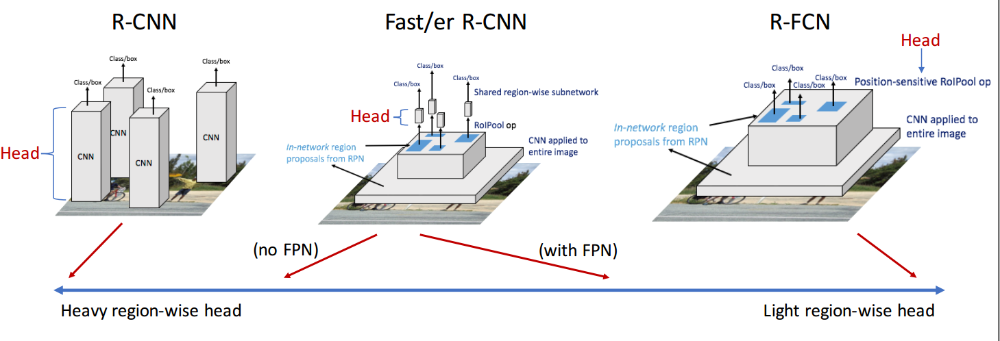

**Position sensitive pooling：**

ROI Pooling 中的每一个网格都来自前面  position-sensitive score maps中不同组通道的  feature map。这个跟分组卷积的意思有点像，这个可以叫做分组ROI池化。是一种选择性ROI池化，主要是为了增强对位置的敏感程度。

# Light-head RCNN

不管是 Faster R-CNN还是 R-FCN 在 ROI(Region of Interest) 生成前后都是计算量很大的，比如 Faster R-CNN 的head部分包含两个全连接层用于ROI 分类，而全连接层极大地消耗计算；R-FCN虽然比 Faster R-CNN快许多，但是由于生成的 score maps太多，想要达到实时（30FPS, Frame Per Second）还是有点困难的。也就是说这些模型之所以速度慢的原因在于计算量过于繁重的 head部分 (heavy-head design )，即便是将 base部分削减压缩，计算消耗也不能很大程度的削减。

本文提出了一种新的两步检测模型， Light-Head RCNN ，为了解决现在的两步检测普遍存在的 heavy-head的问题。在本文模型的设计中使用了thin feature map 和 cheap R-CNN subnet (pooling and single fully-connected layer)，是对R-FCN的改进。

**改进：** 

- 引进inception V3中可分离卷积的思想，作者采用large separable convolution生成**channel数更少的feature map**(从3969减少到490)。
- 用FC层代替了R-FCN中的global average pool，**避免空间信息的丢失**。

**参考资料：** 

- https://zhuanlan.zhihu.com/p/33158548

# Mask R-CNN

在fatser rcnn的基础上对ROI添加一个分割的分支，预测ROI当中元素所属分类，使用FCN进行预测；  

具体步骤：使用fatser rcnn中的rpn网络产生region proposal（ROI），将ROI分两个分支：（1）fatser rcnn操作，即经过ROI pooling 输入fc进行分类和回归；（2）mask操作，即通过**ROIAlign**校正经过ROI Pooling之后的相同大小的ROI，然后在用fcn进行预测（分割）。  

**ROIAlign产生的原因：**RoI Pooling就是将原图ROI区域映射到feature map上，最后pooling到固定大小的功能。当把原图上的ROI 映射到 feature map上时，存在归一化或者量化（即取整）的过程。在归一化的过程当中，由于存在多次量化过程（卷积步长，池化），**会存在ROI与提取到的特征不对准的现象出现** 也就是feature map上的ROI再映射会原图时会跟原来的ROI对不准，由于分类问题对平移问题比较鲁棒，所以影响比较小。但是这在预测像素级精度的掩模时会产生一个非常的大的负面影响。作者就提出了这个概念ROIAlign，使用ROIAlign层对提取的特征和输入之间进行校准。  

**ROI Align的思路很简单：**取消量化操作，使用双线性插值的方法获得坐标为浮点数的像素点上的图像数值,从而将整个特征聚集过程转化为一个连续的操作，。值得注意的是，在具体的算法操作上，ROI Align并不是简单地补充出候选区域边界上的坐标点，然后将这些坐标点进行池化，而是重新设计了一套比较优雅的流程，如 图 所示：

- 遍历每一个候选区域，保持浮点数边界不做量化。
- 将候选区域分割成k x k个单元，每个单元的边界也不做量化。
- 在每个单元中计算固定四个坐标位置，用双线性内插的方法计算出这四个位置的值，然后进行最大池化操作。

这里对上述步骤的第三点作一些说明：这个固定位置是指**在每一个矩形单元（bin）中按照固定规则确定的位置**。比如，如果采样点数是1，那么就是这个单元的中心点。如果采样点数是4，那么就是把这个单元平均分割成四个小方块以后它们分别的中心点。显然这些采样点的坐标通常是浮点数，所以需要使用插值的方法得到它的像素值。

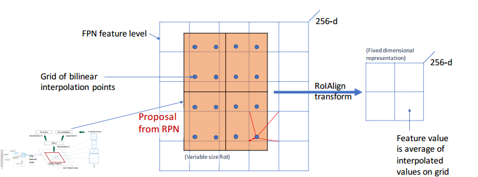

参考资料：

- [详解 ROI Align 的基本原理和实现细节](http://blog.leanote.com/post/afanti.deng@gmail.com/b5f4f526490b)