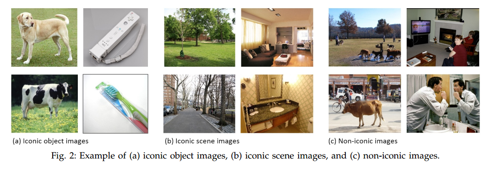
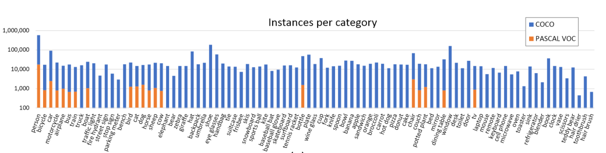
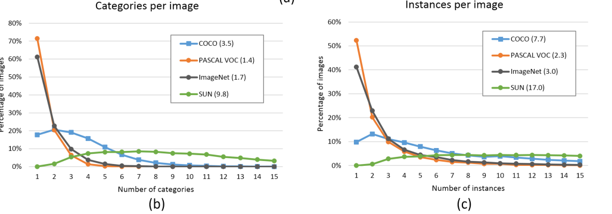
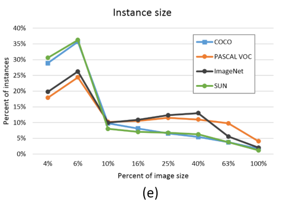
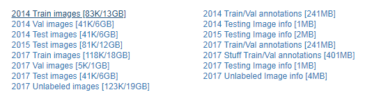

# 简介

介绍一下目标检测领域另外一个比较有名的数据集 [MS COCO](http://cocodataset.org) (Microsoft COCO: Common Objects in Context) .

MSCOCO 数据集是微软构建的一个数据集，其包含 detection, segmentation, keypoints等任务。

MSCOCO主要是为了解决detecting non-iconic views of objects（对应常说的detection）, contextual reasoning between objects and the precise 2D localization of objects（对应常说的分割问题） 这三种场景下的问题。

下面是iconic 图片和 non-iconic 图片之间的对比。

与PASCAL COCO数据集相比，COCO中的图片包含了自然图片以及生活中常见的目标图片，背景比较复杂，目标数量比较多，目标尺寸更小，因此COCO数据集上的任务更难，对于检测任务来说，现在衡量一个模型好坏的标准更加倾向于使用COCO数据集上的检测结果。

数据集的构建过程不说了。主要关注一下统计信息

# 1 统计信息

MSCOCO总共包含91个类别，每个类别的图片数量如下：

- 图中也标出了PASCAL VOC的统计数据作为对比。

------

下图展示的是几个不同数据集的总类别数量，以及每个类别的总实例数量，一个实例就是图片上的一个目标，主要关注一下 PASCAL 和 ImageNet。

- COCO数据集的类别总数虽然没有 ImageNet 中用于detection的类别总数多，但是每个类别的实例目标总数要比PASCAL和ImageNet都要多。

------

下图是每张图片上的类别数量或者实例数量的分布，括号中为平均值

- PASCAL和ImageNet中，每张图片上的类别或者实例数量普遍都很少。

  以PASCAL为例：有多于70%的图片上都只有一个类别，而多于50%的图片上只有一个实例或者目标。PASCAL数据集平均每张图片包含1.4个类别和2.3个实例目标，ImageNet也仅有1.7和3.0个。

- COCO数据集平均每张图片包含 3.5个类别和 7.7 个实例目标，仅有不到20%的图片只包含一个类别，仅有10%的图片包含一个实例目标。

- COCO数据集不仅数据量大，种类和实例数量也多。从这角度来说 SUN 数据集这两个指标更高一点，但是这个数据集在目标检测里面并不常用。

------

实例目标的分布

- COCO数据集中的小目标数量占比更多

关于数据集的划分，COCO的论文里是这么说的，

The 2014 release contains 82,783 training, 40,504 validation, and 40,775 testing images (approximately 1/2 train, 1/4 val, and /4 test). There are nearly 270k segmented people and a total of 886k segmented object instances in the 2014 train+val data alone. The cumulative 2015 release will contain a total of 165,482 train, 81,208 val, and 81,434 test images.    

2014年的数据在官网是可以下载的，但是2015年只有test部分，train和val部分的数据没有。另外2017年的数据并没有什么新的图片，只是将数据重新划分，train的数据更多了，如下：

# 2 评估标准

COCO的测试标准比PASCAL VOC更严格：

- PASCAL 中在测试mAP时，是在IOU=0.5时测的

- COCO中的AP 是指在 10个IOU层面 以及 80个类别层面 的平均值

- COCO的主要评价指标是AP，指 IOU从0.5到0.95 每变化 0.05 就测试一次 AP，然后求这10次测量结果的平均值作为最终的 AP

  AP@0.5 跟PASCAL VOC中的mAP是相同的含义

  AP@0.75 跟PASCAL VOC中的mAP也相同，只是IOU阈值提高到了0.75，显然这个层面更严格，精度也会更低

  IOU越高，AP就越低，所以最终的平均之后的AP要比 AP@0.5 小很多，这也就是为什么COCO的AP 超过 50%的只有寥寥几个而已，因为超过50%太难了。而且由于COCO数据集本身数据的复杂性，所以目前的 AP@0.5 最高也只有 73% 。

- COCO数据集还针对 三种不同大小（small，medium，large） 的图片提出了测量标准，COCO中包含大约 41% 的小目标 ($area < 32×32$), 34% 的中等目标 ($32×32 < area < 96×96$), 和 24% 的大目标 ($area > 96×96$).  小目标的AP是很难提升的。

- 除了AP之外，还提出了 AR 的测量标准 跟AP是类似的。

COCO提供了一些代码，方便对数据集的使用和模型评估 ：https://github.com/cocodataset/cocoapi

# 3 总结

为什么COCO的检测任务那么难？

- 图片大多数来源于生活中，背景更复杂
- 每张图片上的实例目标个数多，平均每张图片7.7个
- 小目标更多
- 评估标准更严格

所以现在大家更倾向于使用COCO来评估模型的质量。

# 参考资料

1. COCO官网：http://cocodataset.org
2. 论文：[Microsoft COCO: Common Objects in Context](https://arxiv.org/abs/1405.0312)
3. 论文：[What makes for effective detection proposals?](https://arxiv.org/abs/1502.05082) 