# 简介

PASCAL VOC挑战赛 （The [PASCAL](http://pascallin2.ecs.soton.ac.uk/) Visual Object Classes ）是一个世界级的计算机视觉挑战赛, [PASCAL](http://www.pascal-network.org/)全称：Pattern Analysis, Statical Modeling and Computational Learning，是一个由欧盟资助的网络组织。

很多优秀的计算机视觉模型比如分类，定位，检测，分割，动作识别等模型都是基于PASCAL VOC挑战赛及其数据集上推出的，尤其是一些目标检测模型（比如大名鼎鼎的R CNN系列，以及后面的YOLO，SSD等）。

PASCAL VOC从2005年开始举办挑战赛，每年的内容都有所不同，从最开始的分类，到后面逐渐增加检测，分割，人体布局，动作识别（Object Classification 、Object Detection、Object Segmentation、Human Layout、Action Classification）等内容，数据集的容量以及种类也在不断的增加和改善。该项挑战赛催生出了一大批优秀的计算机视觉模型（尤其是以深度学习技术为主的）。

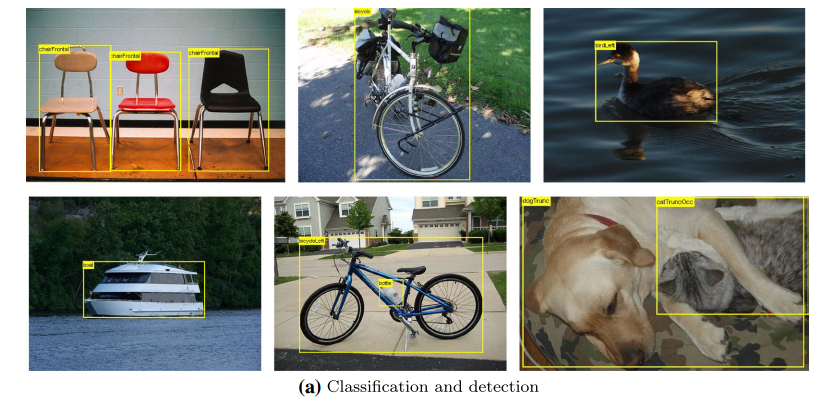

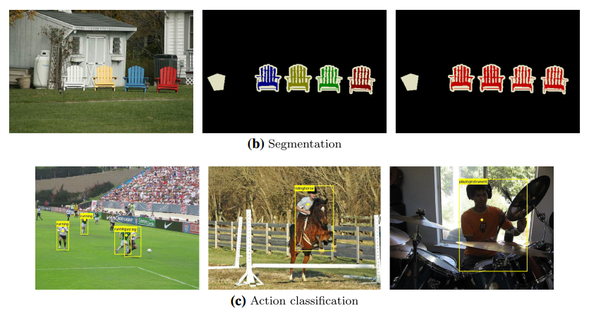

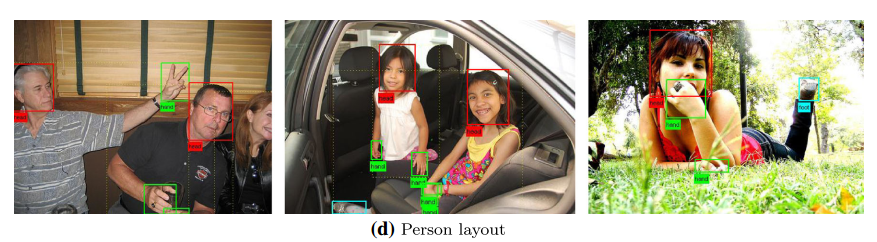


我们知道在 ImageNet挑战赛上涌现了一大批优秀的分类模型，而PASCAL挑战赛上则是涌现了一大批优秀的目标检测和分割模型，这项挑战赛已于2012年停止举办了，但是研究者仍然可以在其服务器上提交预测结果以评估模型的性能。

虽然近期的目标检测或分割模型更倾向于使用MS COCO数据集，但是这丝毫不影响 PASCAL VOC数据集的重要性，毕竟PASCAL对于目标检测或分割类型来说属于先驱者的地位。对于现在的研究者来说比较重要的两个年份的数据集是 PASCAL VOC 2007 与 PASCAL VOC 2012，这两个数据集频频在现在的一些检测或分割类的论文当中出现。

- [PASCAL主页](http://host.robots.ox.ac.uk/pascal/VOC/)    与   [排行榜](http://host.robots.ox.ac.uk:8080/leaderboard/main_bootstrap.php) （榜上已几乎看不到传统的视觉模型了，全是基于深度学习的）

- [PASCAL VOC 2007 挑战赛主页](http://host.robots.ox.ac.uk/pascal/VOC/voc2007/)  与  [PASCAL VOC 2012 挑战赛主页](http://host.robots.ox.ac.uk/pascal/VOC/voc2012/) 与   [PASCAL VOC Evaluation Server](http://host.robots.ox.ac.uk:8080/).  

- 以及在两个重要时间点对 PASCAL VOC挑战赛 成绩进行总结的两篇论文

  - **The PASCAL Visual Object Classes Challenge: A Retrospective** 

    Everingham, M., Eslami, S. M. A., Van Gool, L., Williams, C. K. I., Winn, J. and Zisserman, A.
    *International Journal of Computer Vision, 111(1), 98-136, 2015*
    [Bibtex source](http://host.robots.ox.ac.uk/pascal/VOC/pubs/everingham15.html#bibtex) | [Abstract](http://host.robots.ox.ac.uk/pascal/VOC/pubs/everingham15.html#abstract) | [PDF](http://host.robots.ox.ac.uk/pascal/VOC/pubs/everingham15.pdf)

    主要总结PASCAL VOC 2012的数据集情况，以及2011年-2013年之间出现的模型及其性能对比

  - **The PASCAL Visual Object Classes (VOC) Challenge**
    Everingham, M., Van Gool, L., Williams, C. K. I., Winn, J. and Zisserman, A.
    *International Journal of Computer Vision, 88(2), 303-338, 2010*
    [Bibtex source](http://host.robots.ox.ac.uk/pascal/VOC/pubs/everingham10.html#bibtex) | [Abstract](http://host.robots.ox.ac.uk/pascal/VOC/pubs/everingham10.html#abstract) | [PDF](http://host.robots.ox.ac.uk/pascal/VOC/pubs/everingham10.pdf)

    主要总结PASCAL VOC 2007的数据集情况，以及2008年之前出现的模型及其性能对比

  - 不过在以上论文中出现的深度学习模型只有一个 R-CNN吧，大部分都是传统方式的模型，毕竟深度学习模型主要在14年以后才大量涌现。

本文也是以PASCAL VOC 2007 和 2012 为例简要介绍VOC数据集的结构。

# 1 数据集整体概况

## 1.1 层级结构

PASCAL VOC 数据集的20个类别及其层级结构：

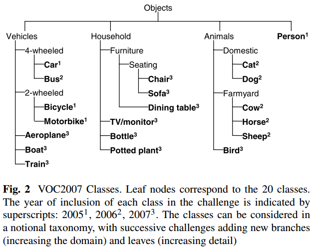

- 从2007年开始，PASCAL VOC每年的数据集都是这个层级结构

- 总共四个大类：vehicle,household,animal,person

- 总共20个小类，预测的时候是只输出图中黑色粗体的类别

- **数据集主要关注分类和检测，也就是分类和检测用到的数据集相对规模较大。**关于其他任务比如分割，动作识别等，其数据集一般是分类和检测数据集的子集。


## 1.2 发展历程与使用方法

简要提一下在几个关键时间点数据集的一些关键变化，详细的请查看[PASCAL VOC主页](http://host.robots.ox.ac.uk/pascal/VOC/) 。

- 2005年：还只有4个类别： bicycles, cars, motorbikes, people. Train/validation/test共有图片1578 张，包含2209 个已标注的目标objects.

- **2007年 ：在这一年PASCAL VOC初步建立成一个完善的数据集。类别扩充到20类，Train/validation/test共有9963张图片，包含24640  个已标注的目标objects.**  

  **07年之前的数据集中test部分都是公布的，但是之后的都没有公布。** 

- 2009年：从这一年开始，通过在前一年的数据集基础上增加新数据的方式来扩充数据集。比如09年的数据集是包含了08年的数据集的，也就是说08年的数据集是09年的一个子集，以后每年都是这样的扩充方式，直到2012年；09年之前虽然每年的数据集都在变大（08年比07年略少），但是每年的数据集都是不一样的，也就是说每年的数据集都是互斥的，没有重叠的图片。

- **2012年：从09年到11年，数据量仍然通过上述方式不断增长，11年到12年，用于分类、检测和person layout 任务的数据量没有改变。主要是针对分割和动作识别，完善相应的数据子集以及标注信息。**


对于分类和检测来说，也就是下图所示的发展历程，相同颜色的代表相同的数据集：

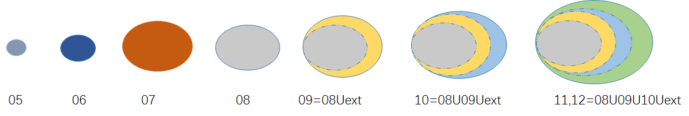

分割任务的数据集变化略有不同：

- VOC 2012用于分类和检测的数据包含 2008-2011年间的所有数据，并与VOC2007互斥。
- VOC 2012用于分割的数据中train+val包含 2007-2011年间的所有数据，test包含2008-2011年间的数据，没有包含07年的是因为07年的test数据已经公开了。

2012年是最后一次挑战赛，最终用于分类和检测的数据集规模为：train/val ：11540 张图片，包含 27450 个已被标注的 ROI annotated objects ；用于分割的数据集规模为：trainval：2913张图片，6929个分割，用于其他任务的不再细说，[参考这里](http://host.robots.ox.ac.uk/pascal/VOC/voc2012/dbstats.html) 。


即便挑战赛结束了，但是研究者们仍然可以上传预测结果进行评估。上传入口： [PASCAL VOC Evaluation Server](http://host.robots.ox.ac.uk:8080/).  

**目前广大研究者们普遍使用的是 VOC2007和VOC2012数据集，因为二者是互斥的，不相容的。**

**论文中针对 VOC2007和VOC2012 的具体用法有以下几种：** 

- 只用VOC2007的trainval 训练，使用VOC2007的test测试
- 只用VOC2012的trainval 训练，使用VOC2012的test测试，这种用法很少使用，因为大家都会结合VOC2007使用
- 使用 VOC2007 的 train+val 和 VOC2012的 train+val 训练，然后使用 VOC2007的test测试，这个用法是论文中经常看到的 07+12 ，研究者可以自己测试在VOC2007上的结果，因为VOC2007的test是公开的。
- 使用 VOC2007 的 train+val+test 和 VOC2012的 train+val训练，然后使用 VOC2012的test测试，这个用法是论文中经常看到的 07++12 ，这种方法需提交到VOC官方服务器上评估结果，因为VOC2012 test没有公布。  
- 先在  MS COCO 的 trainval 上预训练，再使用 VOC2007 的 train+val、 VOC2012的 train+val 微调训练，然后使用 VOC2007的test测试，这个用法是论文中经常看到的 07+12+COCO 。 
- 先在  MS COCO 的 trainval 上预训练，再使用 VOC2007 的 train+val+test 、 VOC2012的 train+val 微调训练，然后使用 VOC2012的test测试 ，这个用法是论文中经常看到的 07++12+COCO，这种方法需提交到VOC官方服务器上评估结果，因为VOC2012 test没有公布。   

在各自数据集上分别进行建模和评测的用法比较少，基本上在早期论文里出现就是起个对照作用；现在的大部分论文都会为了增加数据量而将二者合起来使用。

# 2 数据量统计

由于现在的研究基本上都是在VOC2007和VOC2012上面进行，因此只介绍这两个年份的。

## 2.1 VOC 2007

一些示例图片展示：[Classification/detection example images](http://host.robots.ox.ac.uk/pascal/VOC/voc2007/examples/index.html) 

**数据集总体统计：** 

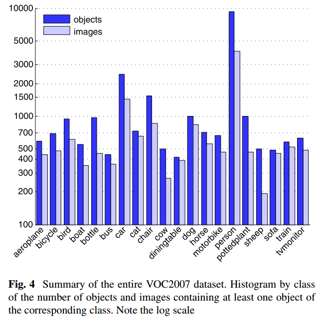

- **以上是数据集总体的统计情况，这个里面是包含了测试集的，可见person 类是最多的。**


**训练集，验证集，测试集划分情况** 

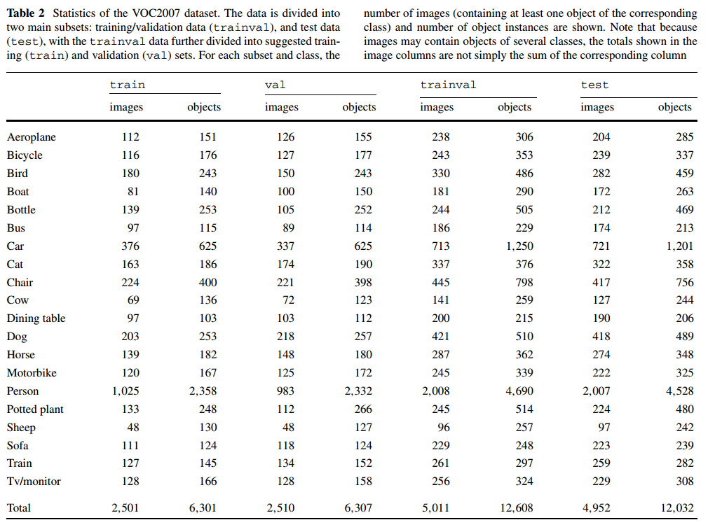

- PASCAL VOC 2007 数据集分为两部分：训练和验证集trainval，测试集test ，两部分各占数据总量的约 50%。其中trainval 又分为训练集和测试集，二者分别各占trainval的50%。
- 每张图片中有可能包含不只一个目标object。

这里我就只贴出用于分类和检测的划分情况，关于分割或者其他任务的划分方式 [点击这里查看](http://host.robots.ox.ac.uk/pascal/VOC/voc2007/dbstats.html) 。


## 2.2 VOC 2012

一些示例图片展示：[Classification/detection example images](http://host.robots.ox.ac.uk/pascal/VOC/voc2012/examples/index.html) 

**数据集总体统计** 

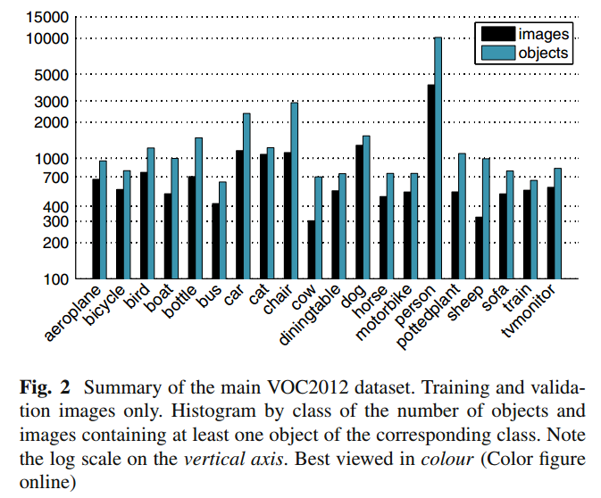

- **这个统计是没有包含 test部分的，仍然是person类最多** 


**trainval部分的数据统计：**  

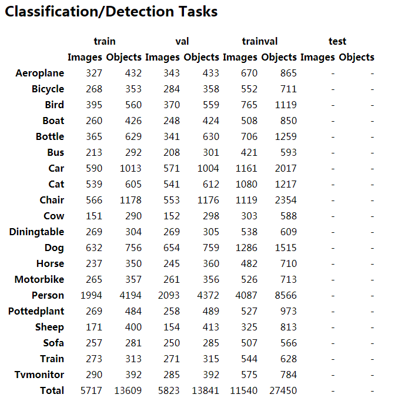

test部分没有公布，同样的 除了分类和检测之外的数据统计，[参考这里](http://host.robots.ox.ac.uk/pascal/VOC/voc2012/dbstats.html) 


## 2.3 VOC 2007 与 2012 的对比

VOC 2007 与 2012 数据集及二者的并集 数据量对比

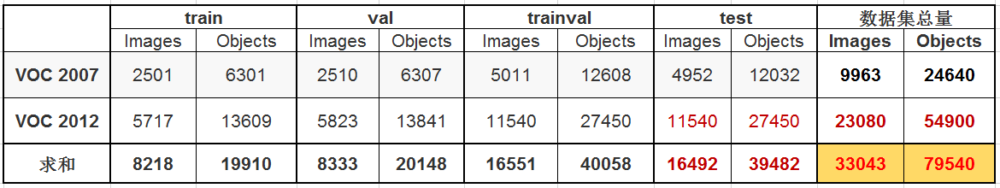

- 黑色字体所示数字是官方给定的，由于VOC2012数据集中 test 部分没有公布，因此红色字体所示数字为估计数据，按照PASCAL 通常的划分方法，即 trainval 与test 各占总数据量的一半。


# 3 标注信息

数据集的标注还是很谨慎的，有专门的标注团队，并遵从统一的标注标准，参考 [guidelines](http://host.robots.ox.ac.uk/pascal/VOC/voc2007/guidelines.html) 。

标注信息是用 xml 文件组织的如下：

```xml
<annotation>
	<folder>VOC2007</folder>
	<filename>000001.jpg</filename>
	<source>
		<database>The VOC2007 Database</database>
		<annotation>PASCAL VOC2007</annotation>
		<image>flickr</image>
		<flickrid>341012865</flickrid>
	</source>
	<owner>
		<flickrid>Fried Camels</flickrid>
		<name>Jinky the Fruit Bat</name>
	</owner>
	<size>
		<width>353</width>
		<height>500</height>
		<depth>3</depth>
	</size>
	<segmented>0</segmented>
	<object>
		<name>dog</name>
		<pose>Left</pose>
		<truncated>1</truncated>
		<difficult>0</difficult>
		<bndbox>
			<xmin>48</xmin>
			<ymin>240</ymin>
			<xmax>195</xmax>
			<ymax>371</ymax>
		</bndbox>
	</object>
	<object>
		<name>person</name>
		<pose>Left</pose>
		<truncated>1</truncated>
		<difficult>0</difficult>
		<bndbox>
			<xmin>8</xmin>
			<ymin>12</ymin>
			<xmax>352</xmax>
			<ymax>498</ymax>
		</bndbox>
	</object>
</annotation>

```

- filename ：文件名

- source，owner：图片来源，及拥有者

- size：图片大小

- segmented：是否分割

- object：表明这是一个目标，里面的内容是目标的相关信息

  - name：object名称，20个类别

  - pose：拍摄角度：front, rear, left, right, unspecified 

  - truncated：目标是否被截断（比如在图片之外），或者被遮挡（超过15%）

  - difficult：检测难易程度，这个主要是根据目标的大小，光照变化，图片质量来判断

    difficult 标签示例：图中白色虚线，被标记为 difficult。

    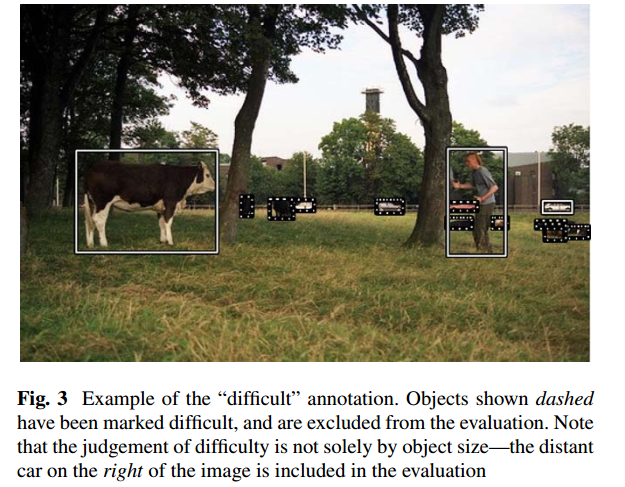

  - bndbox：bounding box 的左上角点和右下角点的4个坐标值。


# 4 提交格式

## 4.1 Classification Task

每一类都有一个txt文件，里面每一行都是测试集中的一张图片，前面一列是图片名称，后面一列是预测的分数。

comp1_cls_test_car.txt:

```tex
    000004 0.702732
    000006 0.870849
    000008 0.532489
    000018 0.477167
    000019 0.112426
```

## 4.2 Detection Task

comp3_det_test_car.txt:

```
    000004 0.702732 89 112 516 466
    000006 0.870849 373 168 488 229
    000006 0.852346 407 157 500 213
    000006 0.914587 2 161 55 221
    000008 0.532489 175 184 232 201
```

每一类都有一个txt文件，里面每一行都是测试集中的一张图片，每行的格式按照如下方式组织

```
 <image identifier> <confidence> <left> <top> <right> <bottom>
```

confidence 用来计算 mAP.


# 5 评估标准

PASCAL的评估标准是 mAP(mean average precision)

关于mAP不再详细解释，参考以下资料：

- [性能指标（模型评估）之mAP](https://blog.csdn.net/u014203453/article/details/77598997) 
- [average precision](https://sanchom.wordpress.com/tag/average-precision/) 
- 周志华老师 《机器学习》 模型评估标准一节


这里简单的提一下：

下面是一个二分类的P-R曲线（precision-recall curve），对于PASCAL来说，每一类都有一个这样的 P-R曲线，P-R曲线下面与x轴围成的面积称为 average precision，每个类别都有一个 AP, 20个类别的AP 取平均值就是 mAP。

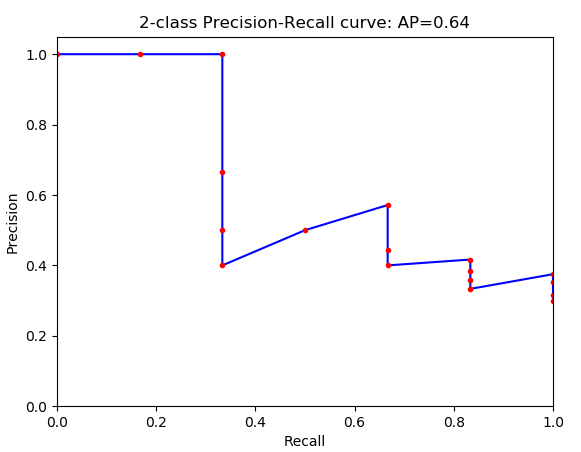

PASCAL官方给了评估脚本mAP的脚本和示例代码 [development kit code and documentation](http://host.robots.ox.ac.uk/pascal/VOC/voc2012/VOCdevkit_18-May-2011.tar) ，是用MATLAB写的。

# 6 数据集组织结构

数据集的下载:

```shell
# Download the data.
cd $HOME/data
wget http://host.robots.ox.ac.uk/pascal/VOC/voc2012/VOCtrainval_11-May-2012.tar
wget http://host.robots.ox.ac.uk/pascal/VOC/voc2007/VOCtrainval_06-Nov-2007.tar
wget http://host.robots.ox.ac.uk/pascal/VOC/voc2007/VOCtest_06-Nov-2007.tar
# Extract the data.
tar -xvf VOCtrainval_11-May-2012.tar
tar -xvf VOCtrainval_06-Nov-2007.tar
tar -xvf VOCtest_06-Nov-2007.tar
```

或者支直接点击下面链接下载：

- Download the [training/validation data](http://host.robots.ox.ac.uk/pascal/VOC/voc2007/VOCtrainval_06-Nov-2007.tar) (450MB tar file)
- Download the [annotated test data](http://host.robots.ox.ac.uk/pascal/VOC/voc2007/VOCtest_06-Nov-2007.tar) (430MB tar file)

上面的解压命令会将VOC2007的trainval和test解压到一块，数据会混在一起，如果不想，可以自己指定解压路径。以VOC 2007 为例，解压后的文件：

```shell
.
├── Annotations 进行detection 任务时的 标签文件，xml文件形式
├── ImageSets 存放数据集的分割文件，比如train，val，test
├── JPEGImages 存放 .jpg格式的图片文件
├── SegmentationClass 存放 按照class 分割的图片
└── SegmentationObject 存放 按照 object 分割的图片
```

**Annotations 文件夹：** 

```shell
.
├── 000001.xml
├── 000002.xml
├── 000003.xml
├── 000004.xml
……
……
……
├── 009962.xml
└── 009963.xml
```

以xml 文件的形式，存放标签文件，文件内容如前述，文件名与图片名是一样的，6位整数


**ImageSets文件夹：** 

存放数据集的分割文件

包含三个子文件夹 Layout，Main，Segmentation，其中Main文件夹存放的是用于分类和检测的数据集分割文件，Layout文件夹用于 person layout任务，Segmentation用于分割任务

```shell
.
├── Layout
│   ├── test.txt
│   ├── train.txt
│   ├── trainval.txt
│   └── val.txt
├── Main
│   ├── aeroplane_test.txt
│   ├── aeroplane_train.txt
│   ├── aeroplane_trainval.txt
│   ├── aeroplane_val.txt
│   ├── bicycle_test.txt
│   ├── bicycle_train.txt
│   ├── bicycle_trainval.txt
│   ├── bicycle_val.txt
│   ├── bird_test.txt
│   ├── bird_train.txt
│   ├── bird_trainval.txt
│   ├── bird_val.txt
│   ├── boat_test.txt
│   ├── boat_train.txt
│   ├── boat_trainval.txt
│   ├── boat_val.txt
│   ├── bottle_test.txt
│   ├── bottle_train.txt
│   ├── bottle_trainval.txt
│   ├── bottle_val.txt
│   ├── bus_test.txt
│   ├── bus_train.txt
│   ├── bus_trainval.txt
│   ├── bus_val.txt
│   ├── car_test.txt
│   ├── car_train.txt
│   ├── car_trainval.txt
│   ├── car_val.txt
│   ├── cat_test.txt
│   ├── cat_train.txt
│   ├── cat_trainval.txt
│   ├── cat_val.txt
│   ├── chair_test.txt
│   ├── chair_train.txt
│   ├── chair_trainval.txt
│   ├── chair_val.txt
│   ├── cow_test.txt
│   ├── cow_train.txt
│   ├── cow_trainval.txt
│   ├── cow_val.txt
│   ├── diningtable_test.txt
│   ├── diningtable_train.txt
│   ├── diningtable_trainval.txt
│   ├── diningtable_val.txt
│   ├── dog_test.txt
│   ├── dog_train.txt
│   ├── dog_trainval.txt
│   ├── dog_val.txt
│   ├── horse_test.txt
│   ├── horse_train.txt
│   ├── horse_trainval.txt
│   ├── horse_val.txt
│   ├── motorbike_test.txt
│   ├── motorbike_train.txt
│   ├── motorbike_trainval.txt
│   ├── motorbike_val.txt
│   ├── person_test.txt
│   ├── person_train.txt
│   ├── person_trainval.txt
│   ├── person_val.txt
│   ├── pottedplant_test.txt
│   ├── pottedplant_train.txt
│   ├── pottedplant_trainval.txt
│   ├── pottedplant_val.txt
│   ├── sheep_test.txt
│   ├── sheep_train.txt
│   ├── sheep_trainval.txt
│   ├── sheep_val.txt
│   ├── sofa_test.txt
│   ├── sofa_train.txt
│   ├── sofa_trainval.txt
│   ├── sofa_val.txt
│   ├── test.txt
│   ├── train_test.txt
│   ├── train_train.txt
│   ├── train_trainval.txt
│   ├── train.txt
│   ├── train_val.txt
│   ├── trainval.txt
│   ├── tvmonitor_test.txt
│   ├── tvmonitor_train.txt
│   ├── tvmonitor_trainval.txt
│   ├── tvmonitor_val.txt
│   └── val.txt
└── Segmentation
    ├── test.txt
    ├── train.txt
    ├── trainval.txt
    └── val.txt
    
3 directories, 92 files
```

主要介绍一下Main文件夹中的组织结构，先来看以下这几个文件：

```shell
├── Main
│   ├── train.txt 写着用于训练的图片名称 共2501个
│   ├── val.txt 写着用于验证的图片名称 共2510个
│   ├── trainval.txt train与val的合集 共5011个
│   ├── test.txt 写着用于测试的图片名称 共4952个
```

里面的文件内容是下面这样的：以train.txt文件为例

```tex
000012
000017
000023
000026
000032
000033
000034
000035
000036
000042
……
……
009949
009959
009961
```

就是对数据库的分割，这一部分图片用于train，其他的用作val，test等。


Main中剩下的文件很显然就是每一类别在train或val或test中的ground truth，这个ground truth是为了方便classification 任务而提供的；如果是detection的话，使用的是上面的xml标签文件。

```shell
├── Main
│   ├── aeroplane_test.txt 写着用于训练的图片名称 共2501个，指定正负样本
│   ├── aeroplane_train.txt 写着用于验证的图片名称 共2510个，指定正负样本
│   ├── aeroplane_trainval.txt train与val的合集 共5011个，指定正负样本
│   ├── aeroplane_val.txt 写着用于测试的图片名称 共4952个，指定正负样本
……
……
```

里面文件是这样的（以aeroplane_train.txt为例）：

```tex
000012 -1
000017 -1
000023 -1
000026 -1
000032  1
000033  1
000034 -1
000035 -1
000036 -1
000042 -1
……
……
009949 -1
009959 -1
009961 -1
```

前面一列是训练集中的图片名称，这一列跟train.txt文件中的内容是一样的，后面一列是标签，即训练集中这张图片是不是aeroplane，是的话为1，否则为-1.


其他所有的 (class)_(imgset).txt  文件都是类似的。

- (class)_train 存放的是训练使用的数据，每一个class都有2501个train数据。
- (class)_val 存放的是验证使用的数据，每一个class都有2510个val数据。
- (class)_trainval 将上面两个进行了合并，每一个class有5011个数据。
- (class)_test 存放的是测试使用的数据，每一个class有4952个test数据。

所有文件都 指定了正负样本，每个class的实际数量为正样本的数量，train和val两者没有交集。

VOC2012 的数据集组织结构是类似的，不一样的地方在于VOC2012 中没有 test类的图片和以及相关标签和分割文件，因为这部分数据 VOC2012没有公布。

# 参考资料

1. http://host.robots.ox.ac.uk/pascal/VOC/
2. [性能指标（模型评估）之mAP](https://blog.csdn.net/u014203453/article/details/77598997) 
3. [多标签图像分类任务的评价方法-mAP](http://blog.sina.com.cn/s/blog_9db078090102whzw.html)
4. [average precision](https://sanchom.wordpress.com/tag/average-precision/) 