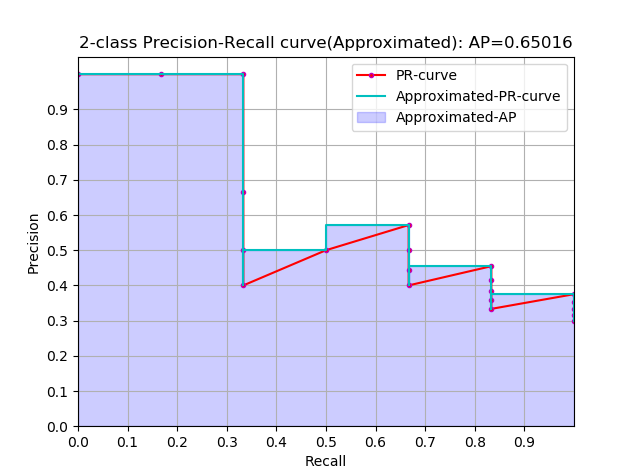
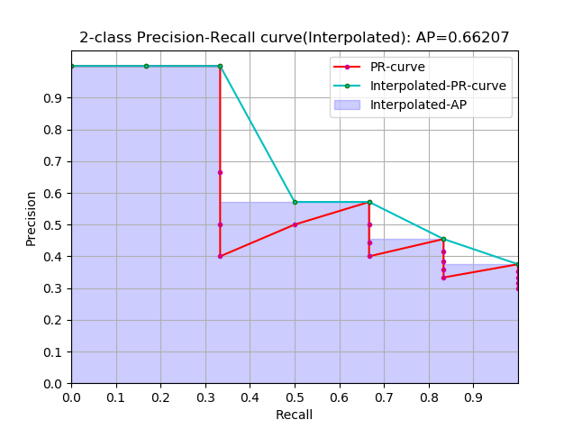
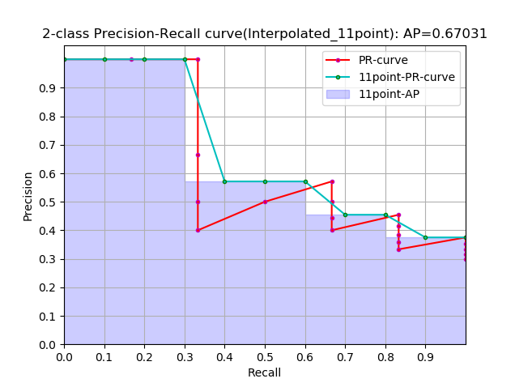
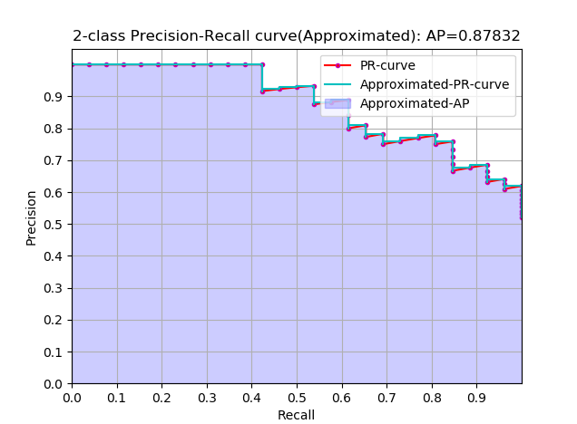
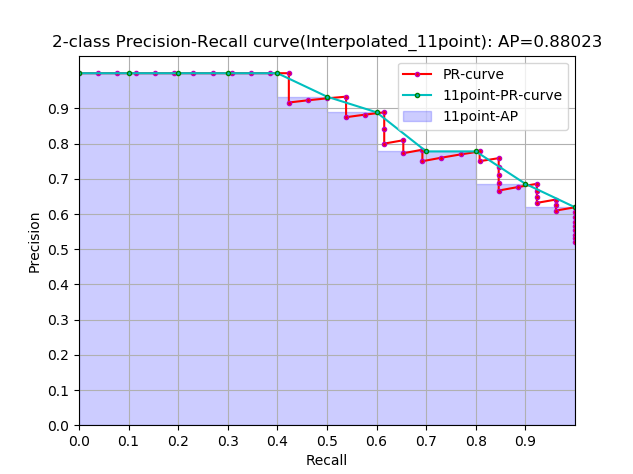

# 1 mAP简介

目标检测里面经常用到的评估标准是：mAP（mean average precision），计算mAP需要涉及到precision 和 recall的计算，mAP，precision，recall的定义含义以及计算方式，网上很多博客都有说明，本文不打算重述。

阅读本文之前，请先仔细阅读如下资料：

- 周志华老师 《机器学习》 模型评估标准一节，主要是precision，recall的计算方式，或者自己网上搜博客
- [多标签图像分类任务的评价方法-mAP](http://blog.sina.com.cn/s/blog_9db078090102whzw.html)  通过一个简单的二分类阐述 mAP的含义与计算
- [average precision](https://sanchom.wordpress.com/tag/average-precision/) 几种不同形式 AP 的计算方式与异同


以博客 [多标签图像分类任务的评价方法-mAP](http://blog.sina.com.cn/s/blog_9db078090102whzw.html) 中的数据为例，下面是这个二分类问题的P-R曲线（precision-recall curve），P-R曲线下面与x轴围成的面积称为 average precision。


那么问题就在于如何计算AP，这里很显然可以通过积分来计算
$$
AP=\int_0^1 P(r) dr
$$
但通常情况下都是使用估算或者插值的方式计算：


**approximated average precision**
$$
AP=\sum_{k=1}^N P(k) \Delta r(k)
$$

- 这个计算方式称为 approximated 形式的，插值计算的方式里面这个是最精确的，每个样本点都参与了计算

- 很显然位于一条竖直线上的点对计算AP没有贡献

- 这里N为数据总量，k为每个样本点的索引， $\Delta r(k)=r(k)-r(k-1)$

  


**Interpolated average precision**

这是一种插值计算方式：
$$
P_{interp}(k)=max_{\hat k \ge k} P(\hat k)
$$

$$
\sum_{k=1}^N P_{interp(k)} \Delta r(k)
$$

- k 为每一个样本点的索引，参与计算的是所有样本点
- $P_{interp}(k)$ 取第 k 个样本点之后的样本中的最大值
- 这种方式不常用，所以不画图了


插值方式进一步演变：
$$
P_{interp}(k)=max_{\hat k \ge k} P(\hat k)
$$

$$
\sum_{k=1}^K P_{interp}(k) \Delta r(k)
$$

- 这是通常意义上的 Interpolated 形式的 AP，这种形式使用的是比较多的，因为这个式子跟上面提到的计算方式在最终的计算结果上来说是一样的，上面那个式子的曲线跟这里图中阴影部分的外部轮廓是一样的

- 当一组数据中的正样本有K个时，那么recall的阈值也有K个，k代表阈值索引，参与计算的只有K个阈值所对应的样本点

- $P_{interp}(k)$ 取第 k 个阈值所对应的样本点之后的样本中的最大值

  


再进一步演变：
$$
P_{interp}(k)=max_{r(\hat k) \ge R(k)} P(\hat k)  \quad R \in \{0,0.1,0.2,...,1.0\}
$$

$$
\sum_{k=1}^K P_{interp}(k) \Delta r(k)
$$

- 这是通常意义上的 11points_Interpolated 形式的 AP，选取固定的 $\{0,0.1,0.2,...,1.0\}$ 11个阈值，这个在PASCAL2007中有使用

- 这里因为参与计算的只有11个点，所以 K=11，称为11points_Interpolated，k为阈值索引

- $P_{interp}(k)$ 取第 k 个阈值所对应的样本点之后的样本中的最大值，只不过这里的阈值被限定在了  $\{0,0.1,0.2,...,1.0\}$ 范围内。

  


从曲线上看，真实 AP< approximated AP < Interpolated AP 

11-points Interpolated AP 可能大也可能小，当数据量很多的时候会接近于 Interpolated AP 


前面的公式中计算AP时都是对PR曲线的面积估计，然后我看到PASCAL的论文里给出的公式就更加简单粗暴了，如下：
$$
AP=\frac{1}{11} \sum_{r \in \{ 0,0.1,0.2,...,1.0 \}} P_{intep} (r)
$$

$$
P_{interp}(r)=MAX_{\hat r: \hat r\ge r} P(\hat r)
$$

直接计算11个阈值处的precision的平均值。

不过我看 Itroduction to Modern Information（中译本：王斌《信息检索导论》）一书中也是直接计算平均值的。

对于Interpolated 形式的 AP，因为recall的阈值变化是等差的（或者recall轴是等分的），所以计算面积和直接计算平均值结果是一样的，

对于11points_Interpolated 来说，虽然recall的阈值也是等差的，但是11points计算平均值时会把recall=0那一点的precision算进去，但实际上那一点是人为添加的，所以计算面积和直接计算平均值会有略微差异。

实际上这是一个极限问题，如果recall轴等分且不考虑初始点，那么计算面积和均值的结果是一样的；如果不等分，只有当分割recall无限多的时候，二者无限趋近，这是一个数学问题。

第 4 节的代码包含这两种计算方式，可以用来验证。

以上几种不同形式的 AP 在第4节会有简单的代码实现。

# 2 PASCAL数据集mAP计算方式

> 一定要先看这个博客 [多标签图像分类任务的评价方法-mAP](http://blog.sina.com.cn/s/blog_9db078090102whzw.html) 。

PASCAL VOC最终的检测结构是如下这种格式的：

比如comp3_det_test_car.txt:

```
    000004 0.702732 89 112 516 466
    000006 0.870849 373 168 488 229
    000006 0.852346 407 157 500 213
    000006 0.914587 2 161 55 221
    000008 0.532489 175 184 232 201
```

每一行依次为 ：

```
<image identifier> <confidence> <left> <top> <right> <bottom>
```

每一行都是一个bounding box，后面四个数定义了检测出的bounding box的左上角点和右下角点的坐标。

在计算mAP时，如果按照二分类问题理解，那么每一行都应该对应一个标签，这个标签可以通过ground truth计算出来。

但是如果严格按照 ground truth 的坐标来判断这个bounding box是否正确，那么这个标准就太严格了，因为这是属于像素级别的检测，所以PASCAL中规定当一个bounding box与ground truth的 IOU>0.5 时就认为这个框是正样本，标记为1；否则标记为0。这样一来每个bounding box都有个得分，也有一个标签，这时你可以认为前面的文件是这样的，后面多了一个标签项：

```
    000004 0.702732 89 112 516 466 1
    000006 0.870849 373 168 488 229 0
    000006 0.852346 407 157 500 213 1
    000006 0.914587 2 161 55 221 0
    000008 0.532489 175 184 232 201 1
```

进而你可以认为是这样的，后面的标签实际上是通过坐标计算出来的

```
    000004 0.702732  1
    000006 0.870849  0
    000006 0.852346  1
    000006 0.914587  0
    000008 0.532489  1
```

这样一来就可以根据前面博客中的二分类方法计算AP了。但这是某一个类别的，将所有类别的都计算出来，再做平均即可得到mAP. 

# 3 COCO数据集AP计算方式

COCO数据集里的评估标准比PASCAL 严格许多

COCO检测出的结果是json文件格式，比如下面的：

```json
[
   		{
            "image_id": 139,
            "category_id": 1,
            "bbox": [
                431.23001,
                164.85001,
                42.580002,
                124.79
            ],
            "score": 0.16355941
     	}, 
    ……
    ……
]
```

我们还是按照前面的形式来便于理解：

```
    000004 0.702732 89 112 516 466
    000006 0.870849 373 168 488 229
    000006 0.852346 407 157 500 213
    000006 0.914587 2 161 55 221
    000008 0.532489 175 184 232 201
```

前面提到可以使用IOU来计算出一个标签，PASCAL用的是 IOU>0.5即认为是正样本，但是COCO要求IOU阈值在[0.5, 0.95]区间内每隔0.05取一次，这样就可以计算出10个类似于PASCAL的mAP，然后这10个还要再做平均，即为最后的AP，COCO中并不将AP与mAP做区分，许多论文中的写法是 AP@[0.5:0.95]。而COCO中的 AP@0.5 与PASCAL 中的mAP是一样的。


# 4 代码简单实现

> 一定要先看这个博客 [多标签图像分类任务的评价方法-mAP](http://blog.sina.com.cn/s/blog_9db078090102whzw.html) 。

计算AP的代码上，我觉得可以看看sklearn关于AP计算的源码，必要时可以逐步调试以加深理解。

sklearn的[average_precision_score API](http://scikit-learn.org/stable/modules/generated/sklearn.metrics.average_precision_score.html)，[average_precision_score 源码](https://github.com/scikit-learn/scikit-learn/blob/a24c8b46/sklearn/metrics/ranking.py#L110) 

sklearn上的一个计算AP的例子 [Precision-Recall and average precision compute](http://scikit-learn.org/stable/auto_examples/model_selection/plot_precision_recall.html#sphx-glr-auto-examples-model-selection-plot-precision-recall-py)

另外PASCAL和COCO都有公开的代码用于评估标准的计算

[PASCAL development kit code and documentation](http://host.robots.ox.ac.uk/pascal/VOC/voc2012/VOCdevkit_18-May-2011.tar) 

[COCO github](https://github.com/cocodataset/cocoapi) 


下面是仿照sklearn上的计算AP的例子写的一个简单的代码，与sklearn略有差异并做了一些扩展，这个代码可以计算 approximated，interpolated，11point_interpolated形式的AP，sklearn的API只能计算approximated形式的AP。这几个形式的AP的差异，参考 [average precision](https://sanchom.wordpress.com/tag/average-precision/) 这个博客。PASCAL2007的测量标准用的 11point_interpolated形式，而 PASCAL2010往后使用的是 interpolated 形式的。

从计算的精确度上 approximated > interpolated > 11point_interpolated，当然最精确的是积分。

```python
# coding=utf-8
from sklearn import svm, datasets
from sklearn.model_selection import train_test_split
import matplotlib.pyplot as plt
import numpy as np


def preprocess_iris_data():
    iris = datasets.load_iris()
    X = iris.data
    y = iris.target
    # Add noisy features
    random_state = np.random.RandomState(0)
    n_samples, n_features = X.shape
    X = np.c_[X, random_state.randn(n_samples, 200 * n_features)]
    # 鸢尾花数据集有三类，取其中两类
    # Limit to the two first classes, and split into training and test
    X_train, X_test, y_train, y_test = train_test_split(X[y < 2], y[y < 2],
                                                        test_size=.5,
                                                        random_state=random_state)
    # Create a simple classifier
    classifier = svm.LinearSVC(random_state=random_state)
    classifier.fit(X_train, y_train)
    y_score = classifier.decision_function(X_test)
    return y_test, y_score


def precision_recall_curve(y_true, y_score, pos_label=None):
    if pos_label is None:
        pos_label = 1
    # 不同的排序方式，其结果也会有略微差别，
    # 比如 kind="mergesort" 的结果跟kind="quicksort"的结果是不同的，
    # 这是因为归并排序是稳定的，快速排序是不稳定的，sklearn中使用的是 kind="mergesort" 
    desc_score_indices = np.argsort(y_score, kind="quicksort")[::-1] 
    y_score = y_score[desc_score_indices]
    y_true = y_true[desc_score_indices]
    # 确定阈值下标索引，score中可能会有重复的分数，在sklearn中，重复的元素被去掉了
    # 本来以为去除重复分数会影响结果呢，因为如果两个样本有重复的分数，一个标签是1，一个是0，
    # 感觉去掉哪个都会影响结果啊，但是实验发现竟然不影响结果，有点纳闷，以后有时间再分析吧
    # distinct_value_indices = np.where(np.diff(y_score))[0]
    # threshold_idxs = np.r_[distinct_value_indices, y_true.size - 1]
    # 这里没有去除重复分数
    threshold_idxs = np.arange(y_score.size)
    # 按照阈值依次降低的顺序，确定当前阈值下的true positives 个数，tps[-1]对应于所有的正例数量
    tps = np.cumsum(y_true * 1.)[threshold_idxs]
    # 计算当前阈值下的 false positives 个数，
    # 它与 tps的关系为fps=1+threshold_idxs-tps，这个关系是比较明显的
    fps = 1 + threshold_idxs - tps
    # y_score[threshold_idxs]把对应下标的阈值取出
    thresholds = y_score[threshold_idxs]
    precision = tps / (tps + fps)
    recall = tps / tps[-1]
    # 这里与sklearn有略微不同，即样本点全部输出，令last_ind = tps.size，即可
    last_ind = tps.size
    sl = slice(0, last_ind)
    return np.r_[1, precision[sl]], np.r_[0, recall[sl]], thresholds[sl]


def average_precision_approximated(y_true, y_predict):
    """
    计算approximated形式的ap，每个样本点的分数都是recall的一个cutoff
    :param y_true: 标签
    :param y_predict: 实际预测得分
    :return: precision，recall，threshold，average precision
    """
    precision, recall, thresholds = precision_recall_curve(
        y_true, y_predict, pos_label=1)
    average_precision = np.sum(np.diff(recall) * np.array(precision)[1:])
    return precision, recall, thresholds, average_precision


def average_precision_interpolated(y_true, y_predict):
    """
    计算interpolated形式的ap，每个正样本对应的分数都是recalll的一个cutoff
    :param y_true: 标签
    :param y_predict: 实际预测得分
    :return: precision，recall，threshold，average precision
    """
    precision, recall, thresholds = precision_recall_curve(
        y_true, y_predict, pos_label=1)
    # 获取recall轴上的分割，np.insert(recall, 0 , -1, axis=0)是为了保证获取到重复recall的第一个索引值
    # 因为重复的recall中只有对应的第一个precision是最大的，我们只需要获取这个最大的precision
    # 或者说每遇到一个正样本，需要将其对应的recall值作为横轴的切分
    recall_cutoff_index = np.where(
        np.diff(np.insert(recall, 0, -1, axis=0)))[0]
    # 从recall的cutoff 索引值开始往后获取precision最大值，相同的precision只取索引值最大的那个
    # P(r) = max{P(r')} | r'>=r
    precision_cutoff_index = []
    for index in recall_cutoff_index:
        precision_cutoff_index.append(
            max([x for x in np.where(precision == np.max(precision[index:]))[0] if x >= index]))
    # interpolated_idx=np.unique(interpolated_cutoff)
    # 从原始的precision和recall中截取对应索引的片段，即可得到 interpolated 方式下的precision，recall以及AP
    precision_interpolated = precision[precision_cutoff_index]
    recall_interpolated = recall[recall_cutoff_index]
    # 以上获得的 recall_cutoff_index 和 precision_cutoff_index 切片包含人为添加的0 和 1（为了画图时与坐标轴封闭）
    # 而计算thresholds_interpolated时要去掉相应索引值的影响
    # 阈值不包括recall=0
    thresholds_interpolated = thresholds[
        [x - 1 for x in recall_cutoff_index if 0 <= x - 1 < thresholds.size]]

    # 按说ap计算应该按照面积的方式计算，也就是下面被注释的部分，但论文里面是直接计算均值，
    # 这里也直接计算均值，因为阈值不包括recall=0，所以这种情况下二者结果是一样的
    average_precision = np.mean(precision_interpolated[1:])
    # average_precision = np.sum(
    #     np.diff(recall_interpolated) * np.array(precision_interpolated)[1:])
    return precision_interpolated, recall_interpolated, thresholds_interpolated, average_precision


def average_precision_11point_interpolated(y_true, y_predict):
    """
    计算 11point形式的 ap
    :param y_true: 标签
    :param y_predict: 实际预测得分
    :return: precision，recall，threshold，average precision
    """
    precision, recall, thresholds = precision_recall_curve(
        y_true, y_predict, pos_label=1)
    recall_11point_cutoff = np.array(
        [0, 0.1, 0.2, 0.3, 0.4, 0.5, 0.6, 0.7, 0.8, 0.9, 1.0])
    # 计算离11个cutoff最近的样本点
    recall_cutoff_index = []
    for cutoff in recall_11point_cutoff:
        recall_cutoff_index.append(np.where(recall >= cutoff)[0][0])

    precision_cutoff_index = []
    for index in recall_cutoff_index:
        precision_cutoff_index.append(
            max([x for x in np.where(precision == np.max(precision[index:]))[0] if x >= index]))
    precision_11point = precision[precision_cutoff_index]
    recall_11point = recall[recall_cutoff_index]
    # 此处阈值包括recall=0，因为是11points
    thresholds_11point = thresholds[
        [x - 1 for x in recall_cutoff_index if -1 <= x - 1 < thresholds.size]]

    # 此处阈值包括recall=0，因为是11points，所以这种情况下两种计算AP的方式结果不同，有略微差别
    average_precision = np.mean(precision_11point)
    # average_precision = np.sum(
    #     0.1 * np.array(precision_11point)[1:])

    # 此处直接返回 recall_11point_cutoff，实际上返回 recall_11point 也是可以的，
    # 差别就是图线的转折点不在[0, 0.1, 0.2, 0.3, 0.4, 0.5, 0.6, 0.7, 0.8, 0.9, 1.0]这11个刻度处
    # return precision_11point, recall_11point, thresholds_11point, average_precision
    return precision_11point, recall_11point_cutoff, thresholds_11point, average_precision


def main(data=None):
    y_test = []
    y_score = []
    if data is None:
        # 一个简单的示例，这个示例直接给定了y_test和y_score
        y_test = np.array([0, 1, 0, 1, 0, 0, 1, 0, 1, 0,
                           0, 0, 0, 0, 0, 1, 0, 0, 0, 1])
        y_score = np.array([0.23, 0.76, 0.01, 0.91, 0.13, 0.45, 0.12, 0.03, 0.38, 0.11,
                            0.03, 0.09, 0.65, 0.07, 0.12, 0.24, 0.1, 0.23, 0.46, 0.08])
    if data == 'iris':
        # 还可以导入鸢尾花数据集并构建一个简单的SVM分类器，通过一个完整的模型来理解 PR曲线的绘制
        # 使用鸢尾花数据集
        y_test, y_score = preprocess_iris_data()

    # 计算AP，并画图
    precision_approximated, recall_approximated, _, ap_approximated = \
        average_precision_approximated(y_test, y_score)

    precision_interpolated, recall_interpolated, _, ap_interpolated = \
        average_precision_interpolated(y_test, y_score)

    precision_11point, recall_11point, _, ap_11point = \
        average_precision_11point_interpolated(y_test, y_score)

    print('Approximated average precision-recall score: {0:0.5f}'.format(
        ap_approximated))

    print('Interpolated average precision-recall score: {0:0.5f}'.format(
        ap_interpolated))

    print('Interpolated at fixed 11 points average precision-recall score: {0:0.5f}'.format(
        ap_11point))

    # print the AP plot
    fig1 = plt.figure('fig1')
    # plt.subplot(311)
    plt.plot(recall_approximated, precision_approximated,
             color='r', marker='o', mec='m', ms=3)
    plt.step(recall_approximated, precision_approximated,
             color='c', where='pre')
    plt.fill_between(recall_approximated, precision_approximated, step='pre', alpha=0.2,
                     color='b')
    plt.xlabel('Recall')
    plt.ylabel('Precision')
    plt.ylim([0.0, 1.05])
    plt.xlim([0.0, 1])
    plt.title('2-class Precision-Recall curve(Approximated): AP={0:0.5f}'.format(
        ap_approximated))
    plt.xticks(np.arange(0, 1, 0.1))
    plt.yticks(np.arange(0, 1, 0.1))
    plt.grid(True)
    plt.legend(('PR-curve', 'Approximated-PR-curve', 'Approximated-AP'),
               loc='upper right')

    fig2 = plt.figure('fig2')
    # plt.subplot(312)
    plt.plot(recall_approximated, precision_approximated,
             color='r', marker='o', mec='m', ms=3)
    plt.plot(recall_interpolated, precision_interpolated,
             color='c', marker='o', mec='g', ms=3, alpha=0.5)
    plt.fill_between(recall_interpolated, precision_interpolated, step='pre', alpha=0.2,
                     color='b')
    plt.xlabel('Recall')
    plt.ylabel('Precision')
    plt.ylim([0.0, 1.05])
    plt.xlim([0.0, 1])
    plt.title('2-class Precision-Recall curve(Interpolated): AP={0:0.5f}'.format(
        ap_interpolated))
    plt.xticks(np.arange(0, 1, 0.1))
    plt.yticks(np.arange(0, 1, 0.1))
    plt.grid(True)
    plt.legend(('PR-curve', 'Interpolated-PR-curve', 'Interpolated-AP'),
               loc='upper right')

    fig3 = plt.figure('fig3')
    # plt.subplot(313)
    plt.plot(recall_approximated, precision_approximated,
             color='r', marker='o', mec='m', ms=3)
    plt.plot(recall_11point, precision_11point,
             color='c', marker='o', mec='g', ms=3)
    plt.fill_between(recall_11point, precision_11point, step='pre', alpha=0.2,
                     color='b')
    plt.xlabel('Recall')
    plt.ylabel('Precision')
    plt.ylim([0.0, 1.05])
    plt.xlim([0.0, 1])
    plt.title('2-class Precision-Recall curve(Interpolated_11point): AP={0:0.5f}'.format(
        ap_11point))
    plt.xticks(np.arange(0, 1, 0.1))
    plt.yticks(np.arange(0, 1, 0.1))
    plt.grid(True)
    plt.legend(('PR-curve', '11point-PR-curve', '11point-AP'),
               loc='upper right')

    # plt.subplots_adjust(top=0.92, bottom=0.08, left=0.10, right=0.95, hspace=0.5,
    #                     wspace=0.35)
    plt.show()


if __name__ == '__main__':
    # main() # 用这个测试博客 “多标签图像分类任务的评价方法-mAP” 中的简单例程
    main('iris')
```

这个例子使用了 鸢尾花数据集中的两类构建了一个SVM分类器，然后对分类结果计算AP.

最终的结果如下所示：







# 参考资料

1. 周志华老师 《机器学习》
2. [多标签图像分类任务的评价方法-mAP](http://blog.sina.com.cn/s/blog_9db078090102whzw.html)  
3. [average precision](https://sanchom.wordpress.com/tag/average-precision/) 
4. 王斌译 《信息检索导论》
5. 论文： The PASCAL Visual Object Classes (VOC) Challenge 2007 和 2012
6. http://cocodataset.org/#detection-eval
7. http://host.robots.ox.ac.uk/pascal/VOC/
8. http://scikit-learn.org/stable/modules/generated/sklearn.metrics.average_precision_score.html

